.. _cursus beheren:

Cursusbeheer
============

.. _cursus:
.. _oefeningenreeks:

Een **cursus** wordt :ref:`opgebouwd <leerpad uitstippelen>` als een :ref:`leerpad <leerpad>` met :ref:`oefeningen <oefening>` die gebundeld worden in **oefeningenreeksen**. De opeenvolging van oefeningenreeksen impliceert een mogelijke volgorde waarin de oefeningen kunnen :ref:`opgelost <oplossing indienen>` worden.

Een :ref:`lesgever <lesgever>` kan onbeperkt :ref:`cursussen <cursus>` :ref:`aanmaken <cursus aanmaken>` en wordt automatisch ook de eerste :ref:`cursusbeheerder <cursusbeheerder>` van die cursussen. Als cursusbeheerder kan hij andere :ref:`cursusgebruikers <cursusgebruiker>` :ref:`aanduiden <cursusbeheerders aanduiden>` om samen met hem de cursus te beheren. Hij kan echter geen cursussen beheren waarvoor hij geen cursusbeheerder is.

Een :ref:`cursusbeheerder <cursusbeheerder>` :ref:`stippelt <leerpad uitstippelen>` voor de :ref:`cursus <cursus>` een :ref:`leerpad <leerpad>` uit  met :ref:`oefeningenreeksen <oefeningenreeks>` waaraan :ref:`oefeningen <oefening>` :ref:`gekoppeld <oefeningenreeks oefeningen koppelen>` worden. Voor elke oefeningenreeks kan hij een :ref:`deadline <oefeningenreeks deadline>` :ref:`instellen <oefeningenreeks eigenschappen instellen>` die aangeeft tot wanneer er rekening gehouden wordt met :ref:`oplossingen <oplossing>` die :ref:`ingediend <oplossing indienen>` worden voor de oefeningen uit de oefeningenreeks. :ref:`Cursusgebruikers <cursusgebruiker>` kunnen na de deadline echter onbeperkt oplossingen blijven indienen voor de oefeningen uit de oefeningenreeks en blijven daar nog steeds feedback voor ontvangen.

.. _cursus aanmaken:

Aanmaken van een cursus
-----------------------

Als :ref:`lesgever <lesgever>` kan je een nieuwe :ref:`cursus <cursus>` aanmaken door op de knop :guilabel:`CURSUS AANMAKEN` te drukken in de rechterbovenhoek van het :ref:`cursusoverzicht <cursusoverzicht>`.

.. TODO:feature-update: vervang de term "Alle cursussen" door "Cursusoverzicht"
.. TODO:feature-update: vervang de term "Cursus aanmaken" door "Nieuwe cursus"; op dezelfde plaats staat bij het bewerken immers ook overal de naam van de nieuwe cursus
.. TODO:feature-missing: lesgevers zouden evengoed ook een nieuwe cursus kunnen aanmaken vanop hun startpagina; deze ziet er bovendien in de toekomst vrij gelijkaardig uit aan het cursusoverzicht

.. image:: images/staff.courses_new_link.nl.png

.. TODO:screenshot-rename: nl.staff.courses.create_start.png

.. _cursuseigenschappen instellen:

In het paneel :guilabel:`Nieuwe cursus` kan je de :ref:`eigenschappen <cursuseigenschappen>` van de nieuwe :ref:`cursus <cursus>` instellen.

.. image:: images/staff.new_course.nl.png

.. TODO:screenshot-rename: nl.staff.courses.create.png

.. TODO:feature-update: vervang titelbalk van cursusbeheerpagina van nieuwe cursus door "Nieuwe cursus", en voeg het academiejaar toe aan de titelbalk van cursusbeheerpagina als het om een bestaande cursus gaat. Het laatst omwille van de consistentie met de cursuspagina waarin naast de naam ook het academiejaar staat.

.. _cursuseigenschappen instellen annuleren:

Druk op :guilabel:`Dodona` in de :ref:`navigatiebalk <navigatiebalk>` om het aanmaken van de :ref:`cursus <cursus>` te annuleren.

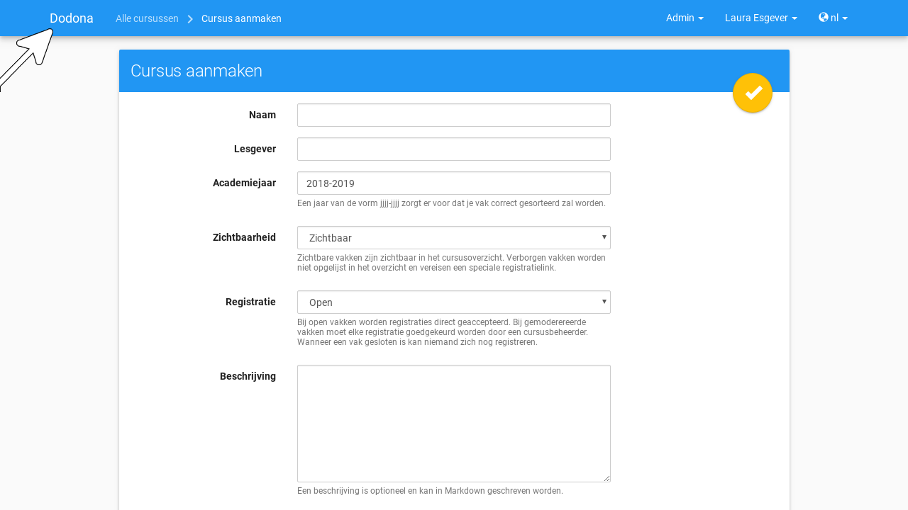

.. TODO:screenshot-rename: nl.staff.courses.create_cancel.png

.. _cursuseigenschappen:

Voor een :ref:`cursus <cursus>` kunnen de volgende eigenschappen ingesteld worden:

.. _cursus naam:

:guilabel:`Naam`

    De naam van de :ref:`cursus <cursus>`.

.. _cursus academiejaar:

:guilabel:`Academiejaar`

    Het academiejaar waarin de :ref:`cursus <cursus>` wordt aangeboden. Gebruik het formaat ``jjjj-jjjj`` om ervoor te zorgen dat de cursus correct gesorteerd wordt op de :ref:`startpagina <startpagina>` en in het :ref:`cursusoverzicht <cursusoverzicht>`.

    .. TODO:feature-update: plaats eigenschap "Academiejaar" onder eigenschap "Naam" omdat ze samen genoemd worden in korte omschrijving van cursus

     .. tip::

        Als op het platform naar een :ref:`cursus <cursus>` wordt verwezen dan wordt de :ref:`naam <cursus naam>` van de cursus altijd in één adem genoemd met het :ref:`academiejaar <cursus academiejaar>` waarin de cursus wordt aangeboden. Op die manier kunnen cursussen die jaarlijks aangeboden worden makkelijk van elkaar onderscheiden worden.

    .. TODO:feature-update: verplaats academiejaar boven lesgever, omdat de naam en het academiejaar altijd in één adem genoemd worden
    .. TODO:feature-update: vervang academiejaar (typisch voor cursusaanbod in hoger onderwijs in België) door meer generieke oplossing: optionele start- en einddatum waarbinnen de cursus wordt aangeboden; de starpagina en het cursusoverzicht kunnen dan ingedeeld worden volgens lopende cursussen, toekomstige cursussen en afgelopen cursussen; zonder startdatum wordt de cursus altijd aangeboden voor de einddatum; zonder einddatum wordt de cursus altijd aangeboden na de startdatum; zonder start- en einddatum wordt de cursus altijd aangeboden

.. _cursus lesgever:

:guilabel:`Lesgevers`

    De namen van de lesgevers van de :ref:`cursus <cursus>`. Gebruik een komma om namen te scheiden als er meerdere lesgevers zijn.

    .. TODO:feature-update: Vervang de term "Lesgever" door "Lesgevers"
    .. TODO:feature-update: Markdown toelaten zodat eventueel ook emailadressen kunnen gekoppeld worden aan de namen van de lesgevers
    .. TODO:feature-update: overwegen om cursusgebruikers te selecteren als lesgevers van een cursus; dan kunnen hun namen aan hun profielpagina gekoppeld worden

.. _cursus zichtbaarheid:

:guilabel:`Zichtbaarheid`

    De zichtbaarheid bepaalt of :ref:`niet-geregistreerde <cursus registreren>` gebruikers de :ref:`cursus <cursus>` kunnen zien. Voor deze eigenschap kunnen de volgende waarden ingesteld worden:

    .. TODO:tutorial-update: nagaan of bovenstaande geldt voor alle gebruikers of enkel voor niet-geregistreerde gebruikers

    .. _cursus zichtbaar:

    :guilabel:`Zichtbaar`

        Alle gebruikers zien de :ref:`cursus <cursus>` in het :ref:`cursusoverzicht <cursusoverzicht>`. Ze kunnen ook naar de :ref:`cursuspagina <cursuspagina>` navigeren en zich daar eventueel voor de cursus :ref:`registreren <cursus registreren>`.

    .. _cursus verborgen:

    :guilabel:`Verborgen`

        Alleen :ref:`cursusbeheerders <cursusbeheerder>` zien de :ref:`cursus <cursus>` in het :ref:`cursusoverzicht <cursusoverzicht>` en op hun :ref:`startpagina <startpagina>`. Er staat een icoontje bij om hen er op te wijzen dat andere gebruikers de cursus daar niet kunnen zien.

        .. TODO:tutorial-update: nagaan wie een verborgen cursus kan zien in het cursusoverzicht: enkel geregistreerde gebruikers? enkel cursusbeheerders? vermoedelijk zien geregistreerde gebruikers de cursus wel in hun startpagina? gebruikt die dan een token-link om naar de cursus te navigeren of wordt de vereiste voor de token-link niet gebruikt voor geregistreerde gebruikers?

        .. image:: images/staff.courses_hidden_course.nl.png

        .. TODO:screenshot-rename: nl.staff.courses.course_hidden.icon_hidden.png

        Alleen :ref:`geregistreerde <cursus registreren>` gebruikers kunnen naar de :ref:`cursuspagina <cursuspagina>` navigeren. :ref:`Cursusbeheerders <cursusbeheerder>` zien een duidelijke mededeling op de cursuspagina om hen er op te wijzen dat niet-geregistreerde gebruikers niet naar de cursuspagina kunnen navigeren en zich enkel voor de :ref:`cursus <cursus>` kunnen registreren als ze de :ref:`registratielink <cursus registratielink>` gebruiken.

        .. image:: images/staff.hidden_course_message.nl.png

        .. TODO:screenshot-rename: nl.staff.course_hidden.png

        .. image:: images/student.hidden_course_unregistered_link_message.nl.png

        .. TODO:screenshot-rename: nl.user.course_hidden._token_invalid.png
        .. TODO:screenshot-update: wat staat er precies in deze screenshot? klopt dit met de naam?

    .. TODO:feature-update: vervang de term "vakken" door "cursussen" in de omschrijving van dit veld op Dodona

.. _cursus registratie:
.. _cursus registratieprocedure:

:guilabel:`Registratieprocedure`

    .. TODO:feature-update: vervang de term "Registratie" door "Registratieprocedure" als naam voor de eigenschap

    De registratieprocedure bepaalt of en hoe gebruikers zich voor de :ref:`cursus <cursus>` kunnen :ref:`registreren <cursus registreren>`. Voor deze eigenschap kunnen de volgende waarden ingesteld worden:

    .. _cursus open:

    :guilabel:`Open`

        Gebruikers kunnen zich voor de :ref:`cursus <cursus>` :ref:`registreren <cursus registreren>` zonder expliciete goedkeuring van een :ref:`cursusbeheerder <cursusbeheerder>`.

    .. _cursus gemodereerd:

    :guilabel:`Gemodereerd`

        Gebruikers kunnen een :ref:`registratieverzoek <registratieverzoek>` :ref:`indienen <registratieverzoek indienen>` voor de :ref:`cursus <cursus>` maar zijn pas :ref:`geregistreerd <cursus registreren>` als een :ref:`cursusbeheerder <cursusbeheerder>` hun registratieverzoek heeft :ref:`goedgekeurd <registratieverzoek goedkeuren>`.

    .. _cursus gesloten:

    :guilabel:`Gesloten`

        Gebruikers kunnen zich niet meer voor de :ref:`cursus <cursus>` :ref:`registreren <cursus registreren>`.

        .. TODO:feature-update: vervang de term "vakken" door "cursussen" in de omschrijving van dit veld op Dodona

    .. important::

        Als je de registratieprocedure aanpast dan blijven bestaande :ref:`registraties <cursus registreren>` voor de :ref:`cursus <cursus>` gelden en blijven :ref:`registratieverzoeken <registratieverzoek>` voor de cursus openstaan. Je moet zelf de bestaande :ref:`registratiestatus <cursusgebruiker registratiestatus>` van :ref:`cursusgebruikers <cursusgebruiker>` :ref:`aanpassen <cursusgebruiker registratiestatus aanpassen>`.

    .. TODO:feature-update: bijkomende mogelijkheden voorzien, bijvoorbeeld selectief automatisch goedkeuren van alle gebruikers van bepaalde instellingen; op die manier kan je die cursus openzetten voor bepaalde instellingen en registratieverzoeken van andere gebruikers modereren

.. _cursus beschrijving:

:guilabel:`Beschrijving`

    Een optionele beschrijving die bovenaan de :ref:`cursuspagina <cursuspagina>` wordt weergegeven. Voor het opmaken van de beschrijving kan je gebruikmaken van :ref:`Markdown <beschrijving markdown>`.

    .. _beschrijving markdown:

    .. tip::

        De beschrijving van eigenschappen die aangeduid worden met het Markdown-logo kan geschreven worden met behulp van `Markdown <https://en.wikipedia.org/wiki/Markdown>`_. Dodona maakt voor de weergave van Markdown gebruik van `kramdown <https://kramdown.gettalong.org>`_ waardoor heel wat uitbreidingen van de standaard Markdown ondersteund worden.

.. _cursus token:
.. _cursus registratielink:

:guilabel:`Registratielink`

    .. TODO:feature-update: eigenschap "Registratielink" plaatsen onder eigenschap "Registratieprocedure" omdat ze samen horen

    Bij het :ref:`aanmaken <cursus aanmaken>` van een :ref:`cursus <cursus>` wordt automatisch een **token** gegenereerd als afschermingsmechanisme van :ref:`verborgen <cursus verborgen>` cursussen. Zonder dit token kunnen :ref:`niet-geregistreerde <cursus registreren>` gebruikers de :ref:`cursuspagina <cursuspagina>` van een :ref:`verborgen <cursus verborgen>` cursus niet zien en zich daar dus ook niet registreren. Als ze toch naar de cursus proberen te navigeren, dan zien ze enkel een melding dat ze niet de geen toegangsrechten hebben voor de cursus.

    .. image:: images/student.hidden_course_unregistered_denied_message.nl.png

    .. TODO:screenshot-rename: nl.user.course_hidden._registration_link.png

    .. _cursus registratielink gebruiken:

    Gebruikers kunnen zich enkel :ref:`registreren <cursus registreren>` voor een :ref:`verborgen <cursus verborgen>` :ref:`cursus <cursus>` als ze gebruikmaken van de **registratielink** voor de cursus. De registratielink bevat het :ref:`token <cursus token>` dat hen toegang geeft tot de cursus. Bovendien navigeren :ref:`niet-geregistreerde <cursus registreren>` gebruikers niet rechtstreeks naar de :ref:`cursuspagina <cursuspagina>`, maar worden ze verzocht om zich voor de cursus te registreren als de :ref:`registratieprocedure <cursus registratieprocedure>` dat toelaat.

    .. image:: images/student.hidden_course_unregistered_link_message.nl.png

    .. TODO:screenshot-rename: nl.user.course_hidden.registration_link_valid.png

    .. TODO:feature-update: niet-geregistreerde cursusgebruikers zouden ook een stub op de cursuspagina kunnen te zien krijgen, met de mogelijkheid om die te ontsluiten door het token in te vullen; na het invullen van het token (of bij gebruik van de tokenlink) wordt de cursuspagina wel weergegeven (moet dan in cookies opgeslagen worden, zodat gebruiker die niet telkens opnieuw moet invullen). Gebruiken van tokenlink heeft dan hetzelfde effect als het invullen van het token bij de stub van de cursus

    .. _cursus registratielink kopiëren:

    De :ref:`registratielink <cursus registratielink>` heeft dus als voordeel dat gebruikers de :ref:`cursus <cursus>` niet zelf moeten :ref:`zoeken <cursus navigeren>` in het :ref:`cursusoverzicht <cursusoverzicht>` en dat ze meteen een verzoek krijgen om zich voor de cursus te :ref:`registreren <registreren>` als ze dat nog niet gedaan hadden. Als :ref:`cursusbeheerder <cursusbeheerder>` krijg je de verantwoordelijkheid om de registratielink enkel te delen met niet-geregistreerde gebruikers die zich voor een :ref:`verborgen <cursus verborgen>` cursus mogen registreren. Druk op de kopieerknop naast de registratielink om de registratielink naar het klembord te kopiëren.

    .. TODO:feature-update: eigenlijk zou dit een "geheime registratielink" moeten heten, met de opties om er enkel een "geheime link" of enkel een "registratielink" van te maken, en ook om de taal uit de link te schrappen indien je die niet wilt opleggen aan de gebruikers die je uitnodigt

    .. image:: images/staff.hidden_course_registration_link.nl.png

    .. TODO:screenshot-rename: nl.staff.courses.create.registration_link.copy.png

    .. _cursus token vernieuwen:
    .. _cursus registratielink vernieuwen:

    Druk op de vernieuwknop naast de :ref:`registratielink <cursus registratielink>` om de :ref:`cursus <cursus>` opnieuw te :ref:`verbergen <cursus verborgen>` nadat de registratielink gedeeld werd. Daardoor wordt een nieuw :ref:`token <cursus token>` gegenereerd en wordt het oude token onbruikbaar gemaakt. De registratielink wordt meteen ook aangepast aan het nieuwe token.

    .. image:: images/staff.registration_link_renew.nl.png

    .. TODO:screenshot-rename: nl.staff.courses.create.registration_link.renew.png

    De :ref:`registratielink <cursus registratielink>` wordt ook weergegeven op de :ref:`cursuspagina <cursuspagina>`.

    .. TODO:feature-update: eigenlijk is het overbodig om de registratielink op de cursuspagina te zetten; als we die daar weghalen, dan mogen deze twee paragrafen ook weg

    .. image:: images/staff.registration_link.nl.png

    .. TODO:screenshot-rename: nl.staff.course_new.registration_link.png

    .. _registratielink kopiëren:

    Druk op de kopieerknop naast de :ref:`registratielink <cursus registratielink>` om de registratielink naar het klembord te kopiëren.

    .. image:: images/staff.registration_link_copy.nl.png

    .. TODO:screenshot-rename: nl.staff.course_new.registration_link.copy.png

Druk op de afwerkknop in de rechterbovenhoek van het paneel :guilabel:`Nieuwe cursus` om het :ref:`aanmaken <cursus aanmaken>` van een :ref:`cursus <cursus>` met de opgegeven :ref:`eigenschappen <cursuseigenschappen>` effectief door te voeren.

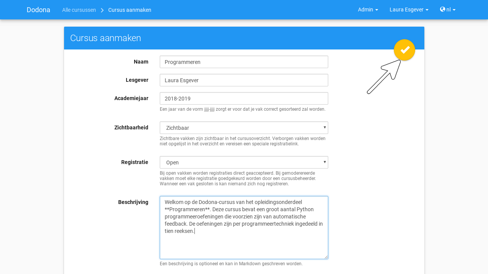

.. TODO:screenshot-rename: nl.staff.courses.create_confirm.png

Na het aanmaken van de nieuwe cursus navigeer je naar de :ref:`cursuspagina <cursuspagina>`, waar je kunt vaststellen dat je automatisch :ref:`geregistreerd <cursus registreren>` bent als :ref:`cursusgebruiker <cursusgebruiker>` en dat je :ref:`aangeduid <cursusbeheerders aanduiden>` bent als :ref:`cursusbeheerder <cursusbeheerder>`.

.. image:: images/staff.created_course.nl.png

.. TODO:screenshot-rename: nl.staff.courses.create_done.png

.. TODO:feature-missing: kopiëren van een bestaande cursus

.. TODO:tutorial-missing: gebruikers herkennen dat ze een cursus kunnen beheren als ze het icoontje van cursusbeheerder zien staan in het kaartje van de cursus op hun startpagina of in het cursusoverzicht

.. _cursus bewerken:

Bewerken van een cursus
-----------------------

.. _cursuseigenschappen aanpassen:

Als :ref:`cursusbeheerder <cursusbeheerder>` kan je de :ref:`eigenschappen <cursuseigenschappen>` van een :ref:`cursus <cursus>` aanpassen door op de bewerkknop te drukken in de rechterbovenhoek van de :ref:`cursuspagina <cursuspagina>`.

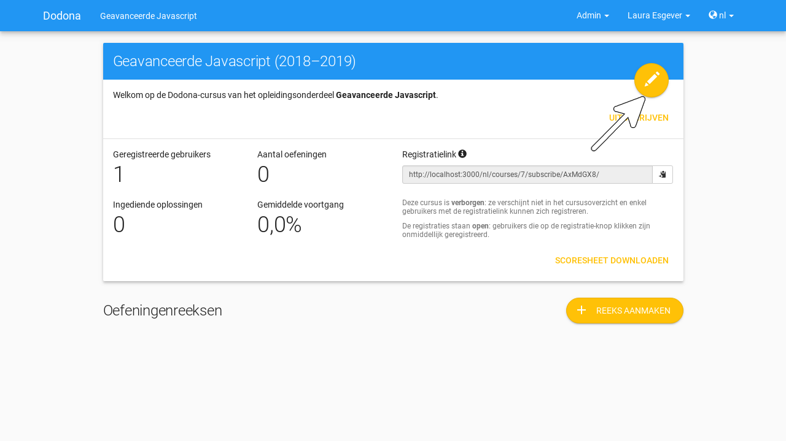

.. TODO:screenshot-rename: nl.staff.course_new.update_start.png

.. _cursuseigenschappen aanpassen annuleren:

Druk op de :ref:`cursus <cursus>` in de :ref:`navigatiebalk <navigatiebalk>` om het aanpassen te annuleren.

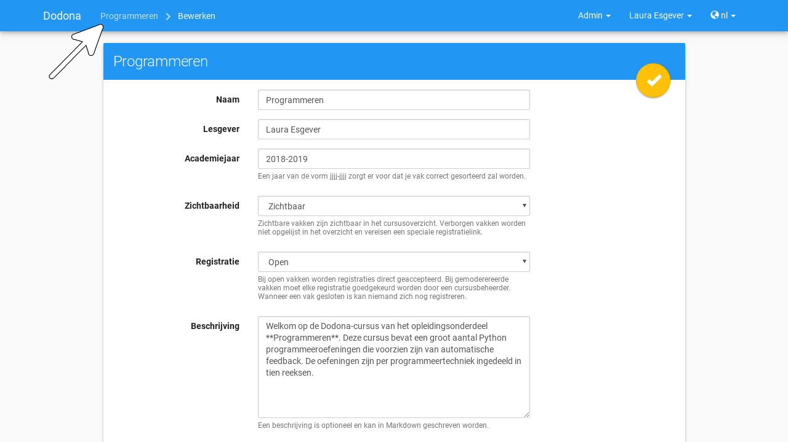

.. TODO:screenshot-rename: nl.staff.course_new.update_cancel.png

.. _cursuseigenschappen aanpassen afwerken:

Druk na het aanpassen op de afwerkknop in de rechterbovenhoek van het paneel om de nieuwe :ref:`cursuseigenschappen <cursuseigenschappen>` effectief in te stellen.

.. image:: images/staff.course_edit_submit_link.nl.png

.. TODO:screenshot-rename: nl.staff.course_new.update_confirm.png

.. TODO:feature-update: de term "registration link" is niet vertaald naar "registratielink" op het formulier waar de cursuseigenschappen kunnen ingesteld worden

Na het afwerken navigeer je terug naar de :ref:`cursuspagina <cursuspagina>` waar de nieuwe :ref:`cursuseigenschappen <cursuseigenschappen>` onmiddellijk van toepassing zijn.

.. image:: images/staff.course_after_edit.nl.png

.. TODO:screenshot-rename: nl.staff.course_new.update_done.png

.. _leerpad:
.. _leerpad weergave:
.. _leerpad uitstippelen:

Uitstippelen van een leerpad
----------------------------

Als :ref:`cursusbeheerder <cursusbeheerder>` kan je voor de :ref:`cursus <cursus>` een **leerpad** uitstippelen. Het leerpad wordt op de :ref:`cursuspagina <cursuspagina>` weergegeven onder de hoofding :guilabel:`Oefeningenreeksen`. Aan het leerpad kan je :ref:`oefeningenreeksen <oefeningenreeks>` :ref:`toevoegen <oefeningenreeks toevoegen>` waaraan je :ref:`oefeningen <oefening>` kunt :ref:`koppelen <oefeningenreeks oefeningen koppelen>`.

.. TODO:screenshot-missing: nl.staff.course_new.series.png
.. leeg leerpad op de cursuspagina van de nieuwe cursus

.. TODO:feature-update: overwegen op de hoofding "Oefeningenreeksen" op de cursuspagina te vervangen door de term "Leerpad"

.. _oefeningenreeks toevoegen:

Toevoegen van oefeningenreeksen
^^^^^^^^^^^^^^^^^^^^^^^^^^^^^^^

Druk in het :ref:`leerpad <leerpad>` op de knop :guilabel:`REEKS AANMAKEN` om een nieuwe oefeningenreeks aan het leerpad toe te voegen.

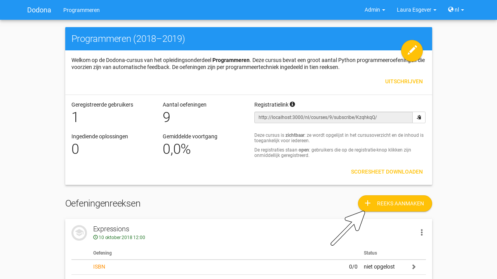

.. TODO:screenshot-rename: nl.staff.course_new.series.create_start.png

.. _oefeningenreeks eigenschappen instellen:

In het paneel :guilabel:`Nieuwe oefeningenreeks` kan je de :ref:`eigenschappen <oefeningenreeks eigenschappen>` van de nieuwe :ref:`oefeningenreeks <oefeningenreeks>` instellen.

.. TODO:feature-update: vervang de titel "Reeks aanmaken" door de titel "Nieuwe oefeningenreeks"

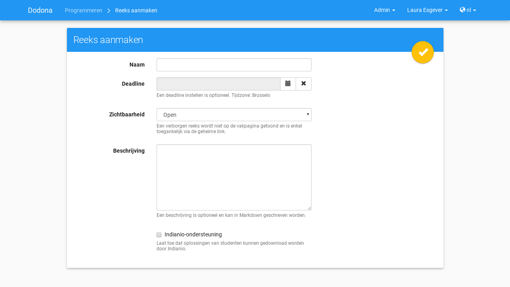

.. TODO:screenshot-rename: nl.staff.course_new.series.create.png

.. _oefeningenreeks eigenschappen instellen annuleren:

Druk op de :ref:`cursus <cursus>` in de :ref:`navigatiebalk <navigatiebalk>` om het :ref:`toevoegen <oefeningenreeks toevoegen>` van de oefeningenreeks te annuleren.

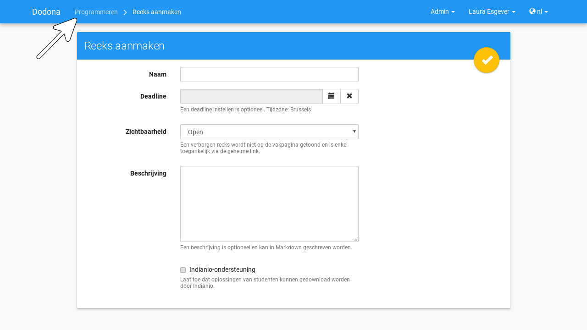

.. TODO:screenshot-rename: nl.staff.course_new.series.create_cancel.png

.. _oefeningenreeks eigenschappen:

Voor een :ref:`oefeningenreeks <oefeningenreeks>` kunnen de volgende eigenschappen ingesteld worden:

.. TODO:feature-update: cursus waaraan een oefeningenreeks gekoppeld is kan op dit moment nog ingesteld worden, maar dat zou niet mogen; deze eigenschap kan eventueel wel read-only weergegeven worden in het formulier zodat je ziet aan welke cursus de reeks gekoppeld is

.. _oefeningenreeks naam:

:guilabel:`Naam`

    De naam van de :ref:`oefeningenreeks <oefeningenreeks>`. Binnen een :ref:`leerpad <leerpad>` kunnen verschillende oefeningenreeksen dezelfde naam hebben. Het is echter aangeraden om alle oefeningenreeksen van het leerpad een unieke naam te geven.

.. _oefeningenreeks deadline:

:guilabel:`Deadline`

    Een optionele deadline die aangeeft tot wanneer er rekening gehouden wordt met :ref:`oplossingen <oplossing>` die :ref:`ingediend <oplossing indienen>` worden voor :ref:`oefeningen <oefening>` uit de :ref:`oefeningenreeks <oefeningenreeks>`. :ref:`Cursusgebruikers <cursusgebruiker>` kunnen na de deadline onbeperkt oplossingen blijven indienen voor oefeningen uit de oefeningenreeks en blijven daar nog steeds een beoordeling en feedback voor ontvangen. Er wordt met deze oplossingen echter geen rekening meer gehouden bij het bepalen van hun :ref:`indienstatus <oefeningenreeks oefening indienstatus>` voor oefeningen uit de oefeningenreeks.

    Zonder deadline wordt er bij het bepalen van de :ref:`indienstatus <oefeningenreeks oefening indienstatus>` van :ref:`cursusgebruikers <cursusgebruiker>` blijvend rekening gehouden met :ref:`oplossingen <oplossing>` die ze :ref:`indienen <oplossing indienen>` voor :ref:`oefeningen <oefening>` uit de :ref:`oefeningenreeks <oefeningenreeks>`

    .. important::

        Als de :ref:`deadline <oefeningenreeks deadline>` aangepast wordt dan krijgen :ref:`cursusgebruikers <cursusgebruiker>` meteen ook een :ref:`indienstatus <oefeningenreeks oefening indienstatus>` voor :ref:`oefeningen <oefening>` uit de :ref:`oefeningenreeks <oefeningenreeks>` die aangepast is aan de nieuwe deadline.

    Klik op het invulveld of druk op de kalenderknop om de datum en het tijdstip van de deadline in te stellen. Selecteer de deadline in de :ref:`tijdzone <gebruikersprofiel tijdzone>` die je hebt :ref:`ingesteld <persoonlijke voorkeuren instellen>` in je :ref:`gebruikersprofiel <gebruikersprofiel>`. Andere gebruikers krijgen de deadline te zien in de tijdzone die ze in hun gebruikersprofiel hebben ingesteld.

    .. image:: images/staff.course_series_calendar_open.nl.png

    .. TODO:screenshot-rename: nl.staff.course_new.series.create.deadline.select.png

    Druk op de verwijderknop om een ingestelde deadline te wissen.

    .. image:: images/staff.course_series_calendar_clear.nl.png

    .. TODO:screenshot-rename: nl.staff.course_new.series.create.deadline.clear.png

.. _oefeningenreeks zichtbaarheid:

:guilabel:`Zichtbaarheid`

    De zichtbaarheid bepaalt of gebruikers de :ref:`oefeningenreeks <oefeningenreeks>` kunnen zien. Voor deze eigenschap kunnen de volgende waarden ingesteld worden:

    .. _oefeningenreeks open:

    :guilabel:`Open`

        Alle gebruikers zien de oefeningenreeks in het :ref:`leerpad <leerpad>`.

    .. _oefeningenreeks verborgen:

    :guilabel:`Verborgen`

        .. _oefeningenreeks verborgen weergave:

        Alleen :ref:`cursusbeheerders <cursusbeheerder>` zien de :ref:`oefeningenreeks <oefeningenreeks>` in het :ref:`leerpad <leerpad>`. Er staat een duidelijke mededeling bij om hen er op te wijzen dat andere gebruikers de oefeningenreeks enkel kunnen zien als ze de :ref:`geheime link <oefeningenreeks geheime link>` gebruiken.

        .. image:: images/staff.course_series_hidden_info.nl.png

        .. TODO:screenshot-rename: nl.staff.course.series_hidden.png

    .. _oefeningenreeks gesloten:

    :guilabel:`Gesloten`

        .. _oefeningenreeks gesloten weergave:

        Alleen :ref:`cursusbeheerders <cursusbeheerder>` zien de :ref:`oefeningenreeks <oefeningenreeks>` in het :ref:`leerpad <leerpad>`. Er staat een duidelijke mededeling bij om hen er op te wijzen dat andere gebruikers de oefeningenreeks daar niet kunnen zien.

        .. image:: images/staff.course_series_closed_info.nl.png

        .. TODO:screenshot-rename: nl.staff.course.series_closed.png

.. _oefeningenreeks token:
.. _oefeningenreeks geheime link:

:guilabel:`Geheime link`

    .. TODO:feature-update: plaats de eigenschap "Geheime link" onder de eigenschap "Zichtbaarheid" omdat die samenhoren

    Bij het :ref:`toevoegen <oefeningenreeks toevoegen>` van een :ref:`oefeningenreeks <oefeningenreeks>` wordt automatisch een **token** gegenereerd als afschermingsmechanisme van :ref:`verborgen <oefeningenreeks verborgen>` oefeningenreeksen. Zonder dit token kunnen gebruikers een :ref:`verborgen <oefeningenreeks verborgen>` oefeningenreeks niet zien in het leerpad. Als ze rechtstreeks naar de oefeningenreeks proberen te navigeren, dan zien ze enkel een melding dat ze geen toegangsrechten hebben voor de oefeningenreeks.

    .. image:: images/student.hidden_series_denied_message.nl.png

    .. TODO:screenshot-rename: nl.user.series_hidden.png

    .. TODO:screenshot-missing: vorige screenshot staat nog niet in de repo

    .. TODO:feature-update: cursusgebruikers zouden initieel ook een stub voor de oefeningenreeks kunnen te zien krijgen, met de mogelijkheid om die te ontsluiten door het token in te vullen; na het invullen van het token (of bij gebruik van de tokenlink) wordt de oefeningenreeks wel weergegeven op de cursuspagina (moet dan in cookies opgeslagen worden, zodat gebruiker die niet telkens opnieuw moet invullen). Gebruiken van geheime link heeft dan hetzelfde effect als het invullen van het token bij de stub van de oefeningenreeks
    .. TODO:screenshot-update: indien we een stub zouden tonen voor een verborgen oefeningenreeks, dan kan hier een screenshot geplaatst worden van hoe die stub wordt weergegeven

    .. TODO:feature-update: overwegen om al een token te genereren op het moment dat het aanmaken van een cursus geïnitieerd wordt; dan kan de geheime link meteen weergegeven worden in het paneel "Nieuwe cursus"
    .. TODO:feature-update: inconsistentie tussen de "registratielink" voor cursussen die genereerd wordt op het moment dat de cursus aangemaakt en de "geheime link" voor oefeningenreeksen die aangemaakt wordt op het moment dat de oefeningenreeks op verborgen gezet wordt; oplossing voor cursussen lijkt beter, omdat het token behouden blijft als de zichtbaarheid van de cursus aangepast wordt en expliciet opnieuw kan gegenereerd worden; nu gaat bij het (tijdelijk) aanpassen van de zichtbaarheid van een cursus het token verloren; op die manier staat de geheime link ook altijd op het formulier en kunnen we die hier ook beter bespreken

    .. _oefeningenreeks geheime link gebruiken:

    Gebruikers kunnen een :ref:`verborgen <oefeningenreeks verborgen>` :ref:`oefeningenreeks <oefeningenreeks>` enkel zien als ze gebruikmaken van de **geheime link** voor de cursus. De geheime link bevat het :ref:`token <oefeningenreeks token>` waarmee ze de oefeningenreeks ook te zien krijgen als die verborgen werd.

    .. image:: images/staff.series_hidden_link.nl.png

    .. TODO:screenshot-rename: nl.user.series_hidden._secret_link.png
    .. vermoedelijk is er hier ook een verschil tussen user/course_user

    .. _oefeningenreeks geheime link kopiëren:

    Als :ref:`cursusbeheerder <cursusbeheerder>` krijg je de verantwoordelijkheid om de :ref:`geheime link <oefeningenreeks geheime link>` enkel te delen met andere gebruikers die de :ref:`oefeningenreeks <oefeningenreeks>` mogen zien. Druk op de kopieerknop naast de geheime link om de geheime link naar het klembord te kopiëren.

    .. image:: images/staff.series_hidden_link_copy.nl.png

    .. TODO:screenshot-rename: nl.staff.course_new.series.create.secret_link.copy.png

    .. _oefeningenreeks token vernieuwen:
    .. _oefeningenreeks geheime link vernieuwen:

    Druk op de vernieuwknop naast de :ref:`geheime link <oefeningenreeks geheime link>` om de :ref:`oefeningenreeks <oefeningenreeks>` opnieuw te :ref:`verbergen <oefeningenreeks verborgen>` nadat de geheime link gedeeld werd. Daardoor wordt een nieuw :ref:`token <oefeningenreeks token>` gegenereerd en wordt het oude token onbruikbaar gemaakt. De geheime link wordt meteen ook aangepast aan het nieuwe token.

    .. image:: images/staff.series_hidden_link_reset.nl.png

    .. TODO:screenshot-rename: nl.staff.course_new.series.create.secret_link.reset.png

.. _oefeningenreeks beschrijving:

:guilabel:`Beschrijving`

    Een optionele beschrijving die gebruikers te zien krijgen bij de weergave van de oefeningenreeks in het :ref:`leerpad <leerpad>`. Voor het opmaken van de beschrijving kan je gebruikmaken van :ref:`Markdown <beschrijving markdown>`.

Druk op de afwerkknop in de rechterbovenhoek van het paneel :guilabel:`Nieuwe oefeningenreeks` om de nieuwe :ref:`oefeningenreeks <oefeningenreeks>` effectief aan het :ref:`leerpad <leerpad>` :ref:`toe te voegen <oefeningenreeks toevoegen>`.

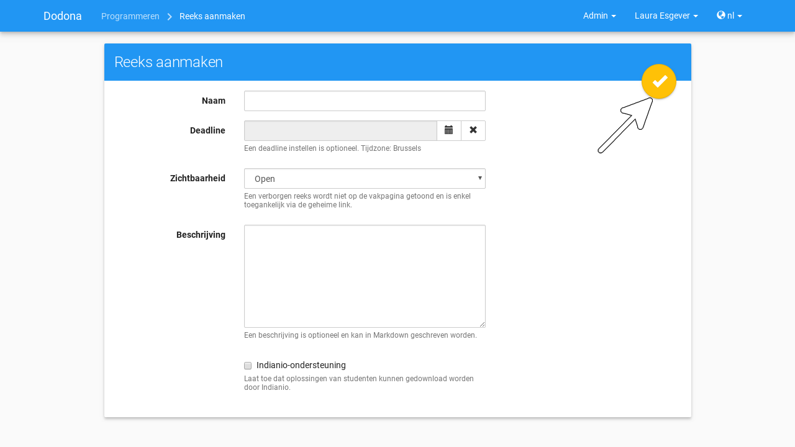

.. TODO:screenshot-rename: nl.staff.course_new.series.create_confirm.png

Na het afwerken navigeer je naar de :ref:`weergave <oefeningenreeks weergeven>` van de :ref:`oefeningenreeks <oefeningenreeks>` in het :ref:`leerpad <leerpad>`. Daarbij zie je dat de nieuwe oefeningenreeks aan de bovenkant van het leerpad toegevoegd werd. Op die manier worden de oefeningenreeksen van het leerpad in omgekeerde chronologische volgorde (eerste oefeningenreeks onderaan) weergegeven op de :ref:`cursuspagina <cursuspagina>`.

.. TODO:feature-missing: cursuseigenschap toevoegen die weergave van oefeningenreeksen op cursuspagina bepaalt (eerste onderaan, eerste bovenaan of dynamisch: meest relevante bovenaan, bijvoorbeeld in functie van deadlines)
.. TODO:feature-missing: mogelijkheid aanbieden om een oefeningenreeks op een willekeurige plaats aan te maken in het leerpad (bovenaan, onderaan of in het midden), bijvoorbeeld door de knop "REEKS TOEVOEGEN" zowel bovenaan als onderaan te zetten, en tussen twee panelen de knop ook dynamisch weer te geven als er over gehooverd wordt
.. TODO:feature-missing: mogelijkheid aanbieden om oefeningenreeksen te verplaatsen binnen het leerpad

.. TODO:screenshot-missing: weergave van nieuw aangemaakte oefeningenreeks aan de bovenkant van het leerpad; zorg ervoor dat vooral enkele oefeningenreeksen onder de nieuwe oefeningenreeks weergegeven wordt, zodat duidelijk is dat de nieuwe oefeningenreeks bovenaan het leerpad toegevoegd werd
.. TODO:screenshot-rename: nl.staff.course_new.series.create_done.png

.. TODO:tutorial-missing: plaats hier de info over de manier waarop de oefeningenreeksen worden weergegeven en het feit dat je hier de oefeningenreeks kunt bewerken, oefeningen kunt koppelen, ...

.. _oefeningenreeks oefeningen:
.. _oefeningenreeks oefeningen koppelen:

Koppelen van oefeningen
^^^^^^^^^^^^^^^^^^^^^^^

.. TODO:feature-update: instellen van eigenschappen voor oefeningenreeks zou op een andere pagina moeten gebeuren dan de pagina waar er oefeningen aan de oefeningenreeks gekoppeld worden; dit kan dan later uitgebreid worden met een pagina voor de oefeningenreeks waarop de learning analytics voor de oefeningenreeks te zien zijn; dan kan deze sectie helemaal losgekoppeld worden van de vorige sectie, en kan er aangegeven worden hoe je de oefeningen van een oefeningenreeks begint te bewerken

Je ziet nu een uitgebreide versie van het paneel waarin je naast het :ref:`instellen <oefeningenreeks eigenschappen instellen>` van :ref:`eigenschappen <oefeningenreeks eigenschappen>` ook oefeningen kunt koppelen aan de :ref:`oefeningenreeks <oefeningenreeks>`. Onder de hoofding :guilabel:`Oefeningen toevoegen` staat een overzicht van alle beschikbare oefeningen en onder de hoofding :guilabel:`Oefeningen in deze reeks` staat een overzicht van alle oefeningen die aan de oefeningenreeks gekoppeld werden.

.. TODO:feature-missing: screenshot van paneel waar oefeningen een oefeningenreeks kunnen gekoppeld worden

.. important::

    We veronderstellen hier dat de :ref:`oefeningen <oefening>` die aan de :ref:`oefeningenreeks <oefeningenreeks>` moeten gekoppeld worden reeds beschikbaar zijn in Dodona. Het opstellen, publiceren en delen van :ref:`oefeningen <oefening>` wordt besproken in :ref:`oefeningen beheren`.

.. _oefeningenoverzicht:
.. _oefeningenreeks oefeningen zoeken:

Onder de hoofding :guilabel:`Oefeningen toevoegen` kan je de zoekbalk gebruiken om te zoeken naar specifieke :ref:`oefeningen <oefening>` op basis van een naam of een padnaam. Hierbij wordt gezocht in alle beschikbare vertalingen voor de naam van de oefeningen.

.. TODO:tutorial-update: aangeven wat er bedoeld wordt met "alle beschikbare oefeningen"

.. TODO:feature-update: verdeel alle beschikbare oefeningen over drie tabs met hoofdingen "standaard" (beschikbare oefeningen die als standaardoefeningen zijn opgenomen in de oefeningenreeks), "extra" (beschikbare oefeningen die als extra oefeningen zijn opgenomen in de oefeningenreeks)" en "beschikbaar" (beschikbare oefeningen die niet opgenomen zijn in de oefeningenreeks); op die manier is er meer ruimte om de oefeningen met wat bijkomende info weer te geven (bijvoorbeeld programmeertaal); zoek beschikbare oefeningen op in de tab "beschikbaar" en voeg die via actieknopppen toe aan de standaard of extra oefeningen; gebruik actieknoppen om oefeningen tussen de tabs te verplaatsen; gebruik dynamische queries om oefeningen aan de verschillende tabs toe te wijzen, bijvoorbeeld "alle 'Python'-oefeningen uit repository 'xxx' met tag 'lussen' of uit pad 'reeks04/moeilijk'"
.. TODO:feature-update: mogelijk bieden om te zoeken in de beschrijving van de oefening (traag, zeker als verplaatst naar bestandssysteem)

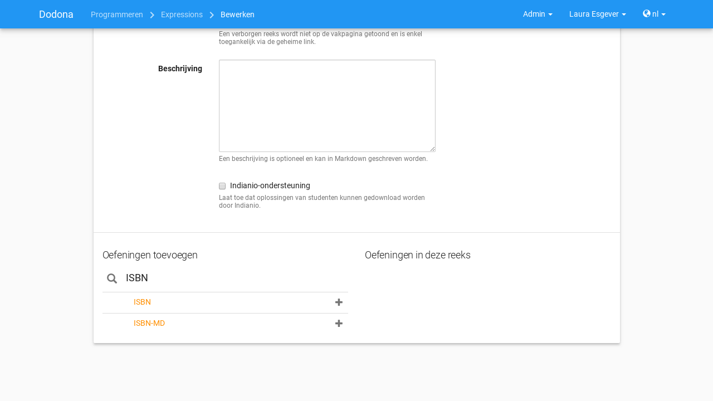

.. TODO:screenshot-rename: nl.staff.course_new.series_new.exercises.update_search.png

.. _oefeningenreeks oefening toevoegen:

Druk op de toevoegknop aan de rechterkant van een :ref:`oefening <oefening>` om de oefening aan de :ref:`oefeningenreeks <oefeningenreeks>` toe te voegen.

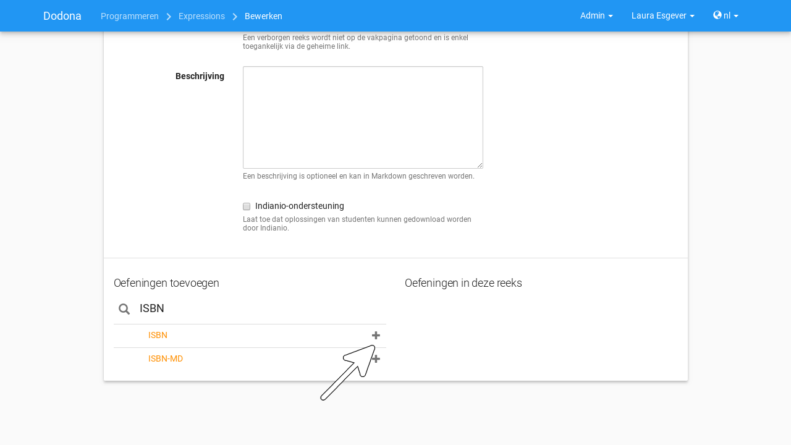

.. TODO:screenshot-rename: nl.staff.course_new.series_new.exercises.update_add.png

.. _oefeningenreeks oefening verwijderen:

Onder de hoofding :guilabel:`Oefeningen in deze reeks`
kan je aan de rechterkant van een :ref:`oefening <oefening>` op de verwijderknop drukken om de oefening uit de :ref:`oefeningenreeks <oefeningenreeks>` te verwijderen.

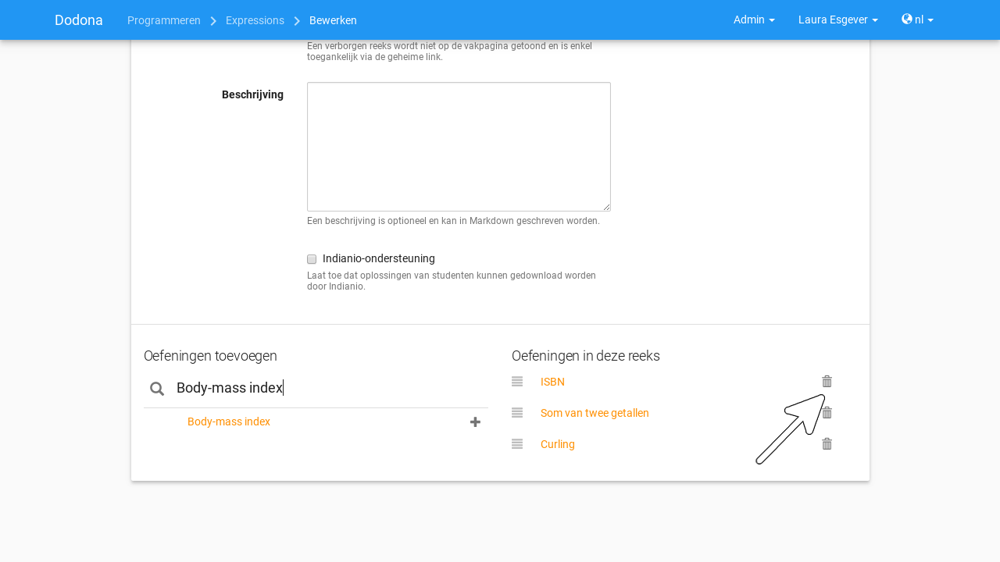

.. TODO:screenshot-rename: nl.staff.course_new.series_new.exercises.update_remove.png

.. _oefeningenreeks oefeningen herschikken:

Versleep de verplaatsknop aan de linkerkant van de :ref:`oefeningen <oefening>` om de volgorde van de oefeningen aan te passen. De volgorde waarin de oefeningen onder de hoofding :guilabel:`Oefeningen in deze reeks` gerangschikt worden, is immers ook de volgorde waarin de oefeningen :ref:`weergegeven <oefeningenreeks weergeven>` worden in de oefeningenreeks.

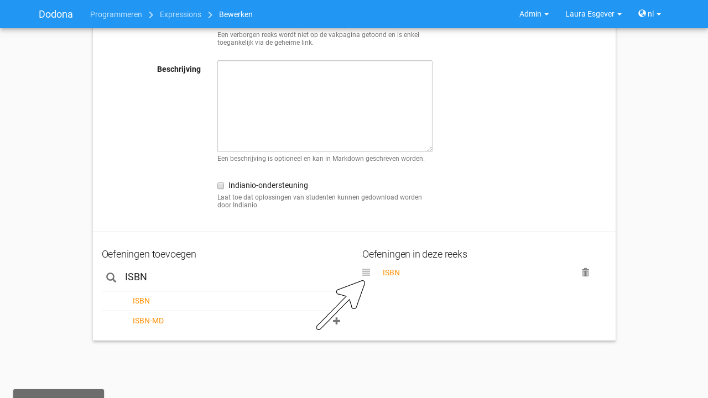

.. TODO:screenshot-rename: nl.staff.course_new.series_new.exercises.update_move.png

.. TODO:feature-missing: mogelijkheid bieden om oefeningen in een vaste volgorde aan te bieden of in een dynamische volgorde (bijvoorbeeld alfabetisch, stijgende moeilijkheidsgraad, ...)

.. _oefeningenreeks oefeningen afwerken:

Druk op de afwerkknop in de rechterbovenhoek van het paneel om de koppeling van :ref:`oefeningen <oefening>` aan de :ref:`oefeningenreeks <oefeningenreeks>` af te werken.

.. TODO:feature-update: de vorige zin zou eigenlijk moeten eindigen met "... effectief in te stellen"

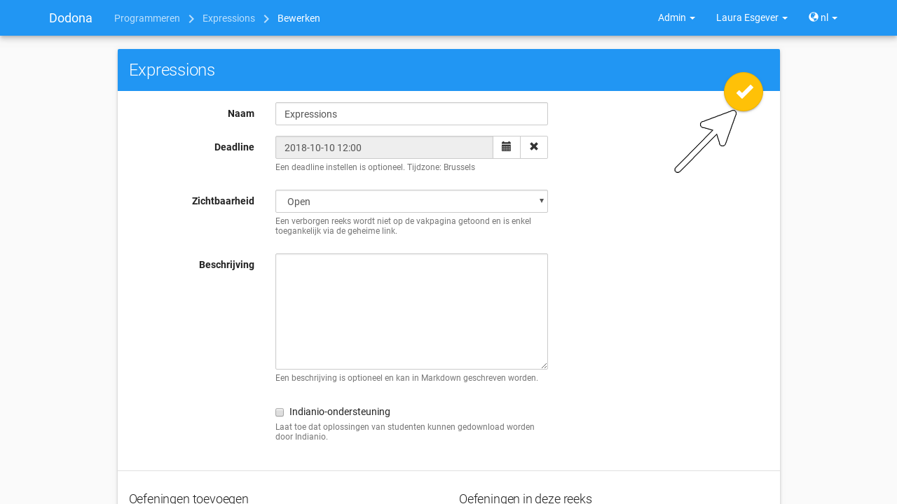

.. TODO:screenshot-rename: nl.staff.course_new.series_new.exercises.update_confirm.png

Na het afwerken navigeer je terug naar de :ref:`oefeningenreeks <oefeningenreeks>` in het :ref:`leerpad <leerpad>`, waar je kunt vaststellen dat de nieuwe koppeling van de :ref:`oefeningen <oefening>` meteen van toepassing is.

.. TODO:screenshot-missing: screenshot met de weergave van de oefeningenreeks waarin de gekoppelde oefeningen zichtbaar zijn
.. TODO:screenshot-rename: nl.staff.course_new.series_new.exercises.update_done.png

.. _oefeningenreeks beheren:

Beheren van oefeningenreeksen
^^^^^^^^^^^^^^^^^^^^^^^^^^^^^

.. _oefeningenreeks menu cursusbeheerder:

In het :ref:`menu <oefeningenreeks menu>` van een :ref:`oefeningenreeks <oefeningenreeks>` staan enkele bijkomende opties die corresponderen met acties die voorbehouden zijn voor :ref:`cursusbeheerders <cursusbeheerder>`.

.. TODO:screenshot-missing: screenshot met weergave van oefeningenreeks in het leerpad, waarbij het menu wordt aangeduid (indien mogelijk opengeklapt)
.. TODO:screenshot-rename: nl.staff.course_new.series_new.menu.png

.. _oefeningenreeks bewerken:
.. _oefeningenreeks eigenschappen aanpassen:

:guilabel:`Reeks bewerken`

    Toont een pagina waarop de :ref:`eigenschappen <oefeningenreeks eigenschappen>` en de :ref:`koppeling <oefeningenreeks oefeningen koppelen>` van :ref:`oefeningen <oefening>` kunnen aangepast worden.

    .. image:: images/staff.series_edit.nl.png

    .. TODO:screenshot-rename: nl.staff.course_new.series_new.update_start.png

    .. TODO:feature-update: ook hier zou het instellen van de eigenschappen en het koppelen van oefeningen moeten ontkoppeld worden

    .. _oefeningenreeks eigenschappen aanpassen annuleren:

    Druk op de :ref:`oefeningenreeks <oefeningenreeks>` in de :ref:`navigatiebalk <navigatiebalk>` om het aanpassen te annuleren.

    .. image:: images/staff.series_edit_cancel.nl.png

    .. TODO:screenshot-rename: nl.staff.course_new.series_new.update_cancel.png

    .. _oefeningenreeks eigenschappen aanpassen afwerken:

    Druk na het aanpassen op de afwerkknop in de rechterbovenhoek van het paneel om de nieuwe :ref:`eigenschappen <oefeningenreeks eigenschappen>` effectief in te stellen.

    .. image:: images/staff.series_edit_submit.nl.png

    .. TODO:screenshot-rename: nl.staff.course_new.series_new.update_confirm.png

    Na het :ref:`aanpassen <oefeningenreeks eigenschappen aanpassen>` navigeer je terug naar de :ref:`oefeningenreeks <oefeningenreeks>` in het :ref:`leerpad <leerpad>`, waar de nieuwe :ref:`eigenschappen <oefeningenreeks eigenschappen>` onmiddellijk van toepassing zijn.

    .. TODO:screenshot-missing: nl.staff.course_new.series_new.update_done.png

.. _oefeningenreeks verwijderen:

:guilabel:`Reeks verwijderen`

    Verwijdert de :ref:`oefeningenreeks <oefeningenreeks>` uit het :ref:`leerpad <leerpad>`.

.. _oefeningenreeks geheime link gebruiken cursusbeheerder:

:guilabel:`Geheime link`

    Gebruikt de :ref:`geheime link <oefeningenreeks geheime link>` om naar de :ref:`oefeningenreeks <oefeningenreeks>` te :ref:`navigeren <oefeningenreeks geheime link gebruiken>`.

    .. TODO:feature-update: dit wordt overbodig als de oefeningenreeks niet op een afzonderlijke pagina wordt weergegeven, maar als de weergave van de oefeningenreeks kan ontsloten worden op de cursuspagina zelf

.. _oefeningenreeks statusoverzicht:
.. _oefeningenreeks statusoverzicht weergeven:

:guilabel:`Statusoverzicht`

    Toont een overzicht met de :ref:`indienstatus <oefeningenreeks oefening indienstatus>` van alle :ref:`cursusgebruikers <cursusgebruiker>` voor alle :ref:`oefeningen <oefening>` uit de :ref:`oefeningenreeks <oefeningenreeks>`. De indienstatus wordt in het overzicht weergegeven met de gebruikelijke :ref:`icoontjes <oefeningenreeks oefening indienstatus icoontje>`.

    .. TODO:tutorial-missing: wordt de indienstatus hier bepaald met of zonder de deadline van de oefeningenreeks in rekening te brengen; zelfde voor de selectie van de oefening waarop de indienstatus gebaseerd is

    .. image:: images/staff.scoresheet.nl.png

    .. TODO:screenshot-missing: screenshot van statusoverzicht
    .. TODO:screenshot-missing: nl.staff.course_new.series_new.exercises.solutions._submit_state.png

    Druk op de naam van een :ref:`cursusgebruiker <cursusgebruiker>` om naar de :ref:`profielpagina <profielpagina>` van de gebruiker te navigeren.

    .. image:: images/staff.scoresheet_user_link.nl.png

    .. TODO:screenshot-missing: nl.staff.course_new.series_new.exercises.solutions._submit_state.user.png

    Druk op het :ref:`icoontje <oefeningenreeks oefening indienstatus icoontje>` van een :ref:`indienstatus <oefeningenreeks oefening indienstatus>` om naar de :ref:`oplossing <oplossing>` te navigeren die gebruikt werd om de :ref:`indienstatus <oefeningenreeks oefening indienstatus>` te bepalen (als de cursusgebruiker effectief een oplossing heeft :ref:`ingediend <oplossing indienen>` op basis waarvan de indienstatus kon bepaald worden).

    .. image:: images/staff.scoresheet_status_icon.nl.png

    .. TODO:screenshot-missing: nl.staff.course_new.series_new.exercises.solutions._submit_state.solution.png

    .. TODO:feature-update: naam oefening aanklikbaar maken om naar de oefeningpagina te navigeren
    .. TODO:feature-update: cursusbeheerders aanduiden met een icoontje
    .. TODO:feature-update: kolom toevoegen met # correcte oplossingen
    .. TODO:feature-update: indienstatus van gebruikers voor volledige oefeningenreeks ook weergeven (icoontje voor de gebruikers)
    .. TODO:feature-update: percentage correcte oplossingen over alle studenten heen weergeven bij oefeningen
    .. TODO:feature-update: gebruikersnaam vervangen door naam van de student
    .. TODO:feature-update: aanklikken van naam zou naar profielpagina van student moeten gaan (nu wordt pagina met oplossingen van student in deze cursus getoond)
    .. TODO:feature-update: bij elke student actieknop toevoegen om overzicht te krijgen van alle oplossingen die student in deze cursus heeft ingediend voor de oefeningen uit de oefeningenreeks
    .. TODO:feature-update: ellipsis toevoegen aan weergave van de namen van studenten en oefeningen
    .. TODO:feature-update: bij elke oefening actieknop toevoegen om overzicht te krijgen van alle oplossingen die studenten in deze cursus hebben ingediend voor deze oefening
    .. TODO:feature-update: filteroptie toevoegen: alle gebruikers die geen oplossingen ingediend hebben te verbergen
    .. TODO:feature-update: filteroptie toevoegen: cursusbeheerders verbergen
    .. TODO:feature-update: filteroptie toevoegen: wel/geen rekening houden met deadline van oefeningenreeks
    .. TODO:feature-update: sorteeroptie toevoegen: studenten alfabetisch rangschikken
    .. TODO:feature-update: sorteeroptie toevoegen: studenten rangschikken op # correcte oplossingen
    .. TODO:feature-update: propere afdrukbare versie van overzicht maken (nu al min of meer OK)

.. _oefeningenreeks oplossingen herevalueren:

:guilabel:`Oplossingen herevalueren`

    :ref:`Herevalueert <oplossing herevalueren>` alle :ref:`oplossingen <oplossing>` die :ref:`cursusgebruikers <cursusgebruiker>` :ref:`ingediend <oplossing indienen>` hebben voor :ref:`oefeningen <oefening>` van de :ref:`oefeningenreeks <oefeningenreeks>`.

.. TODO:feature-missing: overzicht van alle oplossingen die binnen een cursus ingediend werden voor de oefeningen uit een oefeningenreeks ontbreekt in het menu van de oefeningenreeks voor de cursusbeheerder; voor de volledigheid kan deze optie toegevoegd worden; dit maak het vorige menu-item overbodig, omdat de oplossingen dan via het menu van het overzicht kunnen geherevalueerd worden

.. _cursusgebruiker:
.. _cursusgebruikers beheren:

Beheren van cursusgebruikers
----------------------------

Als :ref:`cursusbeheerder <cursusbeheerder>` krijg je toegang tot alle **cursusgebruikers**. Dit zijn de gebruikers die ooit voor de cursus :ref:`geregistreerd <cursus registreren>` geweest zijn of die ooit een :ref:`registratieverzoek <registratieverzoek>` voor de cursus ingediend hebben. Je kunt hun :ref:`gebruikersprofiel <gebruikersprofiel>` :ref:`bekijken <cursusgebruikers navigeren>`, hun :ref:`gebruikersaccount <gebruikersaccount>` :ref:`overnemen <gebruikersaccount overnemen>`, hun :ref:`registratiestatus <cursusgebruiker registratiestatus>` :ref:`aanpassen <cursusgebruiker registratiestatus aanpassen>` en :ref:`cursusbeheerders <cursusbeheerder>` :ref:`aanduiden <cursusbeheerders aanduiden>`.

.. _cursusgebruikersoverzicht:
.. _cursusgebruikers navigeren:

Navigeren naar cursusgebruikers
^^^^^^^^^^^^^^^^^^^^^^^^^^^^^^^

Aan de onderkant van de :ref:`cursuspagina <cursuspagina>` zie je onder de hoofding :guilabel:`Gebruikers` een overzicht waarin alle :ref:`cursusgebruikers <cursusgebruiker>` opgelijst worden met hun gebruikersnaam, naam, emailadres en :ref:`voortgangsstatistieken <cursusgebruiker voortgangsstatistieken>`.

.. image:: images/staff.course_users.nl.png

.. TODO:screenshot-missing: nl.staff.course_new.users.png

.. _cursus beheersrechten icoontje:
.. _cursusgebruiker voortgangsstatistieken:

.. TODO: tutorial-update: vermoedelijk moet op termijn de bespreking van het gebruikersoverzicht naar hier verhuizen, als lesgevers geen toegang meer krijgen tot alle gebruikers (enkel zeus zou dit mogen kunnen); het gebruikersoverzicht is dan alleen nog toegankelijk voor cursusbeheerdes die daar alle gebruikers over al hun cursussen heen terugvinden

Het :ref:`zoeken <gebruiker zoeken>`, :ref:`selecteren <gebruiker selecteren>` en :ref:`bewerken <gebruikersprofiel bewerken>` van :ref:`cursusgebruikers <cursusgebruiker>` verloopt op dezelfde manier als in het :ref:`gebruikersoverzicht <gebruikersoverzicht>`.

.. _cursusgebruiker registratiestatus:
.. _cursusgebruiker registratiestatus aanpassen:

Aanpassen van de registratiestatus
^^^^^^^^^^^^^^^^^^^^^^^^^^^^^^^^^^

In het :ref:`overzicht <cursusgebruikersoverzicht>` van alle :ref:`cursusgebruikers <cursusgebruiker>` worden de cursusgebruikers in tabs gegroepeerd volgens hun **registratiestatus** voor de :ref:`cursus <cursus>`.

:guilabel:`Geregistreerd`

    Alle :ref:`cursusgebruikers <cursusgebruiker>` die momenteel :ref:`geregistreerd <cursus registreren>` zijn.

:guilabel:`Uitgeschreven`

    Alle :ref:`cursusgebruikers <cursusgebruiker>` die ooit :ref:`geregistreerd <cursus registreren>` waren, maar die ondertussen :ref:`uitgeschreven <cursus uitschrijven>` zijn.

:guilabel:`Op de wachtlijst`

    Alle :ref:`cursusgebruikers <cursusgebruiker>` waarvoor er nog een :ref:`registratieverzoek <registratieverzoek>` openstaat dat wacht op :ref:`afhandeling <registratieverzoeken afhandelen>` van een :ref:`cursusbeheerder <cursusbeheerder>`.

.. _registratieverzoek afkeuren:
.. _registratieverzoek goedkeuren:
.. _registratieverzoeken afhandelen:

Elke tab heeft eigen actieknoppen aan de rechterkant van de cursusgebruikers waarmee je hun :ref:`registratiestatus <cursusgebruiker registratiestatus>` kunt aanpassen.

.. TODO:screenshot-rename: rename "images/staff_registration_icons/" into "images/icons/state/user.course." (registration state) and use the same directory/prefix structure for "images/icons/state/user.series." (submit state), "images/icons/state/solution." (evaluation state), "images/icons/state/user." (role) and also use a directory for all action buttons "images/icons/action/", e.g. "images/icons/action/course.user.unregister.png"

.. list-table::
  :header-rows: 1

  * - tab
    - knop
    - actie

  * - :guilabel:`Geregistreerd`
    - .. image:: images/staff_registration_icons/unregister.png
    - cursusgebruiker uitschrijven uit de cursus

      .. TODO:feature-missing: cursusbeheerders kunnen geen (andere) cursusbeheerders uitschrijven uit de cursus; is dat de bedoeling, of zou dat wel moeten kunnen zolang op die manier niet de laatste cursusbeheerder uit de cursus verdwijnt als een cursusbeheerder zichzelf uitschrijft
      .. TODO:feature-missing: als cursusbeheerder kan je enkel bestaande cursusgebruikers registreren, en heb je niet de mogelijkheid om andere gebruikers te registren voor een cursus, behalve dan het gebruikersaccount van de gebruiker overnemen en in naam van de gebruiker de registratie uitvoeren (als dit kan); dit zou eventueel een manier zijn om als cursusbeheerder een gebruiker in te schrijven voor een cursus die werkt met gesloten registratie

  * - :guilabel:`Uitgeschreven`
    - .. image:: images/staff_registration_icons/register.png
    - cursusgebruiker terug registreren voor de cursus

  * - :guilabel:`Registratieverzoeken`
    - .. image:: images/staff_registration_icons/approve.png
    - goedkeuren van het :ref:`registratieverzoek <registratieverzoek>` dat door de gebruiker werd :ref:`ingediend <registratieverzoek indienen>`, waardoor de gebruiker :ref:`geregistreerd <cursus registreren>` wordt voor de cursus

  * - :guilabel:`Registratieverzoeken`
    - .. image:: images/staff_registration_icons/decline.png
    - afkeuren van het :ref:`registratieverzoek <registratieverzoek>` dat door de gebruiker werd :ref:`ingediend <registratieverzoek indienen>`, waardoor de gebruiker :ref:`uitgeschreven <cursus uitschrijven>` wordt uit de cursus

.. TODO:update-feature: cursusbeheerder mogelijkheid geven om een reden op te geven waarom een registratieverzoek wordt afgekeurd
.. TODO:update-feature: notification/email sturen naar de gebruiker wanneer een registratieverzoek wordt goedgekeurd/afgekeurd

.. TODO:tutorial-missing: wat zijn de regels voor het uitschrijven als de laatste cursusbeheerder zich uit een cursus wil uitschrijven

.. _cursusbeheerders aanduiden:

Aanduiden van cursusbeheerders
^^^^^^^^^^^^^^^^^^^^^^^^^^^^^^

.. _cursusbeheerder:

Een **cursusbeheerder** is een :ref:`geregistreerde <cursus registreren>` :ref:`cursusgebruiker <cursusgebruiker>` met beheersrechten voor de :ref:`cursus <cursus>`. Een :ref:`lesgever <lesgever>` die een nieuwe cursus aanmaakt wordt er automatisch voor geregistreerd en wordt er meteen ook de eerste cursusbeheerder van. Lesgever hebben voor het beheren van cursussen echter geen bijkomende rechten ten opzichte van andere :ref:`cursusbeheerders` en kunnen ook geen cursussen beheren waarvoor ze geen cursusbeheerder zijn.

.. _cursusbeheerder icoontje:

In de tab :guilabel:`Geregistreerd` van het :ref:`overzicht <cursusgebruikersoverzicht>` met alle :ref:`cursusgebruikers <cursusgebruiker>` kan je de cursusbeheerders herkennen aan het icoontje in de linkermarge.

.. image:: images/staff.course_users_admin.nl.png

.. TODO:screenshot-missing: nl.staff.course_new.users.tabs.png

.. TODO:update-feature: icoontjes met beheersrechten op platformniveau zijn hier niet zinvol, en moeten dus niet weergegeven worden

.. TODO:update-feature: zeus-cursusgebruikers krijgen altijd een icoontje van cursusbeheerder, ook al zijn ze niet expliciet aangeduid als cursusbeheerder; dit zou niet het geval mogen zijn; is zeker verwarrend om te zien dat zeus-cursusgebruikers een icoontje krijgen als ze uitgeschreven zijn

In de tab kan je de volgende actieknoppen gebruiken om cursusbeheerders aan te duiden:

.. list-table::
  :header-rows: 1

  * - knop
    - actie

  * - .. image:: images/staff_registration_icons/make_course_admin.png
    - cursusgebruiker zonder beheersrechten voor de cursus promoveren tot cursusbeheerder

  * - .. image:: images/staff_registration_icons/make_student.png
    - cursusbeheerder degraderen tot cursusgebruiker zonder beheersrechten voor de cursus

.. TODO:update-feature: in plaats van een doorstreept icoontje zouden we een quasi doorzichtig icoontje kunnen gebruiken om een cursusgebruiker te promoveren en een zwart icoontje om een cursusbeheerder te degraderen (zoals dat ook in Indianio gebeurt); op die manier worden de icoontjes in de linkermarge wellicht ook overbodig

.. important::

    Een :ref:`cursusbeheerder <cursusbeheerder>` die zich :ref:`uitschrijft <cursus uitschrijven>` uit een :ref:`cursus <cursus>` verliest zijn status van cursusbeheerder.

    Om ervoor te zorgen dat een cursus altijd minstens één cursusbeheerder heeft, kan de laatste cursusbeheerder zich niet uitschrijven en kan hij zichzelf ook niet degraderen tot cursusgebruiker zonder beheersrechten voor de cursus.

    Na het aanmaken van een cursus kan een lesgever zich uitschrijven als hij andere cursusbeheerders aangeduid heeft. Hij kan door andere cursusbeheerders ook gedegradeerd worden tot cursusgebruiker zonder beheersrechten voor de cursus.

.. TODO:feature-update: actieknop voor degraderen van cursusbeheerder niet tonen als er maar één cursusbeheerder is in de cursus
.. TODO:feature-update: actieknop voor uitschrijven van cursusbeheerder niet tonen als er maar één cursusbeheerder is in de cursus

.. _oplossingen beheren:

Beheren van oplossingen
-----------------------

Als :ref:`cursusbeheerder <cursusbeheerder>` krijg je toegang tot alle :ref:`oplossingen <oplossing>` die de :ref:`cursusgebruikers <cursusgebruiker>` :ref:`ingediend <oplossing indienen>` hebben in de :ref:`cursus <cursus>`. Je kunt de oplossingen :ref:`herevalueren <oplossing herevalueren>` en er zijn verschillende plaatsen op de :ref:`cursuspagina <cursuspagina>` waar je een overzicht kunt krijgen van (een deel van) de oplossingen.

.. _oplossing herevalueren:

Herevalueren van een oplossing
^^^^^^^^^^^^^^^^^^^^^^^^^^^^^^

Bij het herevalueren van een oplossing wordt het :ref:`beoordelingsproces <oplossing beoordelingsproces>` opnieuw uitgevoerd zonder dat de oplossing opnieuw moet :ref:`ingediend <oplossing indienen>` worden. Op die manier blijft het originele :ref:`tijdstip <oplossing tijdstip>` van indienen behouden. Als de configuratie van de :ref:`oefening <oefening>` aangepast werd sinds de vorige beoordeling van de oplossing, dan kan de :ref:`status <oplossing status>` van de oplossing wijzigen door het herevalueren.

.. important::

    Bij het :ref:`herevalueren <oplossing herevalueren>` krijgen :ref:`oplossingen <oplossing>` een lagere prioriteit in de :ref:`wachtrij <oplossing wachtrij>` dan oplossingen die nieuw :ref:`ingediend <oplossing indienen>` worden. Op die manier ondervindt het beoordelen van oplossingen die gebruikers indienen minimale vertaging, maar kan het herevalueren wel langer duren.

.. important::

    Gebruikers krijgen geen melding van het platform als hun :ref:`oplossingen <oplossing>` :ref:`geherevalueerd <oplossing herevalueren>` worden. Als je beslist om oplossingen te herevalueren, is het belangrijk om gebruikers te informeren dat er zowel wijzigingen kunnen zijn van de :ref:`status <oplossing status>` van :ref:`oplossingen <oplossing>` die ze vroeger :ref:`ingediend <oplossing indienen>` hebben als van hun :ref:`indienstatus <oefeningenreeks oefening indienstatus>` voor :ref:`oefeningen <oefening>` in de :ref:`oefeningenreeksen <oefeningenreeks>` van de cursus.

Druk op de herhaalknop in de rechterbovenhoek van de :ref:`feedbackpagina <feedbackpagina>` om een :ref:`oplossing <oplossing>` te :ref:`herevalueren <oplossing herevalueren>`.

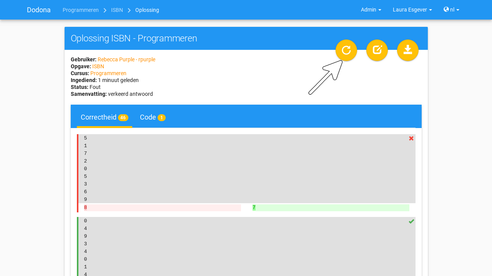

.. TODO:screenshot-rename: nl.staff.solution.evaluate.png

.. TODO:feature-missing: link in sidebar die overzicht geeft van alle oplossingen die ingediend werden (bij cursusgebruikers zijn dit hun eigen oplossingen over alle cursussen heen, bij cursusbeheerders wordt dit aangevuld met oplossingen van alle gebruikers van cursussen die ze beheren; bij zeus zijn dit alle oplossingen)
.. TODO:feature-missing: link in navigatiebalk van cursus die overzicht geeft van alle oplossingen die in cursus ingediend werden (bij cursusgebruikers zijn dit enkel hun eigen oplossingen)
.. TODO:feature-missing: link in menu van oefeningenreeks die overzicht geeft van alle oplossingen die ingediend werden voor oefeningen uit de oefeningenreeks (bij cursusgebruikers zijn dit enkel hun eigen oplossingen); duid op één of andere manier aan welke oefeningen voor/na de deadline werden ingediend, bijvoorbeeld door oplossingen die na de deadline ingediend werden in het grijs te zetten
.. TODO:feature-update: link aan rechterkant van oefening in oefeningenreeks die overzicht geeft van alle oplossingen die ingediend werden voor die oefening (bij cursusgebruikers zijn dit enkel hun eigen oplossingen); duid op één of andere manier aan welke oefeningen voor/na de deadline werden ingediend, bijvoorbeeld door oplossingen die na de deadline ingediend werden in het grijs te zetten

.. _cursusbeheerder oplossingen navigeren:

Navigeren naar oplossingen
^^^^^^^^^^^^^^^^^^^^^^^^^^

Elk overzicht met :ref:`oplossingen <oplossing>` die in de :ref:`cursus <cursus>` ingediend werden, bevat voor :ref:`cursusbeheerders <cursusbeheerder>` de oplossingen van alle :ref:`cursusgebruikers <cursusgebruiker>`. Daarom heeft het overzicht een extra kolom met de naam van de gebruiker die de :ref:`oplossing <oplossing>` heeft :ref:`ingediend <oplossing indienen>`. Druk op de naam van de gebruiker om naar het :ref:`gebruikersprofiel <gebruikersprofiel>` te navigeren.

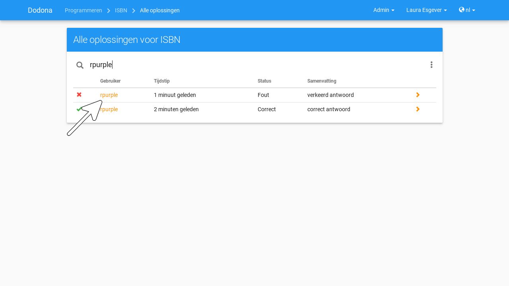

.. TODO:screenshot-rename: nl.staff.course.solutions.user.png

.. TODO:feature-update: vervang de gebruikersnaam in het overzicht door de naam van de gebruiker; eigenlijk kunnen we in alle overzichten de gebruikersnamen vervangen door de namen van de gebruikers (met ellipsis bij de weergave); op die manier worden gebruikersnamen vermoedelijk niet meer gebruikt in Dodona, wat natuurlijke evolutie is van de migratie naar meerdere identity providers; gebruikersnamen hebben immers enkel lokaal binnen de onderwijs- of onderzoeksinstelling een betekenis; elke object (gebruiker, cursus, oefeningenreeks, oplossing (met icoontje)) zou een korte omschrijving moeten hebben op basis van de eigenschappen (bv. naam, academiejaar, ...) die kan gebruikt worden om naar het object te linken en die een link toevoegt naar het object als de gebruiker gemachtigd is om het te zien

Als je zoekt naar specifieke :ref:`oplossingen <oplossing>` met de zoekbalk aan de bovenkant van het :ref:`overzicht <cursusbeheerder oplossingen overzicht>`, dan wordt ook gezocht op de :ref:`naam <persoonsgegevens>` van gebruikers.

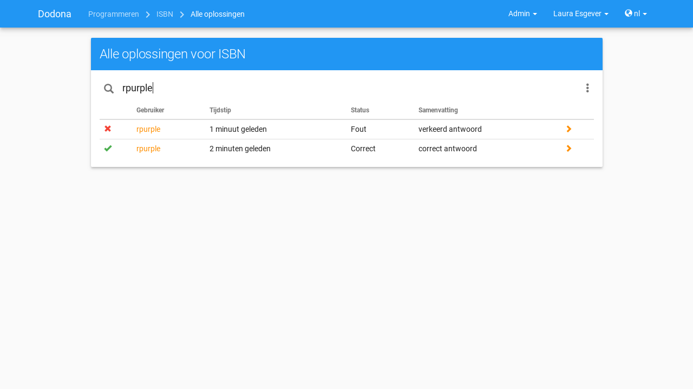
.. TODO:screenshot-rename: nl.staff.course.solutions.search.png

.. TODO:feature-update: nagaan of zowel op gebruikersnaam als op de naam van de gebruiker gezocht wordt

.. _cursusbeheerder oplossingen overzicht menu:

Het overzicht heeft voor :ref:`cursusbeheerders <cursusbeheerder>` ook een :ref:`menu <oefeningenreeks menu>` met filters en acties die voor hen voorbehouden zijn:

.. TODO:feature-update: term "Filter opties" moet in één woord geschreven worden; kan misschien beperkt worden tot "Filters" omwille van de consistentie, want anders zou er ook moeten staan "Actie-opties"
.. TODO:feature-update: menu met filteropties en acties wordt maar deels weergegeven als er bijvoorbeeld nog geen oplossingen ingediend zijn voor de oefening; Z-level van menu verhogen

.. _cursusbeheerder oplossingen overzicht filter recentste correcte:

:guilabel:`Meest recente correcte oplossing per gebruiker` (filter)

    Beperkt het overzicht tot de meest recente correcte oplossing per gebruiker.

    .. TODO:feature-missing: waarom ook geen filter voor meest recente oplossing per gebruiker (niet noodzakelijk correct); op zich lijkt de filter die nu aangeboden wordt een vrij vreemde keuze als enige filter
    .. TODO:feature-missing: waarom ook niet oplossingen voor de deadline van de oefeningenreeks wegfilteren
    .. TODO:feature-missing: zorg ervoor dat de filtercriteria weergegeven worden bovenaan een overzicht; een aantal filtercriteria zullen vastliggen door de actie die naar het overzicht geleid heeft; daarbovenop kan de gebruiker bijkomende filters toepassen die mee in het filtergedeelte aangeboden worden; de zoekbalk kan dan mee opgenomen worden in het filtergedeelte; filteropties moeten dan niet meer via het menu aangeboden worden

.. _cursusbeheerder oplossingen herevalueren:

:guilabel:`Oplossingen herevalueren` (actie)

    Herevalueert alle :ref:`oplossingen <oplossing>` uit het overzicht.

.. TODO:feature-missing: toekennen van labels aan gebruikers binnen de cursus of binnen het plaform
.. TODO:feature-missing: learning analytics van gebruikers binnen de cursus
