.. _cursusbeheer:

Cursusbeheer
============

.. _cursus:
.. _oefeningenreeks:

Een **cursus** vormt een leerpad van :ref:`oefeningen` die gebundeld worden in **oefeningenreeksen**. De opeenvolging van oefeningenreeksen impliceert een mogelijke volgorde waarin :ref:`cursusgebruikers <cursusgebruiker>` de oefeningen kunnen :ref:`oplossen <oplossing indienen>`.

Een :ref:`lesgever <lesgever>` kan onbeperkt :ref:`cursussen <cursus>` :ref:`aanmaken <cursus aanmaken>`. Hij wordt automatisch ook de eerste :ref:`cursusbeheerder <cursusbeheerder>` van een nieuwe cursus. Als cursusbeheerder kan hij andere :ref:`cursusgebruikers <cursusgebruiker>` :ref:`aanduiden <cursusbeheerders aanduiden>` om samen met hem de cursus te beheren. Hij kan echter geen cursussen beheren waarvoor hij geen cursusbeheerder is.

Een :ref:`cursusbeheerder <cursusbeheerder>` stippelt binnen een :ref:`cursus <cursus>` een leerpad uit met :ref:`oefeningen <oefening>` die gegroepeerd worden in :ref:`oefeningenreeksen <oefeningenreeks>`. Voor elke oefeningenreeks kan hij een :ref:`deadline <oefeningenreeks deadline>` instellen die aangeeft tot wanneer er rekening gehouden wordt met :ref:`oplossingen <oplossing>` die cursusgebruikers :ref:`indienen <oplossing indienen>` voor de oefeningen uit de oefeningenreeks. Cursusgebruikers kunnen na de deadline echter onbeperkt oplossingen blijven indienen voor de oefeningen uit de oefeningenreeks en blijven daar nog steeds feedback voor ontvangen.

.. _cursus aanmaken:

Aanmaken van een cursus
-----------------------

Als :ref:`lesgever <lesgever>` maak je een nieuwe :ref:`cursus <cursus>` aan door op de aanmaakknop te drukken in de rechterbovenhoek van het :ref:`cursusoverzicht <cursusoverzicht>`.

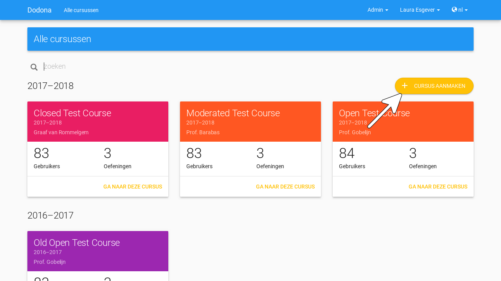

.. _cursus aanmaken formulier:

Je krijgt een formulier te zien waarin je de :ref:`cursuseigenschappen <cursuseigenschappen>` van de nieuwe cursus kunt :ref:`instellen <cursuseigenschappen instellen>`.

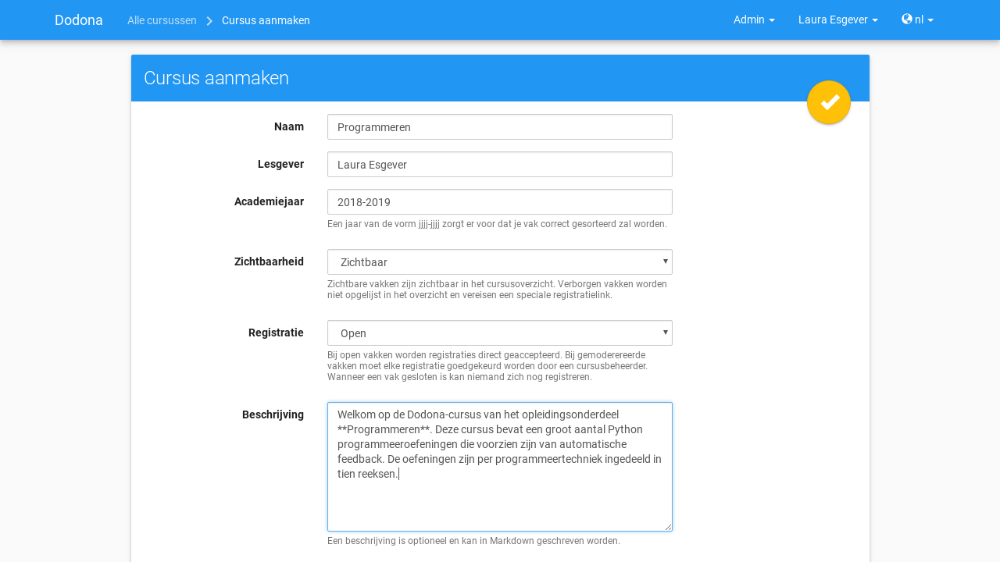

.. TODO:feature-update: vervang titelbalk van cursusbeheerpagina van nieuwe cursus door "Nieuwe cursus", en voeg het academiejaar toe aan de titelbalk van cursusbeheerpagina als het om een bestaande cursus gaat. Het laatst omwille van de consistentie met de cursuspagina waarin naast de naam ook het academiejaar staat.

Druk op de afwerkknop in de rechterbovenhoek van het formulier om de nieuwe :ref:`cursus <cursus>` effectief aan te maken. Daardoor navigeer je naar de :ref:`cursuspagina` waar je kunt vaststellen dat je automatisch voor de cursus :ref:`geregistreerd <registreren>` bent en dat je :ref:`aangeduid <cursusbeheerders aanduiden>` bent als :ref:`cursusbeheerder <cursusbeheerder>` van de cursus.

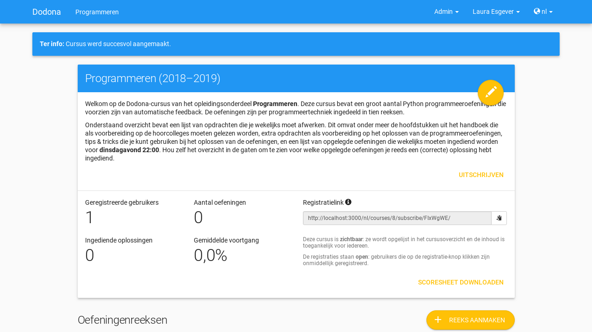

.. TODO:feature-missing: kopiëren van een bestaande cursus

.. _cursuseigenschappen instellen:

Instellen van cursuseigenschappen
---------------------------------

Als :ref:`cursusbeheerder <cursusbeheerder>` kan je de :ref:`eigenschappen <cursuseigenschappen>` van een bestaande :ref:`cursus <cursus>` instellen door op de bewerkknop te drukken in de rechterbovenhoek van de :ref:`cursuspagina <cursuspagina>`.

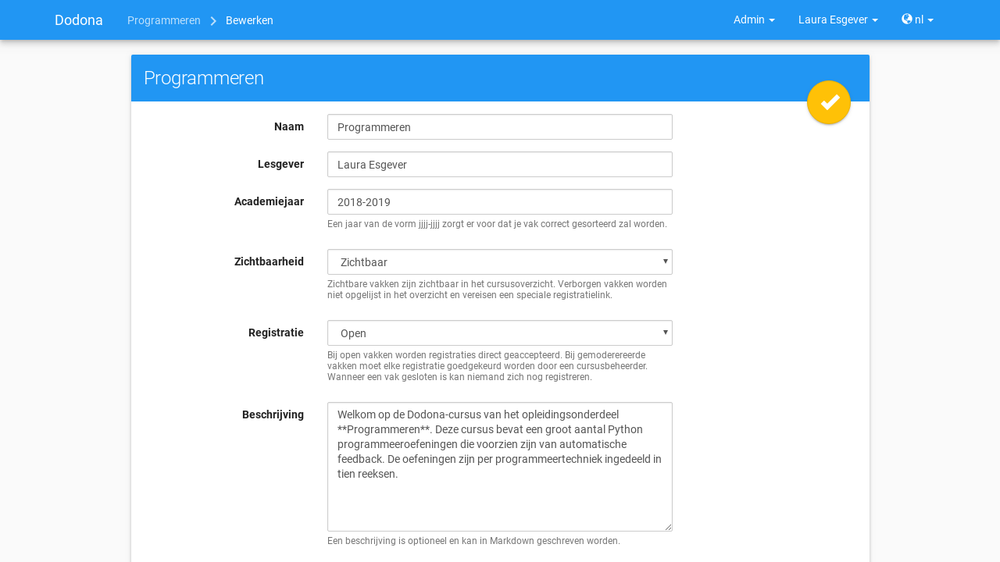

.. _cursuseigenschappen:

Je krijgt een formulier te zien waarin je de volgende **cursuseigenschappen** kunt instellen:

.. _cursuseigenschap naam:

:guilabel:`Naam`

    De naam van de :ref:`cursus <cursus>`.

.. _cursuseigenschap lesgever:

:guilabel:`Lesgever`

    De namen van de lesgevers van de :ref:`cursus <cursus>`. Gebruik een komma om namen te scheiden als er meerdere lesgevers zijn.

    .. TODO:feature-update: Markdown toelaten zodat eventueel ook emailadressen kunnen gekoppeld worden aan de namen van de lesgevers
    .. TODO:feature-update: overwegen om cursusgebruikers te selecteren als lesgevers van een cursus; dan kunnen hun namen aan hun profielpagina gekoppeld worden

.. _cursuseigenschap academiejaar:

:guilabel:`Academiejaar`

    Het academiejaar waarin de :ref:`cursus <cursus>` wordt aangeboden. Gebruik het formaat ``jjjj-jjjj`` om ervoor te zorgen dat de cursus correct gesorteerd wordt op de :ref:`startpagina <startpagina>` en in het :ref:`cursusoverzicht <cursusoverzicht>`. Op Dodona wordt de naam van een cursus altijd in één adem genoemd met het academiejaar waarin de cursus wordt aangeboden.

    .. TODO:feature-update: verplaats academiejaar boven lesgever, omdat de naam en het academiejaar altijd in één adem genoemd worden
    .. TODO:feature-update: vervang academiejaar (typisch voor cursusaanbod in hoger onderwijs in België) door meer generieke oplossing: optionele start- en einddatum waarbinnen de cursus wordt aangeboden; de starpagina en het cursusoverzicht kunnen dan ingedeeld worden volgens lopende cursussen, toekomstige cursussen en afgelopen cursussen; zonder startdatum wordt de cursus altijd aangeboden voor de einddatum; zonder einddatum wordt de cursus altijd aangeboden na de startdatum; zonder start- en einddatum wordt de cursus altijd aangeboden

.. _cursuseigenschap zichtbaarheid:

:guilabel:`Zichtbaarheid`

    Deze :ref:`cursuseigenschap <cursuseigenschappen>` bepaalt of :ref:`niet-geregistreerde <registreren>` gebruikers zelf de :ref:`cursus <cursus>` kunnen :ref:`selecteren <cursus selecteren>` in het :ref:`cursusoverzicht <cursusoverzicht>`. Kies :guilabel:`Zichtbaar` of :guilabel:`Verborgen` als je de cursus wel of niet wilt laten oplijsten in het cursusoverzicht. Als je :guilabel:`Verborgen` kiest dan kunnen gebruikers zich enkel voor de cursus registreren als je hen :ref:`uitnodigt <cursusgebruikers uitnodigen>` met een :ref:`registratielink <registratielink>`.

    .. TODO:tutorial-update: hier moet uitleg die correspondeert met de bescherming om naar een cursus te navigeren zonder tokenlink
    .. TODO:tutorial-update: wie kan de cursus wel/niet zien in het cursusoverzicht? kunnen lesgevers verborgen cursussen zien?
    .. TODO:tutorial-update: verborgen cursussen vereisen een token om naar de cursuspagina te kunnen navigeren; zonder dit token wordt een waarschuwing getoond die we hier ook moeten omschrijven; dit token zit bijvoorbeeld in de registratielink
    .. TODO:feature-update: vervang de term "vakken" door "cursussen" in de omschrijving van dit veld op Dodona

.. _registratieprocedure:
.. _cursuseigenschap registratie:

:guilabel:`Registratie`

    Deze :ref:`cursuseigenschap <cursuseigenschappen>` bepaalt de **registratieprocedure** waarmee gebruikers zich voor de :ref:`cursus <cursus>` kunnen :ref:`registreren <registreren>`:

    .. _open registratieprocedure:
    .. _gemodereerde registratieprocedure:
    .. _gesloten registratieprocedure:

    .. list-table::
      :header-rows: 1

      * - optie
        - registratieprocedure
        - beschrijving

      * - :guilabel:`Open`
        - open
        - alle gebruikers kunnen zich :ref:`registreren <registreren>` voor de :ref:`cursus <cursus>` zonder expliciete goedkeuring van een :ref:`cursusbeheerder <cursusbeheerder>`

      * - :guilabel:`Gemodereerd`
        - gemodereerd
        - alle gebruikers kunnen een :ref:`registratieverzoek <registratieverzoek>` :ref:`indienen <registratieverzoek indienen>` voor de :ref:`cursus <cursus>` maar zijn pas :ref:`geregistreerd <registreren>` als een :ref:`cursusbeheerder <cursusbeheerder>` hun registratieverzoek heeft :ref:`goedgekeurd <registratieverzoek goedkeuren>`

      * - :guilabel:`Gesloten`
        - gesloten
        - gebruikers kunnen zich niet meer :ref:`registreren <registreren>` voor de :ref:`cursus <cursus>`

          .. TODO:feature-update: vervang de term "vakken" door "cursussen" in de omschrijving van dit veld op Dodona

    .. important::

        Als je deze :ref:`cursuseigenschap <cursuseigenschap>` aanpast dan blijven bestaande :ref:`registraties <registreren>` voor de :ref:`cursus <cursus>` gelden en blijven openstaande :ref:`registratieverzoeken <registratieverzoek>` voor de cursus bestaan.

    .. TODO:feature-update: bijkomende mogelijkheden voorzien, bijvoorbeeld selectief automatisch goedkeuren van alle gebruikers van bepaalde instellingen; op die manier kan je die cursus openzetten voor bepaalde instellingen en registratieverzoeken van andere gebruikers modereren

.. _cursuseigenschap beschrijving:

:guilabel:`Beschrijving`

    Een optionele beschrijving die gebruikers te zien krijgen bovenaan de :ref:`cursuspagina <cursuspagina>`. Voor het opmaken van de beschrijving kan je gebruik maken van :ref:`Markdown <markdown>`.

    .. _mardown:

    .. important::

    Markdown
    ^^^^^^^^

    De beschrijving van eigenschappen die aangeduid worden met het Markdown-logo kan geschreven worden met behulp van `Markdown <https://en.wikipedia.org/wiki/Markdown>`_. Dodona maakt voor de weergave van Markdown gebruik van `kramdown `<https://kramdown.gettalong.org>`_ waardoor heel wat uitbreidingen van de standaard Markdown ondersteund worden.

.. _cursuseigenschap registratielink:

:guilabel:`Registratielink`

    Bij het :ref:`aanmaken <cursus aanmaken>` van een :ref:`cursus <cursus>` wordt automatisch een :ref:`registratielink <registratielink>` met een willekeurig token gegenereerd. Druk op de vernieuwknop naast de registratielink om de cursus opnieuw te :ref:`verbergen <cursuseigenschap zichtbaarheid>` nadat de registratielink gedeeld werd.

Druk op de afwerkknop in de rechterbovenhoek van het formulier om de :ref:`cursuseigenschappen <cursuseigenschappen>` effectief in te stellen.

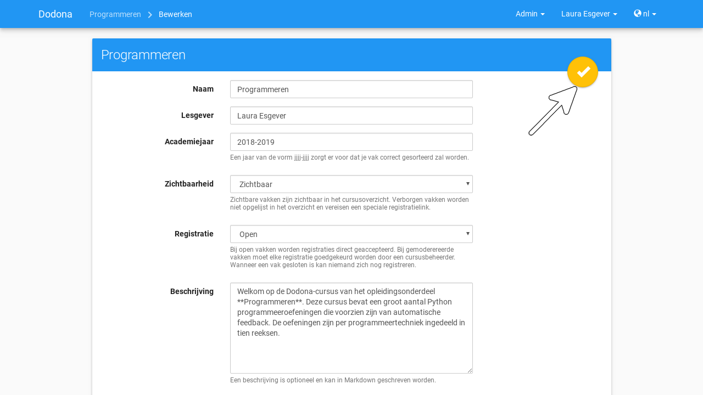

.. TODO:feature-update: de term "registration link" is niet vertaald naar "registratielink" op het formulier waar de cursuseigenschappen kunnen ingesteld worden

Daarna keer je terug naar de :ref:`cursuspagina <cursuspagina>` en worden de nieuwe :ref:`cursuseigenschappen <cursuseigenschappen>` van kracht.

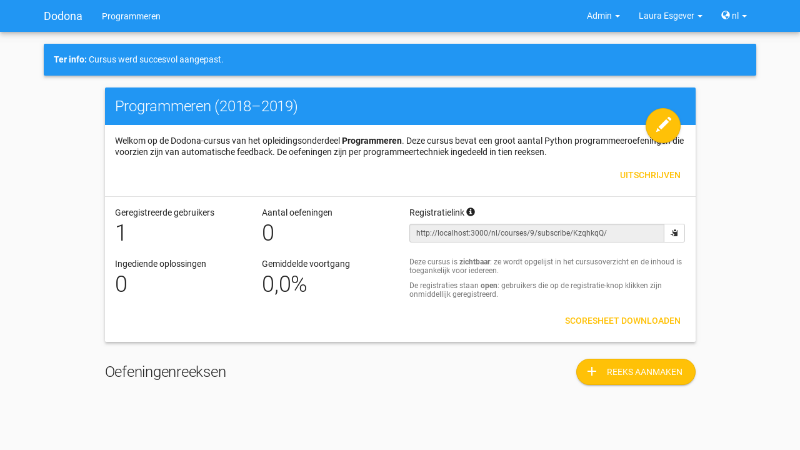

.. _registratielink:
.. _cursusgebruikers uitnodigen:

Uitnodigen van cursusgebruikers
-------------------------------

Bij het :ref:`aanmaken <cursus aanmaken>` van een :ref:`cursus <cursus>` wordt automatisch een **registratielink** gegenereerd. Als afschermingsmechanisme bevat de registratielink een token dat gebruikers nodig hebben om toegang te krijgen tot de cursus als die door een cursusbeheerder verborgen werd. Zonder dit token kunnen ze niet :ref:`navigeren <cursus navigeren>` naar de :ref:`cursuspagina <cursuspagina>`.

.. TODO:screenshot-missing: screenshot van de cursuspagina van een gesloten cursus die bezocht wordt zonder token

Als :ref:cursusbeheer <cursusbeheerder>` kan je de :ref:`registratielink <registratielink>` delen om gebruikers uit te nodigen om zich voor de cursus te :ref:`registreren <cursus registreren>`. Als gebruikers de registratielink volgen dan :ref:`navigeren <cursus navigeren>` ze rechtstreeks naar de cursus zonder dat ze die zelf moeten :ref:`zoeken <cursus zoeken>` in het :ref:`cursusoverzicht <cursusoverzicht>`. Als ze nog niet geregistereerd waren dan krijgen ze bovendien meteen een verzoek om de zich voor de cursus te registreren.

.. TODO:screenshot-missing: screenshot van registratieverzoek dat gebruiker te zien krijgt als hij de registratielink volgt voor een cursus waarvoor hij nog niet geregistreerd was

Als :ref:cursusbeheer <cursusbeheerder>` vind je de :ref:`registratielink <registratielink>` bovenaan de :ref:`cursuspagina <cursuspagina>`.

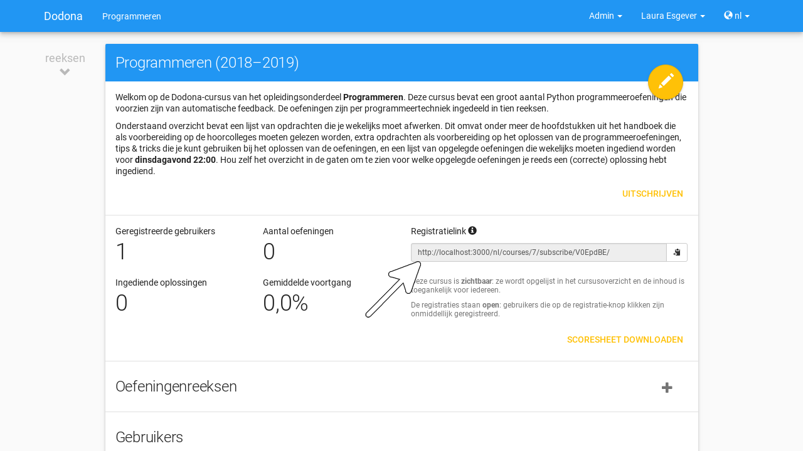

.. _registratielink kopiëren:

Druk op de kopieerknop naast de :ref:`registratielink <registratielink>` om de link naar het klembord te kopiëren.

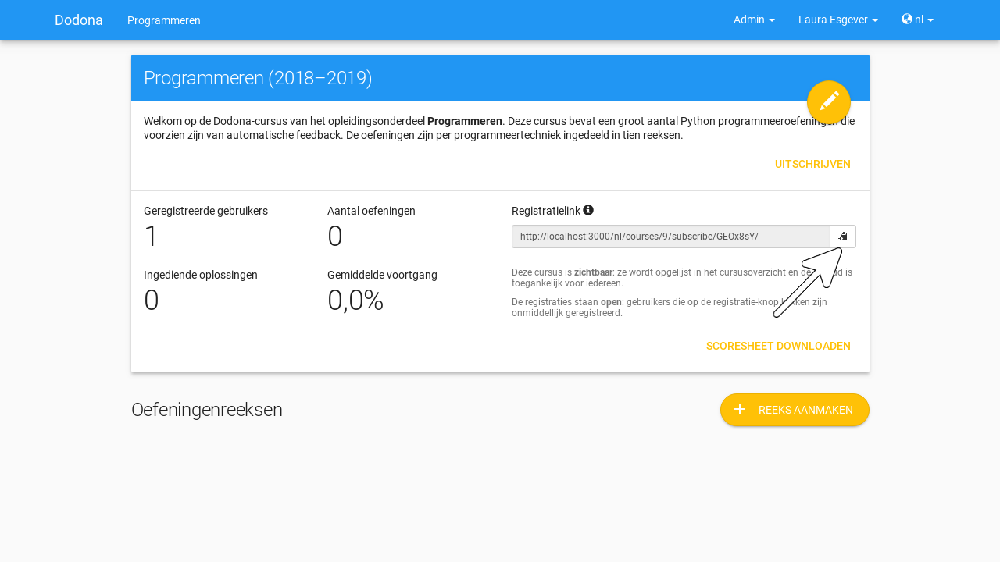

.. _registratielink vernieuwen:

Een :ref:`verborgen <cursuseigenschap zichtbaarheid>` :ref:`cursus <cursus>` kan enkel gevonden worden door gebruikers die de :ref:`registratielink <registratielink>` kennen. Nadat de registratielink gedeeld werd kan je bij het :ref:`instellen <cursuseigenschappen instellen>` van de :ref:`eigenschappen <cursuseigenschappen>` van de cursus echter een nieuwe registratielink laten genereren om daarmee de cursus opnieuw te verbergen. Druk daarvoor op de vernieuwknop naast de registratielink.

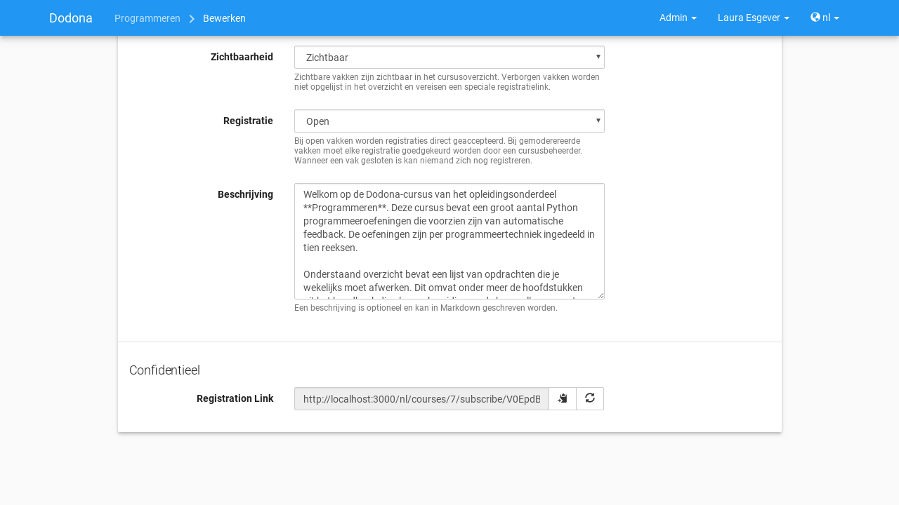

.. TODO:feature-update: omdat de identifiers oplopend genummerd worden en ook gebruikt worden in de URL van een cursus, is het vrij eenvoudig om verborgen cursussen te vinden; heeft het vernieuwen van een registratielink dan wel zin als een manier om de cursus opnieuw te verbergen? ofwel mis ik nog iets om te begrijpen waardoor het opnieuw genereren van de registratielink de cursus opnieuw verbergt

.. _cursusgebruiker:
.. _cursusgebruikersoverzicht:
.. _cursusgebruikers beheren:

Beheren van cursusgebruikers
----------------------------

Als :ref:`cursusbeheerder <cursusbeheerder>` van een :ref:`cursus <cursus>` zie je onderaan de :ref:`cursuspagina <cursuspagina>` een **cursusgebruikersoverzicht** waarin de gebruikersnaam, de naam, het emailadres en :ref:`voortgangsstatistieken <cursusgebruiker voortgangsstatistieken>` opgelijst worden uit het :ref:`gebruikersprofiel <gebruikersprofiel>` van alle **cursusgebruikers**. Dit zijn alle gebruikers die ooit voor de cursus :ref:`geregistreerd <registreren>` geweest zijn of die ooit een :ref:`registratieverzoek <registratieverzoek>` voor de cursus ingediend hebben.

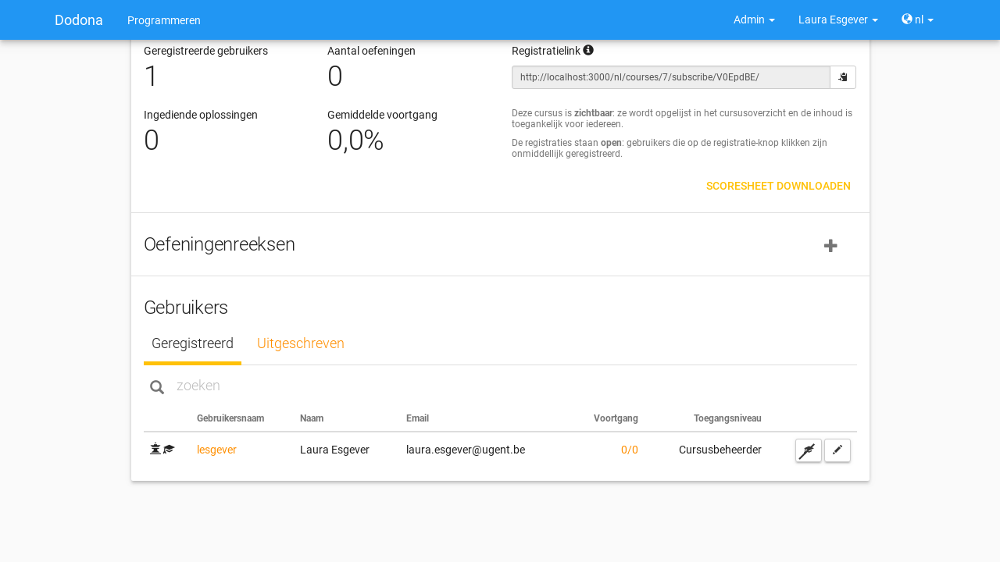

.. TODO:tutorial-missing: uitleggen van de betekenis van de voortgangsstatistieken

.. _cursus beheersrechten icoontje:
.. _cursusgebruiker voortgangsstatistieken:

Het :ref:`zoeken <gebruiker zoeken>`, :ref:`selecteren <gebruiker selecteren>` en :ref:`bewerken <gebruikersprofiel bewerken>` van gebruikers verloopt op dezelfde manier als in het :ref:`gebruikersoverzicht <gebruikersoverzicht>`. Naast de gebruikelijke :ref:`icoontjes <gebruiker beheersrechten icoontje>` die de lesgevers en beheerders aangeven, gebruikt het :ref:`cursusgebruikersoverzicht <cursusgebruikersoverzicht>` een bijkomend icoontje om de cursusbeheerders aan te geven.

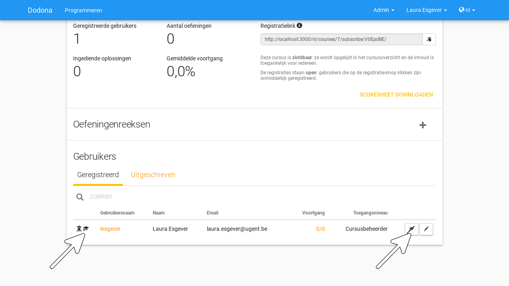

.. TODO:update-feature: plaats icoontje van cursusbeheerders voor het icoontje van lesgevers en beheerders, omdat de sortering van gebruikers eerst gebeurt op cursusbeheerstatus, dan op beheerstatus en dan alfabetisch (op gebruikersnaam !! kan dit op naam ??)

In het :ref:`cursusgebruikersoverzicht <cursusgebruikersoverzicht>` kan je de :ref:`registratiestatus <registratiestatus>` van :ref:`cursusgebruikers <cursusgebruiker>` :ref:`aanpassen <registratiestatus aanpassen>` en :ref:`cursusbeheerders <cursusbeheerder>` :ref:`aanduiden <cursusbeheerders aanduiden>`.

.. _registratiestatus:
.. _registratiestatus aanpassen:

Aanpassen van de registratiestatus
^^^^^^^^^^^^^^^^^^^^^^^^^^^^^^^^^^

In het :ref:`cursusgebruikersoverzicht <cursusgebruikersoverzicht>` worden de :ref:`cursusgebruikers <cursusgebruiker>` gegroepeerd op basis van hun **registratiestatus**. De cursusgebruikers van elke groep worden in een afzonderlijke tab opgelijst:

.. list-table::
  :header-rows: 1

  * - tab
    - groep

  * - :guilabel:`Geregistreerd`
    - alle :ref:`cursusgebruikers <cursusgebruiker>` die :ref:`geregistreerd <registreren>` zijn voor de :ref:`cursus <cursus>`

  * - :guilabel:`Uitgeschreven`
    - alle :ref:`cursusgebruikers <cursusgebruiker>` die ooit :ref:`geregistreerd <registreren>` waren voor de :ref:`cursus <cursus>`, maar die ondertussen :ref:`uitgeschreven <cursus uitschrijven>` zijn voor de cursus

  * - :guilabel:`Op de wachtlijst`
    - alle :ref:`cursusgebruikers <cursusgebruiker>` waarvoor er nog een :ref:`registratieverzoek <registratieverzoek>` openstaat dat wacht op :ref:`afhandeling <registratieverzoek afhandelen>` van een :ref:`cursusbeheerder <cursusbeheerder>`

.. _registratieverzoek afkeuren:
.. _registratieverzoek goedkeuren:
.. _registratieverzoeken afhandelen:

Elke tab van het :ref:`cursusgebruikersoverzicht <cursusgebruikersoverzicht>` heeft eigen actieknoppen om de :ref:`registratiestatus <registratiestatus>` van gebruikers aan te passen:

.. list-table::
  :header-rows: 1

  * - tab
    - knop
    - actie

  * - :guilabel:`Geregistreerd`
    - .. image:: images/staff_registration_icons/unregister.png
    - cursusgebruiker uitschrijven uit de cursus

      .. TODO:feature-missing: cursusbeheerders kunnen geen (andere) cursusbeheerders uitschrijven uit de cursus; is dat de bedoeling, of zou dat wel moeten kunnen zolang op die manier niet de laatste cursusbeheerder uit de cursus verdwijnt als een cursusbeheerder zichzelf uitschrijft
      .. TODO:feature-missing: als cursusbeheerder kan je enkel bestaande cursusgebruikers registreren, en heb je niet de mogelijkheid om andere gebruikers te registren voor een cursus, behalve dan het gebruikersaccount van de gebruiker overnemen en in naam van de gebruiker de registratie uitvoeren (als dit kan); dit zou eventueel een manier zijn om als cursusbeheerder een gebruiker in te schrijven voor een cursus die werkt met gesloten registratie

  * - :guilabel:`Uitgeschreven`
    - .. image:: images/staff_registration_icons/register.png
    - cursusgebruiker terug registreren voor de cursus

  * - :guilabel:`Registratieverzoeken`
    - .. image:: images/staff_registration_icons/approve.png
    - goedkeuren van het :ref:`registratieverzoek <registratieverzoek>` dat door de gebruiker werd :ref:`ingediend <registratieverzoek indienen>`, waardoor de gebruiker :ref:`geregistreerd <registreren>` wordt voor de cursus

  * - :guilabel:`Registratieverzoeken`
    - .. image:: images/staff_registration_icons/decline.png
    - afkeuren van het :ref:`registratieverzoek <registratieverzoek>` dat door de gebruiker werd :ref:`ingediend <registratieverzoek indienen>`, waardoor de gebruiker :ref:`uitgeschreven <cursus uitschrijven>` wordt uit de cursus

.. TODO:update-feature: cursusbeheerder mogelijkheid geven om een reden op te geven waarom een registratieverzoek wordt afgekeurd
.. TODO:update-feature: notification/email sturen naar de gebruiker wanneer een registratieverzoek wordt goedgekeurd/afgekeurd

.. TODO:tutorial-missing: wat zijn de regels voor het uitschrijven als de laatste cursusbeheerder zich uit een cursus wil uitschrijven

.. _cursusbeheerders aanduiden:

Aanduiden van cursusbeheerders
^^^^^^^^^^^^^^^^^^^^^^^^^^^^^^

.. _cursusbeheerder:

Onder de :ref:`geregistreerde <registreren>` gebruikers van een :ref:`cursus <cursus>` onderscheiden we studenten en **cursusbeheerders**, waarbij enkel cursusbeheerders een bestaande cursus kunnen beheren. De lesgever die de cursus heeft aangemaakt wordt automatisch geregistreerd voor de cursus en wordt meteen ook de eerste cursusbeheerder ervan. Lesgevers kunnen echter geen cursussen beheren waarvoor ze geen cursusbeheerder zijn.

In de tab :guilabel:`Geregistreerd` van het :ref:`cursusgebruikersoverzicht <cursusgebruikersoverzicht>` kan je de volgende actieknoppen gebruiken om cursusbeheerders aan te duiden:

.. list-table::
  :header-rows: 1

  * - knop
    - actie

  * - .. image:: images/staff_registration_icons/make_course_admin.png
    - student promoveren tot cursusbeheerder

  * - .. image:: images/staff_registration_icons/make_student.png
    - cursusbeheerder degraderen tot student

.. important::

    Een :ref:`cursusbeheerder <cursusbeheerder>` die zich :ref:`uitschrijft <cursus uitschrijven>` uit een :ref:`cursus <cursus>` verliest zijn status van cursusbeheerder voor de een cursus. Om ervoor te zorgen dat een cursus altijd minstens één cursusbeheerder heeft, kan de laatste cursusbeheerder zich niet uitschrijven uit de cursus en kan hij zichzelf binnen de cursus dan ook niet degraderen tot student.

.. TODO:update-feature: het bovenstaande statement is op dit moment niet het geval voor wat betreft het feit dat een cursusbeheerder zijn status verliest als hij zich uitschrijft in Dodona, maar dat zou wel zo moeten zijn

.. TODO:feature-update: verhuis overzicht en beheer van cursusgebruikers naar de cursusbeheerspagina

.. _leerpad:
.. _leerpad opbouwen:

Uitstippelen van een leerpad
----------------------------

Als :ref:`cursusbeheerder <cursusbeheerder>` kan je binnen een :ref:`cursus <cursus>` een **leerpad** uitstippelen dat bestaat uit een opeenvolging van :ref:`oefeningenreeksen <oefeningenreeks>`. Voor elke oefeningenreeks kan je een :ref:`deadline <oefeningenreeks deadline>` instellen die aangeeft tot wanneer er rekening gehouden wordt met :ref:`oplossingen <oplossing>` die :ref:`cursusgebruikers <cursusgebruiker>` :ref:`indienen <oplossing indienen>` voor de oefeningen uit de oefeningenreeks.

.. _oefeningenreeks toevoegen:

De :ref:`oefeningenreeksen <oefeningenreeks>` van een :ref:`cursus <cursus>` worden opgelijst onder de hoofding :guilabel:`Oefeningenreeksen` op de :ref:`cursuspagina <cursuspagina>`. Druk op de knop :guilabel:`REEKS TOEVOEGEN` om een nieuwe oefeningenreeks aan het :ref:`leerpad <leerpad>` toe te voegen.

.. TODO:feature-update: overwegen op de hoofding "Oefeningenreeksen" op de cursuspagina te vervangen door de term "Leerpad"

.. TODO:screenshot-missing: screenshot van cursuspagina waarop al een aantal oefeningenreeksen te zien zijn, en waar de knop "REEKS TOEVOEGEN" wordt aangeduid

.. _oefeningenreeks eigenschappen instellen:

Je krijgt het formulier :guilabel:`Nieuwe oefeningenreeks` te zien waarin je de :ref:`eigenschappen <oefeningenreeks eigenschappen>` van de nieuwe :ref:`oefeningenreeks <oefeningenreeks>` kunt instellen.

.. TODO:feature-update: vervang de titel "Reeks aanmaken" door de titel "Nieuwe oefeningenreeks"

.. TODO:screenshot-missing: screenshot van formulier "Nieuwe oefeningenreeks"

.. _oefeningenreeks eigenschappen:

Voor een oefeningenreeks kunnen de volgende eigenschappen ingesteld worden:

.. TODO:feature-update: cursus waaraan een oefeningenreeks gekoppeld is kan op dit moment nog ingesteld worden, maar dat zou niet mogen; deze eigenschap kan eventueel wel read-only weergegeven worden in het formulier zodat je ziet aan welke cursus de reeks gekoppeld is

.. _oefeningenreeks naam:

:guilabel:`Naam`

    De naam van de :ref:`oefeningenreeks <oefeningenreeks>`. Binnen een cursus kunnen verschillende oefeningenreeksen dezelfde naam hebben. Het is echter aangeraden om alle oefeningenreeksen binnen een cursus een unieke naam te geven.

.. _oefeningenreeks deadline:

:guilabel:`Deadline`

    Een optionele deadline die aangeeft tot wanneer er rekening gehouden wordt met :ref:`oplossingen <oplossing>` die :ref:`cursusgebruikers <cursusgebruiker>` :ref:`indienen <oplossing indienen>` voor :ref:`oefeningen <oefening>` uit de :ref:`oefeningenreeks <oefeningenreeks>`. Cursusgebruikers kunnen na de deadline onbeperkt oplossingen blijven indienen voor oefeningen uit de oefeningenreeks en blijven daar nog steeds een beoordeling en feedback voor ontvangen. Er wordt met deze oplossingen echter geen rekening meer gehouden bij het bepalen van de :ref:`indienstatus <oefeningenreeks oefening indienstatus>` van cursusgebruikers voor oefeningen uit de oefeningenreeks.

    Als er geen deadline wordt ingesteld voor de :ref:`oefeningenreeks <oefeningenreeks>` dan wordt er blijvend rekening gehouden met :ref:`oplossingen <oplossing>` die :ref:`cursusgebruikers <cursusgebruiker>` :ref:`indienen <oplossing indienen>` bij het bepalen van hun :ref:`indienstatus <oefeningenreeks oefening indienstatus>` voor :ref:`oefeningen <oefening>` uit de oefeningenreeks.

    Klik op het invulveld of druk op de kalenderknop om de datum en het tijdstip van de deadline in te stellen. Selecteer de deadline in de :ref:`tijdzone <gebruikersprofiel tijdzone>` die je hebt `ingesteld <gebruikersprofiel instellen>` in je :ref:`gebruikersprofiel <gebruikersprofiel>`. Andere gebruikers krijgen de deadline te zien in de tijdzone die ze in hun gebruikersprofiel hebben ingesteld.

    .. TODO:screenshot-missing: screenshot van uitgeklapte date picker waarbij de kalenderknop wordt aangeduid

    Druk op de verwijderknop om een ingestelde deadline te wissen.

    .. TODO:screenshot-missing: screenshot van ingestelde deadline waarbij de verwijderknop wordt aangeduid

    .. important::

        Als de deadline aangepast wordt dan krijgen cursusgebruikers meteen een :ref:`indienstatus <oefeningenreeks oefening indienstatus>` voor de oefeningen uit de oefeningenreeks die aangepast wordt aan de nieuwe instelling.

.. _oefeningenreeks zichtbaarheid:

:guilabel:`Zichtbaarheid`

    De zichtbaarheid bepaalt of gebruikers de :ref:`oefeningenreeks <oefeningenreeks>` kunnen zien. Voor deze eigenschap kunnen de volgende waarden ingesteld worden:

    .. _oefeningenreeks zichtbaarheid open:

    :guilabel:`Open`

        Alle gebruikers zien de oefeningenreeks onder de hoofding :guilabel:`Oefeningenreeksen` op de :ref:`cursuspagina <cursuspagina>`.

    .. _oefeningenreeks zichtbaarheid verborgen:

    :guilabel:`Verborgen`

        Enkel :ref:`cursusbeheerders <cursusbeheerder>` zien de :ref:`oefeningenreeks <oefeningenreeks>` onder de hoofding :guilabel:`Oefeningenreeksen` op de :ref:`cursuspagina <cursuspagina>`. Om hen erop te wijzen dat andere gebruikers de oefeningenreeks pas kunnen zien als ze de :ref:`geheime link <oefeningenreeks geheime link>` kennen, staat er een duidelijke mededeling bij.

        .. TODO:screenshot-missing: screenshot van weergave van verborgen oefeningenreeks voor een cursusbeheerder, waarop de mededeling wordt aangeduid

    .. _oefeningenreeks zichtbaarheid gesloten:

    :guilabel:`Gesloten`

        Enkel :ref:`cursusbeheerders <cursusbeheerder>` zien de :ref:`oefeningenreeks <oefeningenreeks>` onder de hoofding :guilabel:`Oefeningenreeksen` op de :ref:`cursuspagina <cursuspagina>`. Om hen erop te wijzen dat andere gebruikers de oefeningenreeks daar niet kunnen zien, staat er een duidelijke mededeling bij.

    .. TODO:screenshot-missing: screenshot van weergave van gesloten oefeningenreeks voor een cursusbeheerder, waarop de mededeling wordt aangeduid

.. _oefeningenreeks token:
.. _oefeningenreeks geheime link:

:guilabel:`Geheime link`

    Bij het :ref:`aanmaken <oefeningenreeks aanmaken>` van de :ref:`oefeningenreeks <oefeningenreeks>` wordt automatisch een **token** gegenereerd waarmee de  oefeningenreeks :ref:`zichtbaar <oefeningenreeks zichtbaarheid>` kan gemaakt worden als ze :ref:`verborgen <oefeningenreeks zichtbaarheid verborgen>` werd. Dit token zit vervat in de **geheime link** voor de oefeningenreeks.

    .. TODO:feature-update: inconsistentie tussen de "registratielink" voor cursussen die genereerd wordt op het moment dat de cursus aangemaakt en de "geheime link" voor oefeningenreeksen die aangemaakt wordt op het moment dat de oefeningenreeks op verborgen gezet wordt; oplossing voor cursussen lijkt beter, omdat het token behouden blijft als de zichtbaarheid van de cursus aangepast wordt en expliciet opnieuw kan gegenereerd worden; nu gaat bij het (tijdelijk) aanpassen van de zichtbaarheid van een cursus het token verloren; op die manier staat de geheime link ook altijd op het formulier en kunnen we die hier ook beter bespreken

    .. _oefeningenreeks geheime link kopiëren:

    Als :ref:`cursusbeheerder <cursusbeheerder>` krijg je de verantwoordelijkheid om de :ref:`geheime link <oefeningenreeks geheime link>` te delen met andere gebruikers die de oefeningenreeks mogen zien. Druk op de kopieerknop om de geheime link naar het klembord te kopiëren.

    .. TODO:feature-update: screenshot van formulier waarop eigenschappen van oefeningenreeks worden ingesteld, waarbij kopieerknop naast geheime link wordt aangeduid

.. _oefeningenreeks geheime link gebruiken:

    Als :ref:`cursusgebruikers <cursusgebruiker>` de geheime link van een :ref:`verborgen <oefeningenreeks zichtbaarheid verborgen>` :ref:`oefeningenreeks <oefeningenreeks>` gebruiken dan krijgen ze de oefeningenreeks toch te zien.

    .. TODO:screenshot-missing: screenshot van cursusgebruiker die verborgen oefeningenreeks zichtbaar gemaakt heeft met behulp van de geheime link

    .. TODO:feature-update: cursusgebruikers zouden initieel ook een stub voor de oefeningenreeks kunnen te zien krijgen, met de mogelijkheid om die te ontsluiten door het token in te vullen; na het invullen van het token (of bij gebruik van de tokenlink) wordt de oefeningenreeks wel weergegeven op de cursuspagina (moet dan in cookies opgeslagen worden, zodat gebruiker die niet telkens opnieuw moet invullen). Gebruiken van geheime link heeft dan hetzelfde effect als het invullen van het token bij de stuk van de oefeningenreeks

.. _oefeningenreeks token vernieuwen:
.. _oefeningenreeks geheime link vernieuwen:

    Druk op de vernieuwknop naast de :ref:`geheime link <oefeningenreeks geheime link>` om de :ref:`oefeningenreeks <oefeningenreeks>` opnieuw te :ref:`verbergen <cursuseigenschap zichtbaarheid verborgen>` nadat de geheime link gedeeld werd.

    .. TODO:screenshot-missing: screenshot van formulier waarop eigenschappen van oefeningenreeks worden ingesteld, waarbij vernieuwknop naast geheime link wordt aangeduid

    Daardoor wordt een nieuw token gegenereerd voor de oefeningenreeks en wordt het oude token onbruikbaar gemaakt. Als :ref:`cursusgebruikers <cursusgebruiker>` een geheime link met een verouderd token gebruiken, dan krijgen ze een :ref:`verborgen <oefeningenreeks zichtbaarheid verborgen>` :ref:`oefeningenreeks <oefeningenreeks>` niet te zien.

    .. TODO:screenshot-missing: screenshot dat aangeeft wat er gebeurt als een cursusgebruiker een verouderd token gebruikt

    .. TODO:feature-update: screenshot van formulier waarop eigenschappen van oefeningenreeks worden ingesteld, waarbij vernieuwknop naast geheime link wordt aangeduid

.. _oefeningenreeks beschrijving:

:guilabel:`Beschrijving`

    Een optionele beschrijving die gebruikers te zien krijgen bij de weergave van de oefeningenreeks op de :ref:`cursuspagina <cursuspagina>`. Voor het opmaken van de beschrijving kan je gebruik maken van :ref:`Markdown <markdown>`.

Druk op de afwerkknop in de rechterbovenhoek van het :ref:`formulier <oefeningenreeks eigenschappen instellen>` om effectief de nieuwe :ref:`oefeningenreeks <oefeningenreeks>` aan het :ref:`leerpad <leerpad>` :ref:`toe te voegen <oefeningenreeks toevoegen>`.

.. TODO:screenshot-missing: screenshot van formulier voor nieuwe cursus waarin de afwerkknop wordt aangeduid

.. _oefeningenreeks oefeningen:
.. _oefeningenreeks oefeningen aanpassen:

Je ziet nu een uitgebreide versie van het formulier waarin je naast het :ref:`instellen <oefeningenreeks eigenschappen instellen>` van :ref:`eigenschappen <oefeningenreeks eigenschappen>` ook oefeningen kunt koppelen aan de :ref:`oefeningenreeks <oefeningenreeks>`.

.. TODO:feature-update: verschillende secties maken voor de oefeningenreeks: eigenschappen, oefeningen, statistieken, ...

.. important::

    We veronderstellen hier dat de :ref:`oefeningen <oefening>` die aan de :ref:`oefeningenreeks <oefeningenreeks>` moeten gekoppeld worden reeds beschikbaar zijn in Dodona. In :ref:`oefeningen toevoegen` bespreken we hoe het toevoegen van :ref:`oefeningen <oefening>` verloopt.

.. _oefeningenreeks oefeningen zoeken:

Gebruik de zoekbalk onder de hoofding :guilabel:`Oefeningen toevoegen` om te zoeken naar specifieke :ref:`oefeningen <oefening>` op basis van een naam of een padnaam. Hierbij wordt gezocht in alle beschikbare vertalingen voor de naam van de oefeningen.

.. TODO:feature-update: verdeel alle beschikbare oefeningen over drie tabs met hoofdingen "standaard" (beschikbare oefeningen die als standaardoefeningen zijn opgenomen in de oefeningenreeks), "extra" (beschikbare oefeningen die als extra oefeningen zijn opgenomen in de oefeningenreeks)" en "beschikbaar" (beschikbare oefeningen die niet opgenomen zijn in de oefeningenreeks); op die manier is er meer ruimte om de oefeningen met wat bijkomende info weer te geven (bijvoorbeeld programmeertaal); zoek beschikbare oefeningen op in de tab "beschikbaar" en voeg die via actieknopppen toe aan de standaard of extra oefeningen; gebruik actieknoppen om oefeningen tussen de tabs te verplaatsen; gebruik dynamische queries om oefeningen aan de verschillende tabs toe te wijzen, bijvoorbeeld "alle 'Python'-oefeningen uit repository 'xxx' met tag 'lussen' of uit pad 'reeks04/moeilijk'"
.. TODO:feature-update: mogelijk bieden om te zoeken in de beschrijving van de oefening (traag, zeker als verplaatst naar bestandssysteem)

.. TODO:screenshot-missing: screenshot waarin gezocht wordt naar oefeningen

.. _oefeningenreeks oefening toevoegen:

Druk op de toevoegknop aan de rechterkant om een :ref:`oefeningen <oefening>` aan de :ref:`oefeningenreeks <oefeningenreeks>` toe te voegen.

.. TODO:screenshot-missing: screenshot waarin het toevoegen van een oefening aan een oefeningenreeks geïllustreerd wordt

.. _oefeningenreeks oefening verwijderen:

Druk op de verwijderknop aan de rechterkant om een :ref:`oefeningen <oefening>` uit de :ref:`oefeningenreeks <oefeningenreeks>` te verwijderen.

.. TODO:screenshot-missing: screenshot waarin het verwijderen van een oefening uit een oefeningenreeks geïllustreerd wordt

.. _oefeningenreeks oefeningen herschikken:

Gebruik de verplaatsknop aan de linkerkant om :ref:`oefeningen <oefening>` binnen een :ref:`oefeningenreeks <oefeningenreeks>` te rangschikken. De volgorde waarin de oefeningen gerangschikt worden, is ook de volgorde waarin de oefeningen zullen :ref:`weergegeven <oefeningenreeks weergeven>` worden in de oefeningenreeks.

.. TODO:screenshot-missing: screenshot waarin het verplaatsen van oefeningen in een oefeningenreeks geïllustreerd wordt

.. TODO:feature-missing: mogelijkheid bieden om oefeningen in een vaste volgorde aan te bieden of in een dynamische volgorde (bijvoorbeeld alfabetisch, stijgende moeilijkheidsgraad, ...)

Druk op de afwerkknop in de rechterbovenhoek van het formulier om het bewerken van de oefeningenreeks af te sluiten.

.. TODO:screenshot-missing: screenshot van formulier voor het bewerken van de oefeningen van een oefeningenreeks waarin de afwerkknop wordt aangeduid

Daardoor navigeer je naar de :ref:`weergave <oefeningenreeks weergeven>` van de :ref:`oefeningenreeks <oefeningenreeks>` op de :ref:`cursuspagina <cursuspagina>`, waarbij je ziet dat de oefeningenreeks aan de bovenkant van het leerpad toegevoegd werd. Op die manier wordt het leerpad in omgekeerde chronologische volgorde (eerste oefeningenreeks onderaan) aangeboden op de cursuspagina.

.. TODO:feature-missing: cursuseigenschap toevoegen die weergave van oefeningenreeksen op cursuspagina bepaalt (eerste onderaan of eerste bovenaan)
.. TODO:feature-missing: mogelijkheid aanbieden om een oefeningenreeks op een willekeurige plaats aan te maken in het leerpad (bovenaan, onderaan of in het midden), bijvoorbeeld door de knop "REEKS TOEVOEGEN" zowel bovenaan als onderaan te zetten, en tussen twee panelen de knop ook dynamisch weer te geven als er over gehooverd wordt
.. TODO:feature-missing: mogelijkheid aanbieden om oefeningenreeksen te verplaatsen binnen het leerpad

.. _oefeningenreeks menu cursusbeheerder:

In het :ref:`menu <oefeningenreeks menu>` van de :ref:`oefeningenreeks <oefeningenreeks>` vind je enkele bijkomende opties die corresponderen met acties die voorbehouden zijn voor :ref:`cursusbeheerders <cursusbeheerder>`:

.. _oefeningenreeks bewerken:

    Toont een pagina waarop je de :ref:`eigenschappen <oefeningenreeks eigenschappen>` van de :ref:`oefeningenreeks <oefeningenreeks>` kunt :ref:`instellen <oefeningenreeks eigenschappen instellen>` en de :ref:`oefeningen <oefening>` die aan de oefeningenreeks :ref:`gekoppeld <oefeningenreeks oefeningen> zijn kunt :ref:`aanpassen <oefeningenreeks oefeningen aanpassen>`.

.. _oefeningenreeks verwijderen:

:guilabel:`Reeks verwijderen`

    Verwijdert de :ref:`oefeningenreeks <oefeningenreeks>` uit het :ref:`leerpad <leerpad>` van de :ref:`cursus <cursus>`.

.. _oefeningenreeks geheime link gebruiken cursusbeheerder:

:guilabel:`Geheime link`

    Gebruikt de :ref:`geheime link <oefeningenreeks geheime link>` om naar de :ref:`oefeningenreeks <oefeningenreeks>` te :ref:`navigeren <oefeningenreeks geheime link gebruiken>`.

    .. TODO:feature-update: dit wordt overbodig als de oefeningenreeks niet op een afzonderlijke pagina wordt weergegeven, maar als de weergave van de oefeningenreeks kan ontsloten worden op de cursuspagina zelf

.. _oefeningenreeks statusoverzicht:
.. _oefeningenreeks statusoverzicht weergeven:

:guilabel:`Statusoverzicht`

    Toont een overzicht met de :ref:`indienstatus <oefeningenreeks oefening indienstatus>` van alle :ref:`cursusgebruikers <cursusgebruiker>` voor alle :ref:`oefeningen <oefening>` uit de :ref:`oefeningenreeks <oefeningenreeks>`. De indienstatus wordt in het overzicht weergegeven met de gebruikelijke :ref:`icoontjes <oefeningenreeks oefening indienstatus icoontje>`.

    .. TODO:tutorial-missing: wordt de indienstatus hier bepaald met of zonder de deadline van de oefeningenreeks in rekening te brengen; zelfde voor de selectie van de oefening waarop de indienstatus gebaseerd is

    .. TODO:screenshot-missing: screenshot van statusoverzicht

    Druk op de naam van de gebruiker om naar haar profielpagina te navigeren. Druk op het icoontje

    .. TODO:screenshot-missing: screenshot van statusoverzicht waarop naam van gebruiker wordt aangeduid

    Druk op een :ref:`icoontje <oefeningenreeks oefening indienstatus icoontje>` om te navigeren naar de :ref:`oplossing <oplossing>` die gebruikt werd om de :ref:`indienstatus <oefeningenreeks oefening indienstatus>` te bepalen (als de gebruiker effectief een oplossing heeft :ref:`ingediend <oplossing indienen>` op basis waarvan de indienstatus kon bepaald worden).

    .. TODO:screenshot-missing: screenshot van statusoverzicht waarop icoontje wordt aangeduid

    .. TODO:feature-update: naam oefening aanklikbaar maken om naar de oefeningpagina te navigeren
    .. TODO:feature-update: cursusbeheerders aanduiden met een icoontje
    .. TODO:feature-update: kolom toevoegen met # correcte oplossingen
    .. TODO:feature-update: indienstatus van gebruikers voor volledige oefeningenreeks ook weergeven (icoontje voor de gebruikers)
    .. TODO:feature-update: percentage correcte oplossingen over alle studenten heen weergeven bij oefeningen
    .. TODO:feature-update: gebruikersnaam vervangen door naam van de student
    .. TODO:feature-update: aanklikken van naam zou naar profielpagina van student moeten gaan (nu wordt pagina met oplossingen van student in deze cursus getoond)
    .. TODO:feature-update: bij elke student actieknop toevoegen om overzicht te krijgen van alle oplossingen die student in deze cursus heeft ingediend voor de oefeningen uit de oefeningenreeks
    .. TODO:feature-update: ellipsis toevoegen aan weergave van de namen van studenten en oefeningen
    .. TODO:feature-update: bij elke oefening actieknop toevoegen om overzicht te krijgen van alle oplossingen die studenten in deze cursus hebben ingediend voor deze oefening
    .. TODO:feature-update: filteroptie toevoegen: alle gebruikers die geen oplossingen
    ingediend hebben te verbergen
    .. TODO:feature-update: filteroptie toevoegen: cursusbeheerders verbergen
    .. TODO:feature-update: filteroptie toevoegen: wel/geen rekening houden met deadline van oefeningenreeks
    .. TODO:feature-update: sorteeroptie toevoegen: studenten alfabetisch rangschikken
    .. TODO:feature-update: sorteeroptie toevoegen: studenten rangschikken op # correcte oplossingen
    .. TODO:feature-update: propere afdrukbare versie van overzicht maken (nu al min of meer OK)

.. _oefeningenreeks oplossingen herevalueren:

:guilabel:`Oplossingen herevalueren`

    Herevalueert alle :ref:`oplossingen <oplossing>` die binnen de :ref:`cursus <cursus>` werden :ref:`ingediend <oplossing indienen>` voor :ref:`oefeningen <oefening>` van de :ref:`oefeningenreeks <oefeningenreeks>`. Daarbij wordt het :ref:`beoordelingsproces <oplossing beoordelingsproces>` voor die oplossingen opnieuw uitgevoerd zonder dat ze opnieuw ingediend worden. Daardoor behouden ze hun :ref:`tijdstip <oplossing tijdstip>` van indienen maar krijgen ze eventueel een nieuwe :ref:`status <oplossing status>`. Dat laatste kan zich bijvoorbeeld voordoen als ondertussen de configuratie van de oefeningen aangepast werd.

    .. important::

    Bij het :ref:`herevalueren <oefeningenreeks oplossingen herevalueren>` krijgen :ref:`oplossingen <oplossing>` een lagere prioriteit in de :ref:`wachtrij <oplossing wachtrij>` dan oplossingen die nieuw :ref:`ingediend <oplossing indienen>` worden. Op die manier ondervindt het beoordelen van oplossingen die gebruikers indienen minimale vertaging, maar kan het herevalueren zelf wel enige tijd duren.

    Gebruikers krijgen geen melding van het platform dat hun oplossingen opnieuw geëvalueerd werden. Als je beslist om oplossingen te herevalueren is het dus belangrijk om gebruikers erop te wijzen dat de status kan gewijzigd zijn van oplossingen die ze eerder ingediend hadden.

.. TODO:feature-missing: overzicht van alle oplossingen die binnen een cursus ingediend werden voor de oefeningen uit een oefeningenreeks ontbreekt in het menu van de oefeningenreeks voor de cursusbeheerder; voor de volledigheid kan deze optie toegevoegd worden

Als je als :ref:`cursusbeerder <cursusbeerder>` op de oplossingenknop drukt aan de rechterkant van een :ref:`oefening <oefening>` in de :ref:`weergave <oefeningenreeks weergeven>` van een :ref:`oefeningenreeks <oefeningenreeks>`, dan krijg je een overzicht van alle :ref:`oplossingen <oplossing>` die door cursusgebruikers :ref:`ingediend <oplossing indienen>` werden voor de oefening.

.. TODO:screenshot-missing: weergave van oefeningenreeks met aanduiding van de oplossingenknop

Het overzicht bevat een extra kolom met de naam van de gebruiker die de :ref:`oplossing <oplossing>` heeft :ref:`ingediend <oplossing indienen>`. Als je de zoekbalk aan de bovenkant van het overzicht gebruikt om te zoeken naar specifieke oplossingen, dan wordt ook gezocht gebruikersnamen.

.. TODO:screenshot-missing: weergave van overzicht van oplossingen waarin de zoekbalk gebruikt wordt om te zoeken naar oplossingen van een gebruiker

.. TODO:feature-update: vervang de gebruikersnaam in het overzicht door de naam van de gebruiker; eigenlijk kunnen we in alle overzichten de gebruikersnamen vervangen door de namen van de gebruikers (met ellipsis bij de weergave); op die manier worden gebruikersnamen vermoedelijk niet meer gebruikt in Dodona, wat natuurlijke evolutie is van de migratie naar meerdere identity providers; gebruikersnamen hebben immers enkel lokaal binnen de onderwijs- of onderzoeksinstelling een betekenis
.. TODO:feature-update: nagaan of zowel op gebruikersnaam als op de naam van de gebruiker gezocht wordt

.. TODO:tutorial-missing: weergave van alle ingediende oplossingen voor een oefening heeft extra filteropties
.. TODO:feature-update: term "Filter opties" moet in één woord geschreven worden; kan misschien beperkt worden tot "Filters" omwille van de consistentie, want anders zou er ook moeten staan "Actie-opties"
.. TODO:feature-update: menu met filteropties en acties wordt maar deels weergegeven als er bijvoorbeeld nog geen oplossingen ingediend zijn voor de oefening; Z-level van menu verhogen

.. _overzicht oplossingen menu cursusbeheerder:

Het overzicht heeft nu ook een :ref:`menu <oefeningenreeks menu>` met filters en acties die voorbehouden zijn voor :ref:`cursusbeheerders <cursusbeheerder>`:

.. _overzicht oplossingen filter recentste correcte:

:guilabel:`Meest recente correcte oplossing per gebruiker` (filter)

    Beperkt het overzicht tot de meest recente correcte oplossing per gebruiker.

    .. TODO:feature-missing: waarom ook geen filter voor meest recente oplossing per gebruiker (niet noodzakelijk correct); op zich lijkt de filter die nu aangeboden wordt een vrij vreemde keuze als enige filter
    .. TODO:feature-missing: waarom ook niet oplossingen voor de deadline van de oefeningenreeks wegfilteren
    .. TODO:feature-missing: zorg ervoor dat de filtercriteria weergegeven worden bovenaan een overzicht; een aantal filtercriteria zullen vastliggen door de actie die naar het overzicht geleid heeft; daarbovenop kan de gebruiker bijkomende filters toepassen die mee in het filtergedeelte aangeboden worden; de zoekbalk kan dan mee opgenomen worden in het filtergedeelte

.. _overzicht oplossingen filter recentste correcte:

:guilabel:`Oplossingen herevalueren` (actie)

    Herevalueert alle :ref:`oplossingen <oplossing>` die binnen de :ref:`cursus <cursus>` werden :ref:`ingediend <oplossing indienen>` voor de :ref:`oefeningen <oefening>`. Daarbij wordt het :ref:`beoordelingsproces <oplossing beoordelingsproces>` voor die oplossingen opnieuw uitgevoerd zonder dat ze opnieuw ingediend worden. Daardoor behouden ze hun :ref:`tijdstip <oplossing tijdstip>` van indienen maar krijgen ze eventueel een nieuwe :ref:`status <oplossing status>`. Dat laatste kan zich bijvoorbeeld voordoen als ondertussen de configuratie van de oefeningen aangepast werd.

.. TODO:feature-missing: toekennen van labels aan gebruikers binnen de cursus of binnen het plaform
.. TODO:feature-missing: learning analytics van gebruikers binnen de cursus