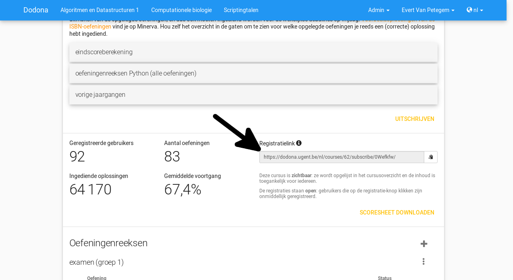

.. _creating_a_course:

===================
Een cursus aanmaken
===================

Om een cursus aan te maken moet je als medewerker geregistreerd staan binnen
Dodona. Ga naar de cursussen pagina (via de knop "Meer cursussen..."
linksonderaan je homepagina). Klik daar op de ``+`` knop rechtsbovenaan de
lijst.

Vul nu de naam van de cursus (best de naam van het vak waarvoor de cursus
gebruikt zal worden), je eigen naam (en evt. de naam van je medelesgevers) en
het academiejaar waarin de cursus gebruikt zal worden. Het academiejaar vul je
best als ``jjjj-jjjj`` in, zodat je cursus juist gesorteerd wordt in de lijst
van cursussen.

Verder moet je ook de zichtbaarheid van je vak instellen. Als
"Zichtbaar" wordt ingesteld kan iedereen de cursus vinden via het
cursusoverzicht. Als "Verborgen" wordt ingesteld zal de cursus niet opduiken in
het cursusoverzicht maar zal je een speciale link moeten sturen naar al je
studenten waarmee ze dan automatisch geregistreerd zullen worden op de cursus.

Daarnaast kan je ook kiezen welke studenten zich mogen registreren voor de
cursus. Bij "Open" registratie wordt elke registratie automatisch geaccepteerd.
Bij "Gemodereerd" zal een cursusbeheerder elke student die een registratie
aanvraagt moeten toelaten of afwijzen. Bij "Gesloten" zal geen enkele student
zich kunnen registreren.

In het vak Beschrijving kan je HTML of Markdown schrijven. Zie
:ref:`describing_an_exercise` voor documentatie over wat je hierin allemaal kan
doen.

De kleur van de cursus bepaalt met welke kleur je cursus op de homepagina van je
studenten getoond zal worden.

Een reeks toevoegen
-------------------

Wanneer je de cursus aangemaakt hebt zal je naar de cursuspagina gebracht
worden. Daar kan je bij oefeningenreeksen nu een reeks toevoegen via de ``+``
helemaal rechts bij de titel. Geef hier een naam in voor de reeks, een optionele
deadline, de zichtbaarheid en een beschrijving.

Als je de reeks aanmaakt zal je op dezelfde pagina blijven. Je kan nu onderaan
oefeningen aan de reeks toevoegen. Zie :ref:`creating_an_exercise` om nieuwe
oefeningen aan Dodona toe te voegen.

Let er op bij het toevoegen van reeksen dat een nieuwe reeks telkens boven de
bestaande reeksen zal toegevoegd worden en dat er momenteel nog geen manier
bestaan om de reeksen te herordenen.

Studenten automatisch laten registreren
---------------------------------------

Op Dodona kan je het proces voor studenten om zich te in te schrijven op je
cursus vergemakkelijken. Als je hen een speciale link geeft zullen ze op het
moment dat ze die volgen automatisch ingeschreven worden in je cursus. Deze link
kan je op de cursuspagina vinden.

