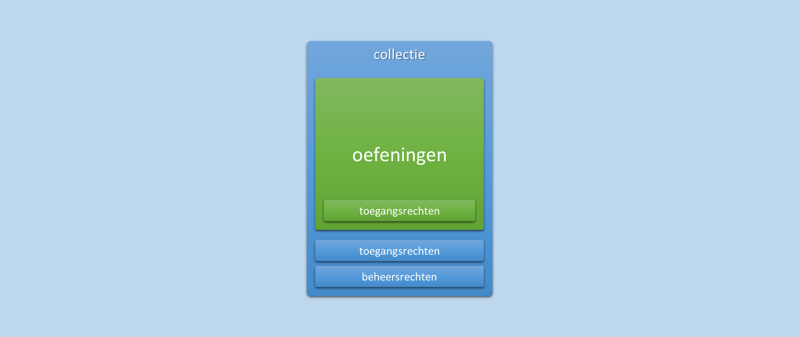
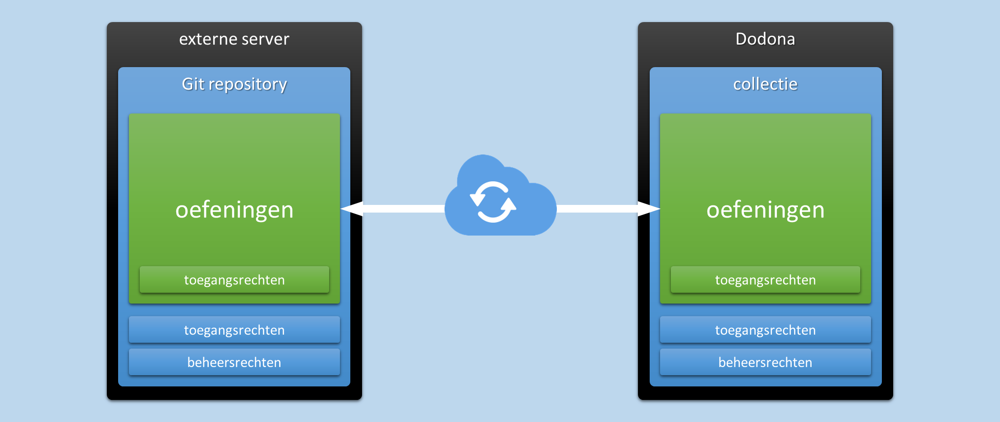
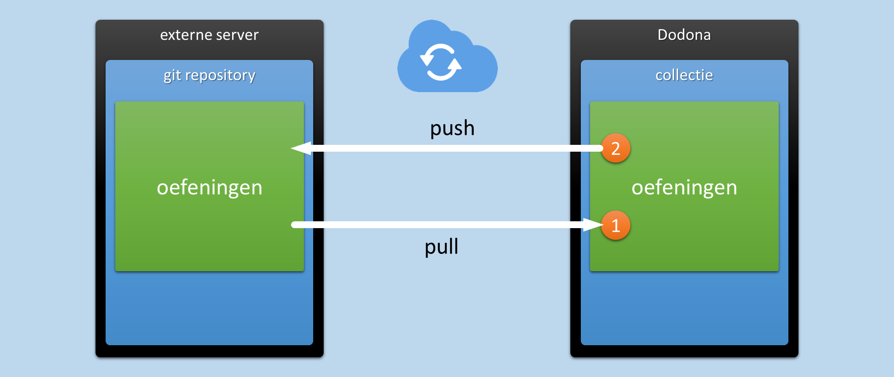
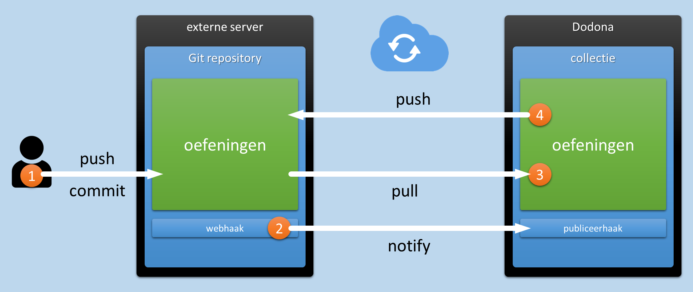
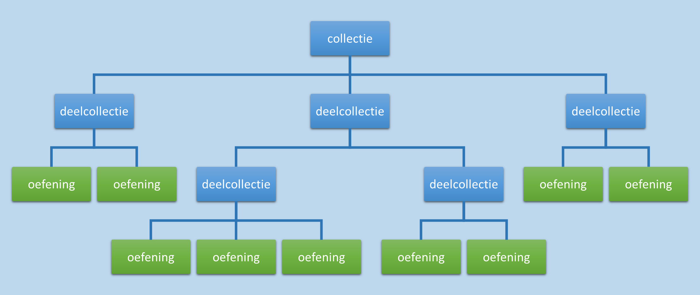
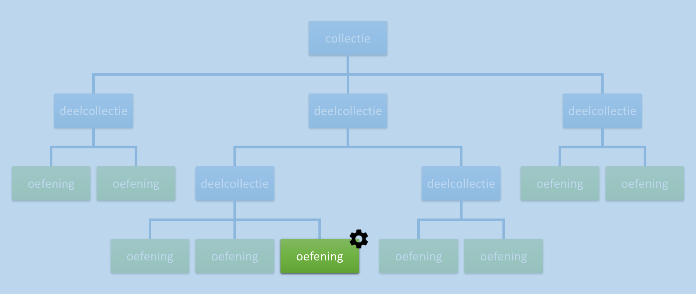
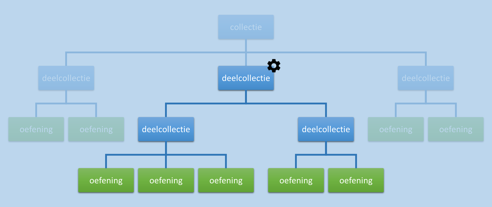
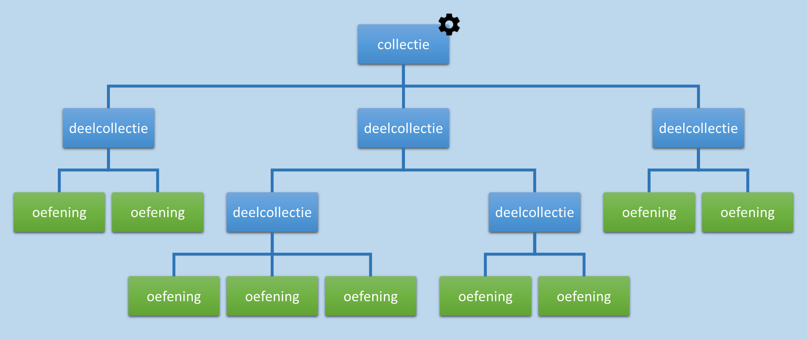
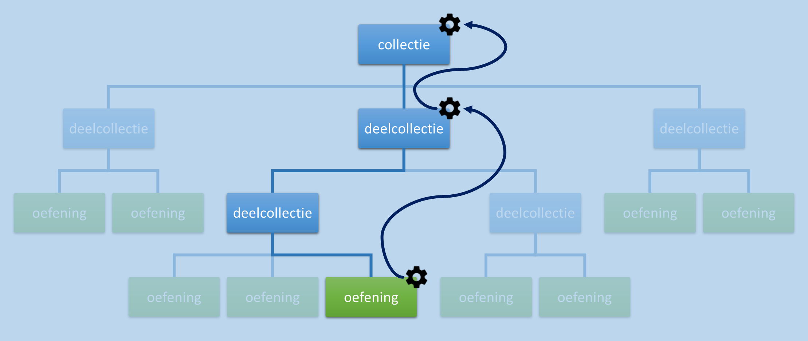

.. _oefeningen beheren:

Oefeningen beheren
==================

.. _oefening:

Een **oefening** bestaat uit een opdracht waarvoor gebruikers :ref:`oplossingen <oplossing>` kunnen :ref:`indienen <oplossing indienen>`. Bovendien wordt een oefening gekoppeld aan een :ref:`judge <judge>` die elke ingediende oplossing voor de oefening automatisch beoordeelt en van feedback voorziet. In dit hoofdstuk leggen we uit hoe oefeningen opgesteld en beheerd moeten worden. Voor het schrijven van judges verwijzen we naar hoofdstuk :ref:`Oplossingen automatisch beoordelen <oplossingen automatisch beoordelen>`.

.. TODO:feature-missing: een oefening zou generiek moeten kunnen vastleggen i) hoe de opdracht van de oefening beschreven wordt (laat gegeneerde opdrachten toe), ii) hoe oplossingen voor de opdracht er uitzien en hoe ze kunnen ingediend worden (laat generieke indienscenario's toe) en iii) hoe ingediende oplossingen kunnen beoordeeld en van feedback voorzien worden (lijkt nu al vrij generiek te zijn, behalve dan misschien dat de feedback-spec te eng is en dat er nog interventie nodig is om Dockers op te laden)

.. _collectie:

Een **collectie** bundelt meerdere :ref:`oefeningen <oefening>` die samen :ref:`beheerd <oefening beheren>` worden. Hierdoor kunnen sommige :ref:`eigenschappen <oefening eigenschappen>` en :ref:`toegangsrechten <oefening toegangsrechten>` van de oefeningen uit de collectie op verschillende niveau's ingesteld worden: voor de volledige collectie, voor een deel van de collectie of individueel per oefening.

.. TODO:feature-update: aangezien het gebruik van de term "repository" verwijst naar een implementatiedetail en verwarring zaait tussen een "repository in Dodona" en een "Git repository op een externe server", is het voorstel om binnen Dodona de term "collectie" te gebruiken voor een verzameling oefeningen die samen beheerd worden
.. TODO:feature-missing: alle Dodona-objecten die geconfigureerd worden in externe repositories zouden gebruik kunnen maken van een generieke "repository"-component die deels instaat voor het interne beheer van de objecten (koppeling van beheerders); dit zou op termijn ook moeten toelaten op cursussen aan Git repo's te haken



.. _externe server:
.. _git repository:

Het :ref:`opstellen <oefening opstellen>` en :ref:`organiseren <collectie organiseren>` van een :ref:`collectie <collectie>` :ref:`oefeningen <oefening>` gebeurt niet rechtstreeks in Dodona, maar in een **Git repository** op een **externe server**. Via een koppeling van de collectie aan de Git repository blijft het wijzigen van oefeningen in Dodona of in de Git repository synchroon verlopen.



.. tip::

    In deze handleiding verwijzen we telkens naar de Nederlandstalige versie van het `Pro Git <https://git-scm.com/book/nl/v2>`_ boek als we voor het eerst gebruikmaken van typische Git terminologie. Als je nog nooit met Git gewerkt hebt dan raden we alvast aan om de eerste twee hoofdstukken van het boek te lezen. Leren werken met Git heeft een zekere leercurve, maar als programmeur loont het meer dan de moeite om over de nodige Git vaardigheden te beschikken.

Door te faciliteren dat :ref:`oefeningen <oefening>` :ref:`opgesteld <oefening opstellen>` kunnen worden in :ref:`Git repositories <git repository>` die :ref:`extern gehost <externe server>` worden, maakt Dodona het eenvoudiger om grote :ref:`collecties <collectie>` oefeningen te :ref:`organiseren <collectie organiseren>` en te :ref:`beheren <collectie>` met een team van personen. Merk daarbij op dat het toekennen van toegangsrechten en beheersrechten voor de :ref:`Git repository <git repository>` volledig gescheiden verloopt van het toekennen van :ref:`toegangsrechten <collectie toegangsrechten>` en :ref:`beheersrechten <collectie beheersrechten>` voor de gekoppelde :ref:`collectie <collectie>` op Dodona. Een deel van de toegangsrechten voor de oefeningen zelf kan echter zowel in Dodona als in de Git repository ingesteld worden.

.. _collectiebeheerder:

Een :ref:`lesgever <lesgever>` kan onbeperkt :ref:`collecties <collectie>` :ref:`aanmaken <collectie aanmaken>` om de :ref:`oefeningen <oefening>` uit een :ref:`Git repository <Git repository>` te :ref:`publiceren <oefeningen publiceren>` op Dodona. Hij wordt automatisch **collectiebeheerder** van elke collectie die hij aanmaakt, maar kan verder geen collecties beheren waarvoor hij geen collectiebeheerder is.

Een :ref:`collectiebeheerder <collectiebeheerder>` kan andere beheerders aanduiden om samen met hem de collectie te beheren. Hij kan de :ref:`eigenschappen <oefening eigenschappen>` en de :ref:`toegangsrechten <oefening toegangsrechten>` van alle oefeningen uit de :ref:`collectie <collectie>` instellen.

.. TODO:feature-missing collectiebeheerders zouden ook collecties moeten kunnen reorganiseren
.. TODO:feature-missing collectiebeheerders zouden ook oefeningen moeten kunnen verplaatsen tussen twee collecties waarvan ze beheerder zijn

.. Een :ref:`lesgever <lesgever>` kan oefeningen uit een externe Git repository publiceren op Dodona. Daarvoor moet hij Dodona aanhaken aan de externe Git repository en Dodona de toestemming geven om de externe Git repository te beheren. Als de externe Git repository een collectie oefeningen bevat die gestructureerde is volgens de daarvoor vastgelegde specificatie, dan worden de oefeningen daardoor beschikbaar op Dodona. Een collectie oefeningen die op deze manier gepubliceerd wordt, noemen we kortweg een **repository**.

.. _oefeningen publiceren:

Publiceren van oefeningen
-------------------------

Voor het publiceren van :ref:`oefeningen <oefening>` op Dodona maakt het niet uit of je eerst de oefeningen opstelt in een :ref:`Git repository <git repository>` en ze pas daarna publiceert, of dat je start met het publiceren van een lege Git repository waarin je achteraf oefeningen begint op te stellen. Het publiceren houdt immers in dat de :ref:`collectie <collectie>` oefeningen op Dodona automatisch gesynchroniseerd blijven met de oefeningen in de Git repository. Daardoor kunnen de oefeningen zowel gewijzigd worden in Dodona als in de Git repository.

.. Onder wijzigingen aan de collectie verstaan we hierbij het reorganiseren van de collectie, het toevoegen van nieuwe oefeningen aan de collectie, het aanpassen van bestaande oefeningen uit de collectie en het verwijderen van oefeningen uit de collectie.

.. TODO:feature-update: reorganiseren van de collectie kan op dit moment nog niet, maar zou wel moeten kunnen
.. TODO:feature-update: verwijderen van oefeningen uit een collectie wordt op dit moment nog niet ideaal opgevangen; over dit scenatio moet nog verder nagedacht worden

.. _collectie synchronisatieprocedures:

Om :ref:`oefeningen <oefening>` te kunnen :ref:`publiceren <oefeningen publiceren>`, moet je eerst wat meer details kennen over het verloop van de synchronisatie tussen Dodona en de :ref:`Git repository <git repository>`. Daarbij zijn er twee mogelijke scenario's:

- .. _collectie synchronisatie uit dodona:

  Als een :ref:`collectie <collectie>` oefeningen gewijzigd worden in Dodona dan worden de wijzigingen als volgt gesynchroniseerd met de Git repository:

  .. image:: images/nl.collection_update_in_dodona.png

  1. Een gebruiker wijzigt de :ref:`collectie <collectie>` :ref:`oefeningen <oefening>` in Dodona.

  2. Dodona `pusht <https://git-scm.com/book/nl/v2/Git-Basics-Werken-met-remotes>`_ (Git lingo voor uploaden) de gewijzigde :ref:`oefeningen <oefening>` naar de :ref:`Git repository <git repository>`.

- .. _collectie synchronisatie uit git repository:

  Als de :ref:`oefeningen <oefening>` gewijzigd worden in de :ref:`Git repository <git repository>` dan worden de wijzigingen als volgt gesynchroniseerd met Dodona:

  .. image:: images/nl.collection_update_from_repository_webhook.png

  1. Er wordt een gewijzigde versie van de :ref:`oefeningen <oefening>` `gecommit <https://git-scm.com/book/nl/v2/Git-Basics-Wijzigingen-aan-de-repository-vastleggen>`_ in (Git lingo voor vastleggen van wijzigingen) of gepusht naar de :ref:`Git repository <git repository>` door een persoon met de nodige toegangsrechten voor Git repository.

     .. important::

         Deze persoon hoeft zelfs geen gebruiker van Dodona te zijn. Hij heeft enkel toegangsrechten nodig om te kunnen committen in of te pushen naar de :ref:`Git repository <git repository>`. Deze toegangsrechten staan los van de toegangsrechten tot de :ref:`collectie <collectie>` :ref:`oefeningen <oefening>` in Dodona.

  2. De externe server gebruikt een `webhook <https://en.wikipedia.org/wiki/Webhook>`_ om Dodona te informeren over de wijzigingen in de :ref:`Git repository <git repository>`.

  3. Dodona `pullt <https://git-scm.com/book/nl/v2/Git-Basics-Werken-met-remotes>`_ (Git lingo voor downloaden) de oefeningen van de :ref:`Git repository <git repository>` en of ze geldig zijn. Als alle oefeningen geldig zijn dan worden ze gekoppeld aan de :ref:`collectie <collectie>` en beschikbaar gesteld op Dodona. Anders wordt de synchronisatieprocedure afgebroken en wordt er een email verstuurd naar de persoon die de wijzigingen in stap (1) gecommit of gepusht heeft, met een overzicht van alle foute oefeningen in de Git repository.

     .. important::

         Na het corrigeren van de fouten kan de Git repository opnieuw gecommit of gepusht worden om de wijzigingen alsnog te synchroniseren met Dodona. Daarbij wordt deze procedure opnieuw uitgevoerd.

  4. Dodona genereert :ref:`tokens <oefening token>` voor elke nieuwe :ref:`oefening <oefening>` en pusht die naar de :ref:`Git repository <git repository>` om ervoor te zorgen dat de :ref:`collectie <collectie>` :ref:`oefeningen <oefening>` zonder problemen kan :ref:`gereorganiseerd <collectie organiseren>` worden in Dodona en in de Git repository.

Op het einde van de twee scenario's is de gewijzigde :ref:`collectie <collectie>` :ref:`oefeningen <oefening>` zowel beschikbaar op Dodona als in de :ref:`Git repository <git repository>`. Nu je begrijpt hoe de synchronisatieprocedures werken, kan je de volgende stappen uitvoeren om oefeningen in een :ref:`Git repository <git repository>` te publiceren.

.. note: We gaan er hier van uit dat de collectie oefeningen die je wilt publiceren opgesteld is in een externe Git repository waarvoor je de nodige beheersrechten hebt. Als je nog moet beginnen met het opstellen van de oefeningen dan maak je daar in eerste instantie een nieuwe Git repository voor aan. Een lege Git repository geldt immers als geldige collectie zonder oefeningen. Verderop bespreken we hoe een collectie oefeningen moet georganiseerd worden en hoe oefeningen moeten opgesteld worden.

.. tip::

    Als je geen server hebt waarop je Git repositories voor :ref:`collecties <collectie>` :ref:`oefeningen <oefening>` kan hosten dan zijn `GitHub <https://github.com/>`_ en `GitLab <https://gitlab.com/>`_ de twee meest populaire aanbieders van serverruimte voor Git repositories. Beide diensten bieden gratis accounts aan voor educatieve doeleinden. Het `Pro Git <https://git-scm.com/book/nl/v2>`_ boek zet je alvast op weg om met `GitHub <https://git-scm.com/book/nl/v2/GitHub-Account-setup-en-configuratie>`_ en `GitLab <https://git-scm.com/book/nl/v2/Git-op-de-server-GitLab>`_ te leren werken als je er nog geen ervaring mee hebt.

    In onderstaande screencast tonen we hoe je letterlijk in een paar klikken een nieuwe Git repository kunt aanmaken op `GitHub <https://github.com>`_. Raadpleeg de `GitHub documentatie <https://guides.github.com/>`_ om meer te leren over het configureren en beheren van Git repositories op GitHub.

    .. image:: create-repository.gif

.. TODO:feature-missing: als we op termijn overwegen om oefeningen rechtreeks aan Dodona toe te voegen via de web interface, dan zouden we dit kunnen doen in lokale Git repositories (op de Dodona servers) waarvoor we de repositorybeheerders een clone URL aanbieden zodat ze de repo daar ook kunnen klonen (desnoods enkel pull, maar indien ook push dan is GitHub als tussenstation niet langer nodig maar dan zijn we wel een hosting-platform geworden)

.. Als :ref:`lesgever <lesgever>` kan je een collectie oefeningen publiceren die opgesteld zijn in een externe Git repository. Dit kan enkel als je de nodige beheersrechten hebt voor de externe Git repository die toelaten om Dodona aan te haken en om Dodona schrijfrechten te kunnen geven.


.. _collectie SSH toegang:

Verlenen van SSH toegang
^^^^^^^^^^^^^^^^^^^^^^^^

.. _collectie git repository ssh:

Voor het uitvoeren van de :ref:`synchronisatieprocedures <collectie synchronisatieprocedures>` moet Dodona de :ref:`oefeningen <oefening>` kunnen **pullen** van en **pushen** naar de :ref:`Git repository <git repository>`. Dodona gebruikt hiervoor het `SSH protocol voor Git <https://git-scm.com/book/nl/v2/Git-op-de-server-De-protocollen>`_. De manier waarop SSH toegangsrechten moeten ingesteld worden, is afhankelijk van de :ref:`externe server <externe server>` waarop de Git repository gehost wordt:

`GitHub <https://github.com>`_

    Dodona heeft een GitHub account met gebruikersnaam ``dodona-server`` en naam ``Dodona Server``. Voeg Dodona als **collaborator** toe aan de Git repository en zorg ervoor dat Dodona minstens toegangsniveau :guilabel:`Write` krijgt. Dit laat Dodona toe om de Git repository te pullen en er naar te pushen over SSH. Onderstaande screencast toont hoe je deze instellingen kan doen.

    .. image:: add-dodona-to-repository.gif

    .. TODO:screenshot-update: vervang voorgaande screencast door een screencast voor GitHub; gebruik de repository waarin de demo's voor de handleiding staan als voorbeeld (deze repo moet nog aangemaakt worden in dezelfde organisatie waar ook de documentatie staat)

`GitHub@UGent <https://github.ugent.be>`_

    De procedure is dezelfde als voor `GitHub <https://github.com>`_, behalve dat Dodona op GitHub@UGent een account heeft met gebruikersnaam ``SA-GithubDodona`` en naam ``Dodona Server``.

.. TODO:feature-update: moeten we ook niet de publieke SSH sleutel van Dodona beschikbaar stellen, zodat een alternatieve methode om Dodona toegang te geven aan de Git repository erin bestaat dat men een "dodona-server" gebruiker aanmaakt op de externe server en de publieke SSH sleutel van Dodona toevoegt aan het ~/.ssh/authorized_keys bestand van die "dodona-server" gebruiker (https://git-scm.com/book/nl/v2/Git-op-de-server-Git-op-een-server-krijgen).

.. tip::

    **Moet ik de Git repository publiek maken om de oefeningen te publiceren op Dodona?**

    De procedures om :ref:`oefeningen <oefening>` te :ref:`synchroniseren <collectie synchronisatieprocedures>` tussen de Git repository en Dodona vereisen **niet** dat de :ref:`Git repository <git repository>` publiek moet zijn, enkel dat Dodona toegangsrechten moet hebben tot de Git repository. Het is zelfs helemaal niet aangewezen om de Git repository publiek te maken als je bijvoorbeeld eigen voorbeeldoplossingen mee opslaat in de Git repository of als je de oefeningen afgeschermd wil publiceren op Dodona.


.. _collectie aanmaken:

Aanmaken van een collectie
^^^^^^^^^^^^^^^^^^^^^^^^^^

Als :ref:`lesgever <lesgever>` kan je een :ref:`collectie` aanmaken waaraan de oefeningen uit de :ref:`Git repository <git repository>` gekoppeld worden en waarin de eigenschappen en de toegangsrechten van deze oefeningen kunnen ingesteld worden. Dit kan enkel nadat Dodona :ref:`SSH toegang <collectie SSH toegang>` gekregen heeft tot de Git repository.

.. _collectie-overzicht:

Selecteer :guilabel:`Collecties` in het :ref:`beheersmenu <beheersmenu>` om naar het **collectie-overzicht** te navigeren.

.. TODO:screenshot-missing: screenshot waarin aangeduid wordt hoe je naar het repositoriesoverzicht kan navigeren via het beheersmenu.

Het :ref:`collectie-overzicht <collectie-overzicht>` toont een overzicht van alle beschikbare :ref:`collecties <collectie>` met :ref:`oefeningen <oefeningen>`.

.. TODO:tutorial-missing: hier nog aangeven hoe het collectie-overzicht er uitziet en hoe je naar een collectie kunt navigeren
.. TODO:feature-missing: zoekfunctionaliteit toevoegen aan dit overzicht
.. TODO:feature-missing: weergeven hoeveel oefenigen er in elke collectie zitten

.. TODO:screenshot-missing: screenshot van het collectie-overzicht

Druk op de knop :guilabel:`COLLECTIE AANMAKEN` in de rechterbovenhoek van het :ref:`collectie-overzicht <collectie-overzicht>` om een nieuwe :ref:`collectie <collectie>` aan te maken.

.. TODO:screenshot-missing: screenshot van het collectie-overzicht waarin de aanmaakknop wordt aangeduid

In het paneel :guilabel:`Nieuwe collectie` kan je de eigenschappen van de nieuwe collectie instellen.

.. TODO:screenshot-missing: screenshot van de pagina waarop de eigenschappen van de repository ingesteld worden.

Druk op :guilabel:`Dodona` in de :ref:`navigatiebalk <navigatiebalk>` om het aanmaken van de nieuwe :ref:`collectie <collectie>` te annuleren.

.. TODO:screenshot-missing: screenshot van de pagina waarop de eigenschappen van de collectie ingesteld worden, en waarin Dodona aangeduid wordt in de navigatiebalk

Voor een :ref:`collectie <collectie>` kunnen de volgende eigenschappen ingesteld worden:

.. _collectie naam:

:guilabel:`Naam`

    Een naam voor de collectie oefeningen op Dodona.

.. _collectie beschrijving:

:guilabel:`Beschrijving`

    Een optionele beschrijving van de collectie oefeningen die bovenaan de :ref:`collectiepagina <collectiepagina>` wordt weergegeven. Voor het opmaken van de beschrijving kan je gebruikmaken van :ref:`Markdown <beschrijving markdown>`.

    .. TODO:feature-missing: deze eigenschap ontbreekt maar het zou een meerwaarde als er een algemene beschrijving van de collectie oefeningen kan toegevoegd worden
    .. TODO:feature-missing: eigenschap "Zichtbaarheid" voor weergave van de collectie in het collectie-overzicht, zodat gebruikers er zich kunnen registreren
    .. TODO:feature-missing: eigenschap "Registratieprocedure" voor registratie (open/moderated/gesloten)

.. _collectie SSH URL:

:guilabel:`SSH URL`

    De `URL <https://nl.wikipedia.org/wiki/Uniform_Resource_Locator>`_ van de :ref:`Git repository <git repository>`.

    .. tip::

        Het aanmaken van de nieuwe collectie zal enkel lukken als Dodona :ref:`SSH toegang <collectie SSH toegang>` heeft tot de :ref:`Git repository <git repository>`. Druk op de testknop naast de SSH URL om te laten testen of Dodona SSH toegang heeft tot de Git repository.

    .. TODO:feature-update: zouden we deze eigenschap niet beter hernoemen naar "SSH URL"; dit is ook hoe ze door GitHub genoemd worden (https://help.github.com/enterprise/2.12/user/articles/which-remote-url-should-i-use/#cloning-with-ssh-urls)
    .. TODO:feature-update: zet deze eigenschap onder een afzonderlijke hoofding "Git repository"; daar zou ook de publieke sleutel van Dodona kunnen gezet worden
    .. TODO:feature-update: testknop toevoegen om test te laten uitvoeren
    .. TODO:feature-update: wordt er een check uitgevoerd om ervoor te zorgen dat dezelfde repo niet tweemaal gekoppeld wordt aan Dodona? we zouden in ieder geval kunnen controleren dat de SSH URL uniek is; als een repo oefeningen bevat waarvan de ID al in gebruik is in een andere repo, dan zouden we die oefeningen ook niet kunnen aanmaken (en een mail sturen naar de commiter dat er oefeningen zijn met ongeldige IDs); NOTE: dit laatste zal het geval zijn als we tokens in de repository plaatsen die toelaten om de oefeningen te identificeren; onze policy laat immers geen twee oefeningen met hetzelfde token toe

    .. TODO:tutorial-missing: omschrijven van onderstaande screenshot waarin alle testen geslaagd zijn
    .. TODO:screenshot-missing: screenshot van paneel "Nieuwe cursus" waarin alle testen geslaagd zijn

    .. TODO:tutorial-missing: omschrijven van onderstaande screenshot waarin de toegangstest niet geslaagd is
    .. TODO:screenshot-missing: screenshot van paneel "Nieuwe cursus" waarin de test voor de toegangscontrole van de Git repository niet geslaagd is

    .. TODO:feature-missing: naast het testen van de toegangscontrole tot de Git respository, zouden we ook de geldigheid van de Git repository kunnen testen en meteen aangeven of er fouten gevonden werden; alles zou in een mooi voortgangsrapport kunnen getoond worden
    .. TODO:tutorial-missing: omschrijven van onderstaande screenshot waarin sommige testen voor de geldigheid van de Git repository niet geslaagd zijn
    .. TODO:screenshot-missing: screenshot van paneel "Nieuwe cursus" waarin sommige testen voor de geldigheid van de Git repository niet geslaagd zijn

:guilabel:`Standaard judge`

    De :ref:`judge <judge>` die standaard gekoppeld wordt aan alle oefeningen in de :ref:`repository <repository>`. Selecteer de judge uit de lijst van beschikbare judges.

    .. TODO:feature-update: zet deze eigenschap onder een afzonderlijke hoofding "Standaardwaarden voor oefeningen"; hier zou dan niet enkel de judge moeten ingesteld worden, maar alle eigenschappen voor oefeningen in de collectie die niet oefening-specifiek zijn (bijvoorbeeld de naam van de oefening)
    .. TODO:feature-missing: als de repository al een config.json heeft in de root van de repository --- en dat kunnen we op dit moment nog niet weten --- dan moeten we ervoor zorgen dat die niet overschreven wordt; het lijkt dus aangewezen om de defaults pas in te stellen in een tweede stap, nadat de repo aan Dodona werd gekoppeld maar voordat de collectie oefeningen uit de repository verwerkt wordt (dit laatste wordt beïnvloed door de default-instellingen in de root)
    .. TODO:feature-missing: het selecteren van een judge moet op termijn uitgebreid worden met betere functionaliteit voor het zoeken naar judges

Druk op de afwerkknop in de rechterbovenhoek van het paneel :guilabel:`Nieuwe collectie` om het :ref:`aanmaken <collectie aanmaken>` van een :ref:`collectie <collectie>` met de opgegeven :ref:`eigenschappen <collectie eigenschappen>` effectief te laten doorvoeren. Je wordt meteen ook aangesteld als de eerste :ref:`collectiebeheerder <collectiebeheerder>`.

.. TODO:screenshot-missing: screenshot van paneel "Nieuwe collectie" waarop de afwerkknop aangeduid word


.. _publiceren:

Na het :ref:`aanmaken <collectie aanmaken>` van de :ref:`collectie <collectie>` wordt er automatisch een procedure opgestart wordt om de :ref:`oefeningen <oefening>` uit de :ref:`Git repository <git repository>` toe te voegen aan de collectie. Het uitvoeren van deze procedure is wat we aanduiden met de term **publiceren**. Tijdens het publiceren wordt er gerapporteerd over de status van de opeenvolgende stappen van de uitgevoerde procedure:



1. Dodona pullt de :ref:`oefeningen <oefening>` van de :ref:`Git repository <git repository>` en controleert of ze geldig zijn. Als alle oefeningen geldig zijn dan worden ze gekoppeld aan de :ref:`collectie <collectie>` en beschikbaar gesteld op Dodona. Anders wordt de synchronisatieprocedure afgebroken en toont het voortgangsrapport een overzicht van alle foute oefeningen in de Git repository.

   .. important::

       In :ref:`Remediëren van publicatiefouten <publicatiefouten remediëren>` worden alle mogelijke fouten besproken die zich kunnen voordoen tijdens het publiceren van oefeningen uit een :ref:`Git repository <git repository>`. Er wordt telkens ook aangegeven hoe ze kunnen rechtgezet worden.

2. Dodona genereert :ref:`tokens <oefening token>` voor elke nieuwe :ref:`oefening <oefening>` en pusht die naar de :ref:`Git repository <git repository>` om ervoor te zorgen dat de :ref:`collectie <collectie>` :ref:`oefeningen <oefening>` zonder problemen kan :ref:`gereorganiseerd <collectie organiseren>` worden in Dodona en in de Git repository.

Dit is een licht gewijzigde versie van stappen (3) en (4) in de synchronisatieprocedure die zal uitgevoerd worden als de :ref:`Git repository <git repository>` later gewijzigd wordt. Het enige verschil is dat foute oefeningen in de Git repository onmiddellijk zichtbaar zijn in het voortgangsrapport en niet per email verstuurd worden.

.. TODO:screenshot-missing: screenshot van weergave van voortgangsrapport met fouten

Van zodra de synchronisatieprocedure volledig uitgevoerd werd, kan je vaststellen dat alle oefeningen aan de collectie gekoppeld werden.

.. TODO:screenshot-missing: screenshot van nieuw aangemaakte collectie waarin de oefeningen zichtbaar zijn

.. TODO: tutorial-missing: omschrijven hoe de nieuw aangemaakte repository weergegeven wordt op Dodona
.. TODO: feature-missing: naast een list-view van de oefeningen in de collectie, zouden we ook een tree-view van de oefeningen kunnen geven waarin duidelijk de structuur van de deelcollecties (directories die oefeningen bevatten (zelf of in één van hun subdirectories))


.. _repository webhook:
.. _collectie aanhaken:

Aanhaken van een collectie
^^^^^^^^^^^^^^^^^^^^^^^^^^

.. _collectie handmatig publiceren:

Als er een nieuwe versie van de oefeningen beschikbaar is in de :ref:`Git repository <git repository>` dan kan je die als :ref:`collectiebeheerder <collectiebeheerder>` publiceren in de :ref:`collectie` door op de knop :guilabel:`Publiceren` te drukken in de weergave van de collectie.

.. TODO:feature-update: vervang de naam van de knop "Alle oefeningen herverwerken" door "Publiceren"

.. TODO:screenshot-missing: screenshot van weergave van de collectie waarin de knop "Publiceren" aangeduid wordt

Hierdoor wordt de nieuwe versie van de :ref:`oefeningen <oefening>` uit de :ref:`Git repository <git repository>` gepubliceerd met dezelfde procedure die uitgevoerd werd bij het aanmaken van de collectie. Tijdens het publiceren wordt er gerapporteerd over de status van de opeenvolgende stappen van de uitgevoerde procedure.

.. _collectie automatisch publiceren:
.. _externe server webhaak:
.. _collectie publiceerhaak:

Het is meestal echter de bedoeling om elke nieuwe versie van de :ref:`oefeningen <oefening>` in de :ref:`Git repository <git repository>` automatisch te laten publiceren in de :ref:`collectie`. Daarvoor kan op de :ref:`externe server <externe server>` een **webhaak** ingesteld worden die in gang gezet wordt telkens er wijzigingen gecommit worden in de :ref:`Git repository <git repository>` of er naar gepusht worden. Het instellen van de webhaak moet gebeuren met de **publiceerhaak** van de :ref:`collectie`: een specifieke URL die gegeneerd werd bij het aanmaken van de collectie. Als :ref:`collectiebeheerder <collectiebeheerder>` zie je publiceerhaak in de weergave van de collectie.

.. TODO:screenshot-missing: weergave van collectie waarop de publiceerhaak wordt aangeduid

Druk op de kopieerknop naast de :ref:`publiceerhaak <publiceerhaak>` om de publiceerhaak naar het klembord te kopiëren.

.. TODO:screenshot-missing: screenshot van nieuw aangemaakte repository waarin de kopieerknop naast de webhook wordt aangeduid

Stel op de :ref:`externe server <externe server>` de :ref:`publiceerhaak <publiceerhaak>` in voor een :ref:`webhaak <externe server webhaak>` die in gang gezet wordt bij het committen en pushen in de :ref:`Git repository <git repository>`. Hoe dit precies moet gebeuren is afhankelijk van de externe server waarop de Git repository gehost wordt:

`GitHub <https://github.com>`_

    Druk in de navigatiebalk van de :ref:`Git repository <git repository>` op :guilabel:`Settings`. Onder :guilabel:`Hooks` druk je op de knop :guilabel:`Add webhook`. Plak de :ref:`publiceerhaak <publiceerhaak>` in het eigenschap :guilabel:`Payload URL`. De andere eigenschappen staan reeds correct ingesteld. Druk op de knop :guilabel:`Add webhook` om de webhaak effectief in te stellen.

    .. TODO:screenshot-missing: screencast van het instellen van een webhook op GitHub

    In het `Pro Git <https://git-scm.com/book/nl/v2>`_ boek lees je meer details over het `instellen van webhaken <https://git-scm.com/book/nl/v2/GitHub-GitHub-Scripten>`_.

Daarmee is het scenario om wijzigingen in de :ref:`Git repository <git repository>` automatisch te synchroniseren met Dodona volledig gerealiseerd.



.. tip::

    Druk na het instellen van de :ref:`publiceerhaak <publiceerhaak>` voor de zekerheid nog eens op de knop :guilabel:`Publiceren` in de weergave van de collectie. Als de externe Git repository gewijzigd werd tussen het :ref:`aanmaken <aanmaken>` en het :ref:`aanhaken <aanhaken>` van de collectie, dan wordt daardoor de recentste versie van de oefeningen in de Git repository gepubliceerd.

.. _collectie bewerken:

Bewerken van een collectie
^^^^^^^^^^^^^^^^^^^^^^^^^^

.. _collectie eigenschappen aanpassen:

Als :ref:`collectiebeheerder <collectiebeheerder>` kan je de :ref:`eigenschappen <collectie eigenschappen>` van een :ref:`collectie <collectie>` aanpassen door op de bewerkknop te drukken in de rechterbovenhoek van de :ref:`collectiepagina <collectiepagina>`.

.. TODO:screenshot-missing: screenshot van collectiepagina (nieuwe collectie) waarin de bewerkknop aangeduid wordt

.. _collectie eigenschappen aanpassen annuleren:

Druk op de :ref:`collectie <collectie>` in de :ref:`navigatiebalk <navigatiebalk>` om het aanpassen te annuleren.

.. TODO:screenshot-missing: screenshot van bewerken van de collectiepagina (nieuwe collectie) waarin de navigatiebalk wordt aangeduid voor annuleren

.. _collectie eigenschappen aanpassen afwerken:

Druk na het aanpassen op de afwerkknop in de rechterbovenhoek van het paneel om de nieuwe :ref:`eigenschappen <collectie eigenschappen>` effectief in te stellen.

.. TODO:screenshot-missing: screenshot van bewerken van de collectiepagina (nieuwe collectie) waarin de afwerkknop wordt aangeduid

Na het afwerken navigeer je terug naar de :ref:`collectiepagina <collectiepagina>` waar de nieuwe :ref:`eigenschappen <collectie eigenschappen>` onmiddellijk van toepassing zijn.

.. TODO:screenshot-rename: screenshot van nieuwe collectie na het bewerken

.. tip::

    Als de :ref:`Git repository <git repository>` met de :ref:`oefeningen <oefening>` van een :ref:`collectie <collectie>` verplaatst werd, dan hoef je daarvoor geen nieuwe collectie aan te maken. Het volstaat om de :ref:`SSH URL <collectie SSH URL>` van de collectie in te stellen met de nieuwe locatie van de Git repository. Vergeet ook niet om de collectie :ref:`aan te haken <collectie aanhaken>` aan de nieuwe Git repository.


.. _oefeningen deelcollectie:
.. _oefeningen organiseren:

Organiseren van oefeningen
--------------------------

De :ref:`oefeningen <oefening>` uit een :ref:`collectie <collectie>` kunnen georganiseerd worden door **deelcollecties** te vormen. Deelcollecties bevatten altijd een deel van de oefeningen en/of andere deelcollecties. Daarbij zit elke oefening in hoogstens één deelcollectie en zit elke deelcollectie in hoogstens één andere deelcollectie. Op die manier ontstaat een boomstructuur waarvan de wortel correspondeert met de volledige collectie, de takken met de deelcollecties en de bladeren met de oefeningen.



Deze boomstructuur wordt gebruikt om de :ref:`eigenschappen <oefening eigenschappen>` van de :ref:`oefeningen <oefening>` uit de :ref:`collectie <collectie>` in te stellen. Deze eigenschappen omvatten ook een deel van de :ref:`toegangsrechten <oefening toegangsrechten>` van de oefeningen. Het is mogelijk om de eigenschappen van alle oefeningen individueel in te stellen.



Als we :ref:`oefeningen <oefening>` met gemeenschappelijke :ref:`eigenschappen <oefening eigenschappen>` groeperen in een :ref:`deelcollectie <oefening deelcollectie>`, dan kunnen de gemeenschappelijke eigenschappen ingesteld worden op het niveau van de deelcollectie. Alle eigenschappen van oefeningen die ingesteld worden voor een deelcollectie gelden immers voor alle oefeningen en andere deelcollecties in de deelcollectie.



:ref:`Eigenschappen <oefening eigenschappen>` van :ref:`oefeningen <oefening>` die gelden voor alle oefeningen uit de :ref:`collectie <collectie>` kunnen ingesteld worden op het niveau van de collectie. Alle eigenschappen van oefeningen die ingesteld worden voor de collectie gelden immers voor alle oefeningen en deelcollecties in de collectie.



Voor een oefeningen wordt de waarde van een eigenschap bepaald door in eerste instantie te kijken of er voor de oefening zelf een waarde werd ingesteld voor die eigenschap. Als dat niet het geval is dan worden de bovenliggende deelcollecties in de boomstructuur één voor één afgelopen, tot er een deelcollectie gevonden wordt waarvoor er een waarde werd ingesteld voor de eigenschap. Dit is de waarde die de oefening voor de eigenschap zal krijgen. Als er voor geen enkele deelcollectie een waarde ingesteld werd voor de eigenschap, dan wordt uiteindelijk gekeken naar de waarde die ingesteld werd voor de volledige collectie.



In de repository mag je de mappen zelf organiseren zoals je wil. Om een map te
markeren als een map waar een oefening in zit moet je er een ``config.json``
bestand in plaatsen. Mappen waar oefeningen in zitten hebben een vaste
structuur:

``config.json``
  Dit bestand bevat de :ref:`configuratie <exercise_configuration>` specifiek
  voor de oefening. Deze configuratie zal samengeritsd worden met alle
  ``dirconfig.json`` bestanden in de oudermappen (tot aan de wortel van de
  repository) om de complete configuratie van de oefening te vormen.

``description``
  Deze map bevat de files die
  :ref:`de oefening beschrijven <describing_an_exercise>` en enkele (optionele
  mappen).

  ``media``
    Deze map bevat statische bestanden die toegankelijk zijn op de webserver
    (handig om bijvoorbeeld afbeeldingen in te voegen in de beschrijving van de
    oefening). De bestanden zijn even toegankelijk als de oefening, dus als de
    oefening niet toegankelijk is voor studenten zullen deze bestanden dat ook
    niet zijn.
  ``boilerplate``
    Deze map bevat standaardtekst die automatisch in de indienomgeving geplaatst
    wordt wanneer de oefening op de site geladen wordt. Deze files zijn van de
    vorm ``boilerplate.<lang>`` (bijvoorbeeld ``boilerplate.en`` of
    ``boilerplate.nl``). Hiermee kan je commentaar of namen in de taal van de
    gebruiker zetten. Het bestand ``boilerplate`` (zonder taal extensie) wordt
    gebruikt wanneer de gevraagde taal niet beschikbaar is.

``evaluation``
  De inhoud van deze map zal beschikbaar gesteld worden aan de judge (dus
  bijvoorbeeld de testcode).

``workdir``
  Deze map is optioneel. De inhoud zal beschikbaar gemaakt worden aan de
  ingediende code (door ze in de huidige map te plaatsen tijdens de uitvoering).

Alle mappen en bestanden naast deze zullen door Dodona genegeerd worden, dus je
mag zelf zoveel bestanden als je wil toevoegen (behalve bestanden die
``config.json`` heten, aangezien oefeningen in oefeningen niet toegelaten zijn).
Dit kan je gebruiken om bijvoorbeeld een voorbeeldoplossingen bij elke oefening
te plaatsen.

Een voorbeeld van een geldige structuur kan hier gevonden worden:

.. code-block:: text

   +-- README.md                      # Beschrijft de repository
   +-- dirconfig.json                 # Gedeelde configuratie voor alle oefeningen in deze repository
   +-- week01                         # Oefeningen kunnen bijvoorbeeld per week opgedeeld worden
   |   +-- intsum                     # Korte naam voor de oefening
   |   |   +-- config.json            # Configuratie voor de oefening
   |   |   +-- evaluation             #
   |   |   |   `-- intsum_test.hs     # Een Haskell test bestand
   |   |   +-- description            #
   |   |   |   +-- description.nl.md  # De beschrijving in het Nederlands
   |   |   |   +-- description.en.md  # De beschrijving in het Engels
   |   |   |   +-- media              #
   |   |   |   |   `-- some_image.png # Een afbeelding die in de beschrijving gebruikt wordt
   |   |   |   `-- boilerplate        #
   |   |   |       +-- boilerplate    # Default standaardtekst
   |   |   |       `-- boilerplate.en # Standaardtekst in het Engels
   |   |   `-- workdir                #
   |   |       `-- intlines.txt       # Een bestand beschikbaar voor de code van de student
   |   :
   :

.. TODO:feature-discuss: public folder

.. _oefening opstellen:

Opstellen van een oefening
--------------------------

Het configuratie bestand van een oefening moet de volgende velden bevatten:

``description``
  Een JSON object met drie velden:

  ``difficulty``
    Een optionele numerieke inschatting van de moeilijkheid van de oefening.

  ``handler``
    Momenteel is hier enkel ``default`` als waarde mogelijk.

  ``names``
    Een JSON object met ``en`` en/of ``nl`` als keys. De values zijn de naam van
    de oefening in de verschillende talen.

``evaluation``
  Een JSON object met vier velden:

  ``handler``
    De naam van de judge gebruikt voor de evaluatie.

  ``time_limit``
    Een geheel getal dat de maximale tijd aanduid om de evaluatie te draaien.

  ``memory_limit``
    Een geheel getal dat het maximale geheugen in bytes aanduid dat gebruikt mag
    worden tijdens de evaluatie.

  ``network_enabled``
    Een (optionele) boolean die aanduid of het netwerk ingeschakeld moet zijn.
    Standaard is de waarde ``false``.

``programming_language``
  Een string die de programmeertaal aangeeft. Dit wordt momenteel enkel gebruikt
  voor syntax highlighting.

``submission``
  Een object dat de specificatie voor de indienprocedure voorstelt. Dit wordt
  momenteel nog niet gebruikt.

  ``handler``
    Naam van de handler voor het indienen.

  ``size_limit``
    Een geheel getal dat de maximale grootte van ingediende code in bytes
    voorstelt.

  ``supported_programming_languages``
    Een lijst van strings die de aanvaardbare programmeertalen voorstellen. (Of
    een enkele string als er maar één aanvaardbare programmeertaal is.)

``visibility``
  Oftewel ``"open"``, ``"hidden"`` of ``"closed"``. Als de waarde ``"open"`` is
  kan iedereen de oefening vinden door er naar te zoeken. Als de waarde
  ``"hidden"`` is, is de oefening enkel beschikbaar via een link er naar toe.
  Als de waarde ``"closed"`` is kunnen enkel medewerkers van Dodona de oefening
  bekijken.

.. _describing_an_exercise:

Beschrijven van de opdracht
---------------------------

Beschrijvingen van oefeningen worden gerenderd met `Bootstrap
<http://getbootstrap.com/>`_ CSS, componenten en JavaScript. Beschrijvingen
kunnen op twee manieren geschreven worden: in HTML of in Markdown. Dodona
gebruikt `kramdown syntax <http://kramdown.gettalong.org/syntax.html>`_ voor
Markdown documenten. Zie het `Markdown cheatsheet
<https://github.com/adam-p/markdown-here/wiki/Markdown-Cheatsheet#html>`_ voor
basis Markdown formatting.

Hieronder volgt een lijst van standaard features die voorkomen in beschrijvingen
van oefeningen. Volg deze instructies om de features een consistente Dodona
stijl te geven.

Afbeeldingen
""""""""""""

Dodona installeert automatisch lightbox ondersteuning op alle afbeeldingen in de beschrijving. Het is mogelijk om een caption te specifiëren voor een afbeelding en om een alternatieve bron in te stellen die in de lightbox getoond zal worden.

HTML
  Een caption kan ingesteld worden met het ``data-caption`` attribuut. Als er geen ``data-caption`` attribuut is zal Dodona als caption de eerste waarde van de volgende attributen nemen: ``alt`` en ``src``.

  .. code-block:: html

     

  Een alternatieve bron voor een hoge-resolutie versie van de afbeelding kan
  toegevoegd worden via het ``data-large`` attribuut. Deze versie zal getoond
  worden in de lightbox in plaats van de afbeelding die inline in de
  beschrijving getoond wordt.

  .. code-block:: html

     

Markdown
  Om via markdown een caption in te stellen kan ook het ``data-caption``
  attribuut gebruikt worden. Als dit niet aanwezig is zal Dodona kijken naar de
  eerste waarde van de volgende attributen: ``title text`` en ``alt text``. In
  de *inline style* ziet dat er zo uit:

  .. code-block:: text

     {:data-caption="Caption onder de afbeelding"}

  Of in *reference style*:

  .. code-block:: text

     ![alt text][my-image]
     [my-image]: image.jpg "title text"
     {:data-caption="Caption onder de afbeelding"}

  Een alternatieve bron voor een hoge-resolutie versie van de afbeelding kan
  weer toegevoegd worden via het ``data-large`` attribuut. In de *inline style* ziet dat er zo uit:

  .. code-block:: text

     {:data-large="large-image.jpg"}

  Of in *reference style*:

  .. code-block:: text

     ![alt text][my-image]
     [my-image]: image.jpg "title text"
     {:data-large="large-image.jpg"}

Tabellen
""""""""

HTML
  In HTML voeg je best de volgende *classes* toe aan je tabel: ``table``,
  ``table-striped`` en ``table-condensed``. Zo kan je ervan uitgaan dat er voor
  je tabel dezelfde stijl gebruikt wordt als in de rest van Dodona. Dit ziet er
  dan zo uit:

  .. code-block:: html

     <table class="table table-striped table-condensed">
         <thead>
             <tr>
                 <th>...</th>
                 <th>...</th>
             </tr>
         </thead>
         <tbody>
             <tr>
                 <td>...</td>
                 <td>...</td>
             </tr>
             <tr>
                 <td>...</td>
                 <td>...</td>
             </tr>
         </tbody>
     </table>

Markdown
  In Markdown kan je een tabel schrijven zoals je gewoon bent:

  .. code-block:: text

     |-----------------+------------+-----------------+----------------|
     | Default aligned |Left aligned| Center aligned  | Right aligned  |
     |-----------------|:-----------|:---------------:|---------------:|
     | First body part |Second cell | Third cell      | fourth cell    |
     | Second line     |foo         | **strong**      | baz            |
     | Third line      |quux        | baz             | bar            |
     |-----------------+------------+-----------------+----------------|
     | Second body     |            |                 |                |
     | 2 line          |            |                 |                |
     |=================+============+=================+================|
     | Footer row      |            |                 |                |
     |-----------------+------------+-----------------+----------------|

Gecentreerde groepen
""""""""""""""""""""

Media (afbeeldingen, tabellen, videos, ...) in een groep worden naast elkaar
getoond met wat spacing ertussen en de groep wordt gecentreerd.

HTML
  Om dit in HTML te gebruiken plaats je de elementen die je in de groep wilt in
  een ``div`` met de ``dodona-centered-group`` *class*. Dit ziet er als volgt
  uit:

  .. code-block:: html

     <div class="dodona-centered-group">
       
       
       
     </div>

Markdown
  In Markdown kunnen we dit oplosson met `Inline Attribute Lists
  <http://kramdown.gettalong.org/syntax.html#inline-attribute-lists>`_, een
  kramdown feature. Dit ziet er dan als volgt uit:

  .. code-block:: text

     {: .dodona-centered-group}
     
     

YouTube
"""""""
Om een YouTube-filmpje te embedden moet je eerst de embed code halen op YouTube. Dit zal iets van de volgende vorm zijn:

.. code-block:: html

   <iframe width="560" height="315" src="https://www.youtube.com/embed/lRKriSNJlyg" frameborder="0" allow="autoplay; encrypted-media" allowfullscreen></iframe>

HTML
  Om dit te gebruiken in HTML gebruik je best een gecentreerde groep:

  .. code-block:: html

     <div class="dodona-centered-group">
       <iframe width="560" height="315" src="https://www.youtube.com/embed/lRKriSNJlyg" frameborder="0" allow="autoplay; encrypted-media" allowfullscreen></iframe>
     </div>

Markdown
  In Markdown kan je gewoon HTML embedden. Dit kan dus gelijkaardig aan het HTML voorbeeld:

  .. code-block:: text

     {: .dodona-centered-group}
     <iframe width="560" height="315" src="https://www.youtube.com/embed/lRKriSNJlyg" frameborder="0" allow="autoplay; encrypted-media" allowfullscreen></iframe>

Blockquotes
"""""""""""
HTML
  In HTML moet je geen speciale dingen doen om blockquotes te gebruiken. Dit kan met andere woorden gewoon zo:

  .. code-block:: html

     <blockquote>
       Blockquotes are very handy in email to emulate reply text.
       This line is part of the same quote.
     </blockquote>

Markdown
  Ook in Markdown is het gebruik van blockquotes zeer gemakkelijk:

  .. code-block:: text

     > Blockquotes are very handy in email to emulate reply text.
     > This line is part of the same quote.

Code snippets
"""""""""""""
HTML
  Om broncode te tonen in de beschrijving maak je best gebruik van de
  ``highlighter-rouge``, ``language-<lang>`` en ``highlight`` *classes*. Hierbij
  moet je ``<lang>`` vervangen door de naam van de programmeertaal waarvoor je
  syntax highlighting wilt. Dus bijvoorbeeld ``language-python`` voor Python.
  Schrijf je HTML als volgt:

  .. code-block:: html

     <div class="highlighter-rouge language-<lang>">
       <pre class="highlight">
         <code>
         # source code comes here
         </code>
       </pre>
     </div>

  Om een voorbeeld input te tonen kan je gewoon gebruikmaken van het ``pre``
  element. Dus als volgt:

  .. code-block:: html

     <pre>Sample text here...</pre>

Markdown
  Om in markdown syntax highlighting te krijgen kan je gewoon gebruik maken van
  de standaard manier om dit in markdown te doen:

  .. code-block:: text

     ```lang
     # source code comes here
     ```

  Vergeet niet om ``lang`` te vervangen door de naam van de programmeertaal
  waarvoor je syntax highlighting wilt.

Wiskundige snippets
"""""""""""""""""""
HTML
  Om in HTML mooi gerenderde wiskunde te krijgen wordt gebruik gemaakt van `MathJax <https://www.mathjax.org/>`_.

  Om inline wiskunde te renderen kan dit als volgt:

  .. code-block:: html

     <p>
       tekst $$ valide LaTeX $$ tekst
     </p>

  Om de wiskunde in een apart blok te renderen kan dit op twee manieren:

  .. code-block:: html

     <p>
       tekst \[ valide LaTeX \] tekst
     <p>

  of

  .. code-block:: html

     <p>
       tekst $$\begin valide LaTeX$$ tekst
     </p>

  Deze laatste methode zal enkel als blok gerenderd worden wanneer de LaTeX met ``\begin`` begint.

Markdown
  Om in Markdown inline wiskunde te renderen kan dit als volgt:

  .. code-block:: text

     tekst $$ valide LaTeX $$ meer tekst

  Om de wiskunde als blok te renderen in Markdown kan dit als volgt:

  .. code-block:: text

     tekst
     $$
     valide LaTeX
     $$
     meer tekst

Callouts
""""""""

Callouts zijn enkel mogelijk in HTML. Dit kan als volgt:

.. code-block:: html

   <div class="callout callout-info">
     <h4>Titel</h4>
     <p>Tekst</p>
   </div>

In plaats van ``callout-info`` kan ook ``callout-warning`` en ``callout-danger``
gebruikt worden. Je kan deze HTML natuurlijk gewoon in je Markdown plaatsen om
hetzelfde effect te creëren. Je moet dan wel het volledig element in HTML
schrijven.

.. TODO:feature-discuss: aangeven hoe je een deel van de omschrijving kan verbergen in de afdrukbare versie van een oefening of ze daar net zichtbaar te maken (bv. videofragment vervangen door afbeelding)


Voorbeeld
"""""""""

Markdown

  .. code-block:: text

     Schrijf een natuurlijk getal op een blaadje papier:

     > 886328712442992

     Tel het aantal even en oneven cijfers, en ook het totaal aantal cijfers:

     > 10 5 15

     Vorm een nieuw getal door de cijfers van de voorgaande dree getallen samen te voegen:

     > 10515

     Voor dezelfde procedure nogmaals uit op het bekomen getal:

     > 1 4 5 ⟶ 145

     En blijf dit herhalen:

     > 1 2 3 ⟶ 123

     Je zal finaal altijd bij het getal 123 uitkomen.

     <div class="callout callout-info">
          <h4>Opmerking</h4>
          <p>Bij het toepassen van de procedure om het volgende getal te bepalen,
            dien je de voorloopnullen te laten vallen als er geen even cijfers in
            het getal staan. Als we bijvoorbeeld vertrekken van het getal 111, dan
            bepalen we het volgende getal als</p>
          <blockquote>0 3 3 &#10230; 33 (en niet 033)</blockquote>
          <p>Dat maakt een verschil omdat 33 geen even cijfers heeft (en bij een
            volgende toepassing van de procedure 22 oplevert) en 033 wel een even
            cijfer heeft (en bij een volgende toepassing van de procedure 123 zou
            opleveren).</p>
     </div>


    ### Opgave

     * Schrijf een functie `evenOneven` waaraan een getal $$n \in \mathbb{N}$$
       moet doorgegeven worden. De functie moet een tuple met twee natuurlijke
       getallen teruggeven, die repectievelijk aangeven hoeveel even en oneven
       cijfers er in $$n$$ voorkomen.
     * Schrijf een functie `volgende` waaraan een getal $$n \in \mathbb{N}$$
       moet doorgegeven worden. De functie moet het getal teruggeven dat men
       bekomt door de procedure uit de inleiding eenmaal toe te passen op $$n$$.
     * Schrijf een functie `stappen` waaraan een getal $$n \in \mathbb{N}$$ moet
       doorgegeven worden. De functie moet teruggeven hoe vaak we de procedure
       uit de inleiding moeten toepassen voor we 123 bekomen, als we beginnen
       bij $$n$$.

    ### Voorbeeld

    ```python
    >>> evenOneven(886328712442992)
    (10, 5)
    >>> evenOneven(10515)
    (1, 4)
    >>> evenOneven(145)
    (1, 2)

    >>> volgende(886328712442992)
    10515
    >>> volgende(10515)
    145
    >>> volgende(145)
    123

    >>> stappen(886328712442992)
    3
    >>> stappen(1217637626188463187643618416764317864)
    4
    >>> stappen(0)
    2
    >>> stappen(1)
    5
    ```

HTML

  .. code-block:: html

     <html>
      <head>
        <meta http-equiv="content-type" content="text/html; charset=utf-8">
      </head>
      <body>
        <p>Schrijf een natuurlijk getal op een blaadje papier:</p>
        <blockquote>886328712442992</blockquote>
        <p>Tel het aantal even en oneven cijfers, en ook het totaal aantal cijfers:</p>
        <blockquote>10 5 15</blockquote>
        <p>Vorm een nieuw getal door de cijfers van de voorgaande drie getallen
          samen te voegen:</p>
        <blockquote>10515</blockquote>
        <p>Voer dezelfde procedure nogmaals uit op het bekomen getal:</p>
        <blockquote>1 4 5 &#10230; 145</blockquote>
        <p>En blijf dit herhalen:</p>
        <blockquote>1 2 3 &#10230; 123</blockquote>
        <p>Je zal finaal altijd bij het getal 123 uitkomen.</p>
        <div class="callout callout-info">
          <h4>Opmerking</h4>
          <p>Bij het toepassen van de procedure om het volgende getal te bepalen,
            dien je de voorloopnullen te laten vallen als er geen even cijfers in
            het getal staan. Als we bijvoorbeeld vertrekken van het getal 111, dan
            bepalen we het volgende getal als</p>
          <blockquote>0 3 3 &#10230; 33 (en niet 033)</blockquote>
          <p>Dat maakt een verschil omdat 33 geen even cijfers heeft (en bij een
            volgende toepassing van de procedure 22 oplevert) en 033 wel een even
            cijfer heeft (en bij een volgende toepassing van de procedure 123 zou
            opleveren).</p>
        </div>
        <h3>Opgave</h3>
        <ul>
          <li>
            <p>Schrijf een functie <samp>evenOneven</samp> waaraan een getal $$n
              \in \mathbb{N}$$ moet doorgegeven worden. De functie moet een tuple
              met twee natuurlijke getallen teruggeven, die respectievelijk aangeven
              hoeveel even en oneven cijfers er in $$n$$ voorkomen.</p>
          </li>
          <li>
            <p>Schrijf een functie <samp>volgende</samp> waaraan een getal $$n \in
              \mathbb{N}$$ moet doorgegeven worden. De functie moet het getal
              teruggeven dat men bekomt door de procedure uit de inleiding eenmaal
              toe te passen op $$n$$.</p>
          </li>
          <li>
            <p>Schrijf een functie <samp>stappen</samp> waaraan een getal $$n \in
              \mathbb{N}$$ moet doorgegeven worden. De functie moet teruggeven hoe
              vaak we de procedure uit de inleiding moeten toepassen vooraleer we
              het getal 123 bekomen, als we beginnen bij $$n$$.</p>
          </li>
        </ul>
        <h3>Voorbeeld</h3>
        <div class="highlighter-rouge language-python">
          <div class="syntax">
            <pre><span class="gp">&gt;&gt;&gt; </span><span class="n">evenOneven</span><span
    class="p">(</span><span class="mi">886328712442992</span><span class="p">)</span>
    <span class="go">(10, 5)</span>
    <span class="gp">&gt;&gt;&gt; </span><span class="n">evenOneven</span><span class="p">(</span><span
    class="mi">10515</span><span class="p">)</span>
    <span class="go">(1, 4)</span>
    <span class="gp">&gt;&gt;&gt; </span><span class="n">evenOneven</span><span class="p">(</span><span
    class="mi">145</span><span class="p">)</span>
    <span class="go">(1, 2)</span>

    <span class="gp">&gt;&gt;&gt; </span><span class="n">volgende</span><span class="p">(</span><span
    class="mi">886328712442992</span><span class="p">)</span>
    <span class="go">10515</span>
    <span class="gp">&gt;&gt;&gt; </span><span class="n">volgende</span><span class="p">(</span><span
    class="mi">10515</span><span class="p">)</span>
    <span class="go">145</span>
    <span class="gp">&gt;&gt;&gt; </span><span class="n">volgende</span><span class="p">(</span><span
    class="mi">145</span><span class="p">)</span>
    <span class="go">123</span>

    <span class="gp">&gt;&gt;&gt; </span><span class="n">stappen</span><span class="p">(</span><span
    class="mi">886328712442992</span><span class="p">)</span>
    <span class="go">3</span>
    <span class="gp">&gt;&gt;&gt; </span><span class="n">stappen</span><span class="p">(</span><span
    class="mi">1217637626188463187643618416764317864</span><span class="p">)</span>
    <span class="go">4</span>
    <span class="gp">&gt;&gt;&gt; </span><span class="n">stappen</span><span class="p">(</span><span
    class="mi">0</span><span class="p">)</span>
    <span class="go">2</span>
    <span class="gp">&gt;&gt;&gt; </span><span class="n">stappen</span><span class="p">(</span><span
    class="mi">1</span><span class="p">)</span>
    <span class="go">5</span>
    </pre></div>
        </div>
      </body>
    </html>

Dit ziet er dan uiteindelijk als volgt uit:

.. image:: description-example.nl.png

.. _publicatiefouten remediëren:

Remediëren van publicatietiefouten
----------------------------------

.. TODO:tutorial-missing: volledige omschrijving van de controles die uitgevoerd worden, de fouten die gerapporteerd worden en hoe gebruikers hieraan kunnen remediëren; op die manier kunnen gebruikers het rapport of en de email met de fouten volledig begrijpen