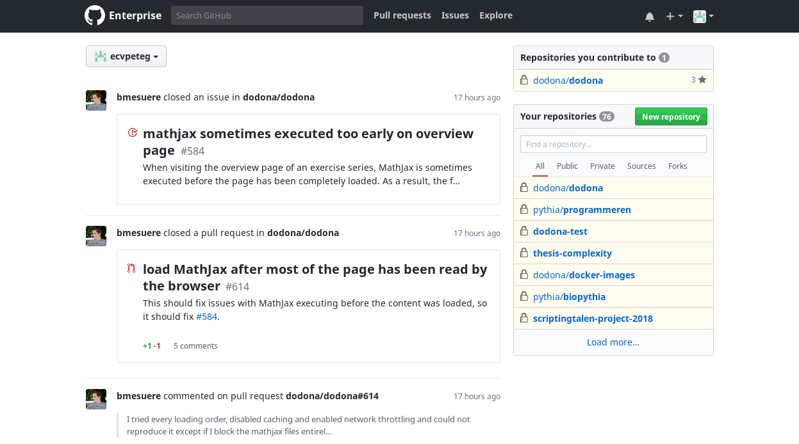

.. _oefeningen beheren:

Oefeningen beheren
==================

.. _oefening:

Een **oefening** bestaat uit een opdracht waarvoor :ref:`oplossingen <oplossing>` kunnen :ref:`ingediend <oplossing indienen>` worden en is gekoppeld aan een :ref:`judge <judge>` die de ingediende oplossingen automatisch kan beoordelen en van feedback voorzien. In dit hoofdstuk bespreken we de specificatie voor het opstellen van oefeningen. Deze specificatie legt vast hoe de opdracht van een oefening moet beschreven worden en hoe de automatische beoordeling voor een oefening moet geconfigureerd worden. De specificatie voor het schrijven van judges voor Dodona wordt besproken in `oplossingen automatisch beoordelen`.

Het opstellen van :ref:`oefeningen <oefening>` gebeurt niet in Dodona, maar in externe `git <https://nl.wikipedia.org/wiki/Git_(software)>`_ `repositories <https://en.wikipedia.org/wiki/Repository_(version_control)>`_ die aan Dodona gekoppeld worden. Elke git repository wordt extern beheerd door één of meer personen, kan meerdere oefeningen bevatten en synchroniseert elke wijziging aan de oefeningen automatisch met Dodona. Dit zorgt ervoor dat grote collecties oefeningen eenvoudig kunnen beheerd worden, dat individuele oefeningen eenvoudig kunnen aangepast worden en dat wijzigingen meteen zichtbaar zijn op Dodona.

.. TODO:feature-missing: een oefening zou generiek moeten kunnen vastleggen i) hoe de opdracht van de oefening beschreven wordt (laat gegeneerde opdrachten toe), ii) hoe oplossingen voor de opdracht er uitzien en hoe ze kunnen ingediend worden (laat generieke indienscenario's toe) en iii) hoe ingediende oplossingen kunnen beoordeeld en van feedback voorzien worden (lijkt nu al vrij generiek te zijn, behalve dan misschien dat de feedback-spec te eng is en dat er nog interventie nodig is om Dockers op te laden)

.. _repository:

Een :ref:`lesgever <lesgever>` kan oefeningen uit een externe git repository publiceren op Dodona. Daarvoor moet hij Dodona koppelen met de externe git repository en Dodona de toestemming geven om de externe git repository te beheren. Als de externe git repository een collectie oefeningen bevat die gestructureerde is volgens de daarvoor vastgelegde specificatie, dan worden de oefeningen daardoor beschikbaar op Dodona. Een collectie oefeningen die op deze manier gepubliceerd wordt, noemen we kortweg een **repository**.

.. TODO:feature-update: aangezien de term "repository" beladen is, zouden we beter zoeken naar een specifiekere term voor een "collectie oefeningen uit een externe git repository die aan Dodona gekoppeld is"

.. TODO:feature-missing: alle Dodona-objecten die geconfigureerd worden in externe repositories zouden gebruik kunnen maken van een generieke "repository"-component die deels instaat voor het interne beheer van de objecten (koppeling van beheerders); dit zou op termijn ook moeten toelaten op cursussen aan git repo's te koppelens

.. Een :ref:`lesgever <lesgever>` kan alle beschikbare oefeningen op Dodona beheren. Voorlopig ga ik hier over zwijgen, want dit zou enkel moeten kunnen als hij beheerder is van de repository waaruit de oefeningen komen.

.. TODO:feature-missing: het beheren van repositories en oefeningen in Dodona moet fijnmaziger gemaakt worden, en zou analoog kunnen gebeuren aan het beheren van cursussen; lesgevers kunnen repositories koppelen, worden er meteen voor geregistreerd en als beheerder aangeduid; ze kunnen ook andere beheerders aanduiden voor de repository; een beheerder bepaalt welke andere gebruikers en welke cursussen gebruik kunnen maken van de oefeningen uit de repository (dit kan niet afzonderlijk voor de oefeningen uit de repository)

.. Lesgevers kunnen oefeningen toevoegen en delen

.. Het definiëren van judges en oefeningen – die voor hun automatische beoordeling gebruikmaken van deze judges – gebeurt via GitHub repositories die automatisch gesynchroniseerd worden met de webapplicatie.


.. note::

    Om oefeningen aan Dodona toe te voegen moet je `git <https://git-scm.org>`_ gebruiken. Als je hier weinig of geen ervaring mee hebt lees je best `dit boek <https://git-scm.com/book>`_. Vooral hoofdstukken 1, 2 en 6 zijn hierbij nuttig.

Alle oefeningen in Dodona komen van een git repository. Ook lege repositorie kunnen :ref:`toegevoegd worden aan Dodona <adding_a_repository>` maar om de oefeningen correct te identificeren en parsen moet de repository aan een :ref:`voorgedefinieerde structuur <predefined_structure>` voldoen.

.. _adding_a_repository:

Publiceren van oefeningen
-------------------------

Om oefeningen aan Dodona toe te voegen moet je eerst een git repository
aanmaken. Dit kan je doen op de `UGent GitHub <https://github.ugent.be>`_ of op
de `publieke GitHub <https://github.com>`_.



Daarna is het belangrijk om de account van Dodona toe te voegen als
*collaborator* aan je repository. Op de UGent GitHub is dat **SA-GithubDodona**
en op de publieke GitHub is dat **dodona-server**.

.. image:: add-dodona-to-repository.gif

De volgende stap is de repository op Dodona registreren. Alle medewerkers op
Dodona hebben een "Repositories" link in hun "Admin" dropdown. Dit brengt je
naar een overzicht van de repositories die Dodona gebruikt als bronnen voor
oefeningen. Klik op de ``+`` knop om een nieuwe repository toe te voegen.

Geef een naam, de git clone URL en de standaard :ref:`judge <list_of_judges>` in
en klik op de knop rechtsboven om een nieuwe repository toe te voegen. Hierbij
moet de git clone URL een SSH URL zijn.

Als laatste moet je op GitHub een *webhook* instellen. De URL hiervoor kan je
vinden op de detailpagina van je repository op Dodona. De *webhook* instellen
kan je doen in de instellingen van je repository op GitHub.

Klik tenslotte nog eens op "Alle oefeningen herwerken". Zo ben je zeker dat er
geen oefeningen gemist zijn tussen het moment dat je de respository toevoegde en
de *webhook* instelde.

Moet ik mijn repository *private* of *public* maken?
""""""""""""""""""""""""""""""""""""""""""""""""""""

Dit mag je zelf kiezen. Houd er wel rekening mee dat als je bijvoorbeeld
voorbeeldoplossingen bij de oefeningen plaatst of als je de oefeningen voor
examens gebruikt dat je de repository dan beter *private* maakt. Anders
kunnen studenten de repository vinden en deze oplossingen of oefeningen
bekijken.

.. _predefined_structure:
.. _structuur van een repository:

Organiseren van oefeningen
--------------------------

.. warning::

   Denk op voorhand goed na over hoe je je repository wil organiseren. Dodona
   kan er namelijk (nog) niet mee om dat oefeningen verplaatst of verwijderd
   worden.

In de repository mag je de mappen zelf organiseren zoals je wil. Om een map te
markeren als een map waar een oefening in zit moet je er een ``config.json``
bestand in plaatsen. Mappen waar oefeningen in zitten hebben een vaste
structuur:

``config.json``
  Dit bestand bevat de :ref:`configuratie <exercise_configuration>` specifiek
  voor de oefening. Deze configuratie zal samengeritsd worden met alle
  ``dirconfig.json`` bestanden in de oudermappen (tot aan de wortel van de
  repository) om de complete configuratie van de oefening te vormen.

``description``
  Deze map bevat de files die
  :ref:`de oefening beschrijven <describing_an_exercise>` en enkele (optionele
  mappen).

  ``media``
    Deze map bevat statische bestanden die toegankelijk zijn op de webserver
    (handig om bijvoorbeeld afbeeldingen in te voegen in de beschrijving van de
    oefening). De bestanden zijn even toegankelijk als de oefening, dus als de
    oefening niet toegankelijk is voor studenten zullen deze bestanden dat ook
    niet zijn.
  ``boilerplate``
    Deze map bevat standaardtekst die automatisch in de indienomgeving geplaatst
    wordt wanneer de oefening op de site geladen wordt. Deze files zijn van de
    vorm ``boilerplate.<lang>`` (bijvoorbeeld ``boilerplate.en`` of
    ``boilerplate.nl``). Hiermee kan je commentaar of namen in de taal van de
    gebruiker zetten. Het bestand ``boilerplate`` (zonder taal extensie) wordt
    gebruikt wanneer de gevraagde taal niet beschikbaar is.

``evaluation``
  De inhoud van deze map zal beschikbaar gesteld worden aan de judge (dus
  bijvoorbeeld de testcode).

``workdir``
  Deze map is optioneel. De inhoud zal beschikbaar gemaakt worden aan de
  ingediende code (door ze in de huidige map te plaatsen tijdens de uitvoering).

Alle mappen en bestanden naast deze zullen door Dodona genegeerd worden, dus je
mag zelf zoveel bestanden als je wil toevoegen (behalve bestanden die
``config.json`` heten, aangezien oefeningen in oefeningen niet toegelaten zijn).
Dit kan je gebruiken om bijvoorbeeld een voorbeeldoplossingen bij elke oefening
te plaatsen.

Een voorbeeld van een geldige structuur kan hier gevonden worden:

.. code-block:: text

   +-- README.md                      # Beschrijft de repository
   +-- dirconfig.json                 # Gedeelde configuratie voor alle oefeningen in deze repository
   +-- week01                         # Oefeningen kunnen bijvoorbeeld per week opgedeeld worden
   |   +-- intsum                     # Korte naam voor de oefening
   |   |   +-- config.json            # Configuratie voor de oefening
   |   |   +-- evaluation             #
   |   |   |   `-- intsum_test.hs     # Een Haskell test bestand
   |   |   +-- description            #
   |   |   |   +-- description.nl.md  # De beschrijving in het Nederlands
   |   |   |   +-- description.en.md  # De beschrijving in het Engels
   |   |   |   +-- media              #
   |   |   |   |   `-- some_image.png # Een afbeelding die in de beschrijving gebruikt wordt
   |   |   |   `-- boilerplate        #
   |   |   |       +-- boilerplate    # Default standaardtekst
   |   |   |       `-- boilerplate.en # Standaardtekst in het Engels
   |   |   `-- workdir                #
   |   |       `-- intlines.txt       # Een bestand beschikbaar voor de code van de student
   |   :
   :

.. TODO:feature-discuss: public folder

.. _exercise_configuration:

Opstellen van oefeningen
------------------------

Het configuratie bestand van een oefening moet de volgende velden bevatten:

``description``
  Een JSON object met drie velden:

  ``difficulty``
    Een optionele numerieke inschatting van de moeilijkheid van de oefening.

  ``handler``
    Momenteel is hier enkel ``default`` als waarde mogelijk.

  ``names``
    Een JSON object met ``en`` en/of ``nl`` als keys. De values zijn de naam van
    de oefening in de verschillende talen.

``evaluation``
  Een JSON object met vier velden:

  ``handler``
    De naam van de judge gebruikt voor de evaluatie.

  ``time_limit``
    Een geheel getal dat de maximale tijd aanduid om de evaluatie te draaien.

  ``memory_limit``
    Een geheel getal dat het maximale geheugen in bytes aanduid dat gebruikt mag
    worden tijdens de evaluatie.

  ``network_enabled``
    Een (optionele) boolean die aanduid of het netwerk ingeschakeld moet zijn.
    Standaard is de waarde ``false``.

``programming_language``
  Een string die de programmeertaal aangeeft. Dit wordt momenteel enkel gebruikt
  voor syntax highlighting.

``submission``
  Een object dat de specificatie voor de indienprocedure voorstelt. Dit wordt
  momenteel nog niet gebruikt.

  ``handler``
    Naam van de handler voor het indienen.

  ``size_limit``
    Een geheel getal dat de maximale grootte van ingediende code in bytes
    voorstelt.

  ``supported_programming_languages``
    Een lijst van strings die de aanvaardbare programmeertalen voorstellen. (Of
    een enkele string als er maar één aanvaardbare programmeertaal is.)

``visibility``
  Oftewel ``"open"``, ``"hidden"`` of ``"closed"``. Als de waarde ``"open"`` is
  kan iedereen de oefening vinden door er naar te zoeken. Als de waarde
  ``"hidden"`` is, is de oefening enkel beschikbaar via een link er naar toe.
  Als de waarde ``"closed"`` is kunnen enkel medewerkers van Dodona de oefening
  bekijken.

.. _describing_an_exercise:

Beschrijven van de opdracht
---------------------------

Beschrijvingen van oefeningen worden gerenderd met `Bootstrap
<http://getbootstrap.com/>`_ CSS, componenten en JavaScript. Beschrijvingen
kunnen op twee manieren geschreven worden: in HTML of in Markdown. Dodona
gebruikt `kramdown syntax <http://kramdown.gettalong.org/syntax.html>`_ voor
Markdown documenten. Zie het `Markdown cheatsheet
<https://github.com/adam-p/markdown-here/wiki/Markdown-Cheatsheet#html>`_ voor
basis Markdown formatting.

Hieronder volgt een lijst van standaard features die voorkomen in beschrijvingen
van oefeningen. Volg deze instructies om de features een consistente Dodona
stijl te geven.

Afbeeldingen
""""""""""""

Dodona installeert automatisch lightbox ondersteuning op alle afbeeldingen in de beschrijving. Het is mogelijk om een caption te specifiëren voor een afbeelding en om een alternatieve bron in te stellen die in de lightbox getoond zal worden.

HTML
  Een caption kan ingesteld worden met het ``data-caption`` attribuut. Als er geen ``data-caption`` attribuut is zal Dodona als caption de eerste waarde van de volgende attributen nemen: ``alt`` en ``src``.

  .. code-block:: html

     

  Een alternatieve bron voor een hoge-resolutie versie van de afbeelding kan
  toegevoegd worden via het ``data-large`` attribuut. Deze versie zal getoond
  worden in de lightbox in plaats van de afbeelding die inline in de
  beschrijving getoond wordt.

  .. code-block:: html

     

Markdown
  Om via markdown een caption in te stellen kan ook het ``data-caption``
  attribuut gebruikt worden. Als dit niet aanwezig is zal Dodona kijken naar de
  eerste waarde van de volgende attributen: ``title text`` en ``alt text``. In
  de *inline style* ziet dat er zo uit:

  .. code-block:: text

     {:data-caption="Caption onder de afbeelding"}

  Of in *reference style*:

  .. code-block:: text

     ![alt text][my-image]
     [my-image]: image.jpg "title text"
     {:data-caption="Caption onder de afbeelding"}

  Een alternatieve bron voor een hoge-resolutie versie van de afbeelding kan
  weer toegevoegd worden via het ``data-large`` attribuut. In de *inline style* ziet dat er zo uit:

  .. code-block:: text

     {:data-large="large-image.jpg"}

  Of in *reference style*:

  .. code-block:: text

     ![alt text][my-image]
     [my-image]: image.jpg "title text"
     {:data-large="large-image.jpg"}

Tabellen
""""""""

HTML
  In HTML voeg je best de volgende *classes* toe aan je tabel: ``table``,
  ``table-striped`` en ``table-condensed``. Zo kan je ervan uitgaan dat er voor
  je tabel dezelfde stijl gebruikt wordt als in de rest van Dodona. Dit ziet er
  dan zo uit:

  .. code-block:: html

     <table class="table table-striped table-condensed">
         <thead>
             <tr>
                 <th>...</th>
                 <th>...</th>
             </tr>
         </thead>
         <tbody>
             <tr>
                 <td>...</td>
                 <td>...</td>
             </tr>
             <tr>
                 <td>...</td>
                 <td>...</td>
             </tr>
         </tbody>
     </table>

Markdown
  In Markdown kan je een tabel schrijven zoals je gewoon bent:

  .. code-block:: text

     |-----------------+------------+-----------------+----------------|
     | Default aligned |Left aligned| Center aligned  | Right aligned  |
     |-----------------|:-----------|:---------------:|---------------:|
     | First body part |Second cell | Third cell      | fourth cell    |
     | Second line     |foo         | **strong**      | baz            |
     | Third line      |quux        | baz             | bar            |
     |-----------------+------------+-----------------+----------------|
     | Second body     |            |                 |                |
     | 2 line          |            |                 |                |
     |=================+============+=================+================|
     | Footer row      |            |                 |                |
     |-----------------+------------+-----------------+----------------|

Gecentreerde groepen
""""""""""""""""""""

Media (afbeeldingen, tabellen, videos, ...) in een groep worden naast elkaar
getoond met wat spacing ertussen en de groep wordt gecentreerd.

HTML
  Om dit in HTML te gebruiken plaats je de elementen die je in de groep wilt in
  een ``div`` met de ``dodona-centered-group`` *class*. Dit ziet er als volgt
  uit:

  .. code-block:: html

     <div class="dodona-centered-group">
       
       
       
     </div>

Markdown
  In Markdown kunnen we dit oplosson met `Inline Attribute Lists
  <http://kramdown.gettalong.org/syntax.html#inline-attribute-lists>`_, een
  kramdown feature. Dit ziet er dan als volgt uit:

  .. code-block:: text

     {: .dodona-centered-group}
     
     

YouTube
"""""""
Om een YouTube-filmpje te embedden moet je eerst de embed code halen op YouTube. Dit zal iets van de volgende vorm zijn:

.. code-block:: html

   <iframe width="560" height="315" src="https://www.youtube.com/embed/lRKriSNJlyg" frameborder="0" allow="autoplay; encrypted-media" allowfullscreen></iframe>

HTML
  Om dit te gebruiken in HTML gebruik je best een gecentreerde groep:

  .. code-block:: html

     <div class="dodona-centered-group">
       <iframe width="560" height="315" src="https://www.youtube.com/embed/lRKriSNJlyg" frameborder="0" allow="autoplay; encrypted-media" allowfullscreen></iframe>
     </div>

Markdown
  In Markdown kan je gewoon HTML embedden. Dit kan dus gelijkaardig aan het HTML voorbeeld:

  .. code-block:: text

     {: .dodona-centered-group}
     <iframe width="560" height="315" src="https://www.youtube.com/embed/lRKriSNJlyg" frameborder="0" allow="autoplay; encrypted-media" allowfullscreen></iframe>

Blockquotes
"""""""""""
HTML
  In HTML moet je geen speciale dingen doen om blockquotes te gebruiken. Dit kan met andere woorden gewoon zo:

  .. code-block:: html

     <blockquote>
       Blockquotes are very handy in email to emulate reply text.
       This line is part of the same quote.
     </blockquote>

Markdown
  Ook in Markdown is het gebruik van blockquotes zeer gemakkelijk:

  .. code-block:: text

     > Blockquotes are very handy in email to emulate reply text.
     > This line is part of the same quote.

Code snippets
"""""""""""""
HTML
  Om broncode te tonen in de beschrijving maak je best gebruik van de
  ``highlighter-rouge``, ``language-<lang>`` en ``highlight`` *classes*. Hierbij
  moet je ``<lang>`` vervangen door de naam van de programmeertaal waarvoor je
  syntax highlighting wilt. Dus bijvoorbeeld ``language-python`` voor Python.
  Schrijf je HTML als volgt:

  .. code-block:: html

     <div class="highlighter-rouge language-<lang>">
       <pre class="highlight">
         <code>
         # source code comes here
         </code>
       </pre>
     </div>

  Om een voorbeeld input te tonen kan je gewoon gebruikmaken van het ``pre``
  element. Dus als volgt:

  .. code-block:: html

     <pre>Sample text here...</pre>

Markdown
  Om in markdown syntax highlighting te krijgen kan je gewoon gebruik maken van
  de standaard manier om dit in markdown te doen:

  .. code-block:: text

     ```lang
     # source code comes here
     ```

  Vergeet niet om ``lang`` te vervangen door de naam van de programmeertaal
  waarvoor je syntax highlighting wilt.

Wiskundige snippets
"""""""""""""""""""
HTML
  Om in HTML mooi gerenderde wiskunde te krijgen wordt gebruik gemaakt van `MathJax <https://www.mathjax.org/>`_.

  Om inline wiskunde te renderen kan dit als volgt:

  .. code-block:: html

     <p>
       tekst $$ valide LaTeX $$ tekst
     </p>

  Om de wiskunde in een apart blok te renderen kan dit op twee manieren:

  .. code-block:: html

     <p>
       tekst \[ valide LaTeX \] tekst
     <p>

  of

  .. code-block:: html

     <p>
       tekst $$\begin valide LaTeX$$ tekst
     </p>

  Deze laatste methode zal enkel als blok gerenderd worden wanneer de LaTeX met ``\begin`` begint.

Markdown
  Om in Markdown inline wiskunde te renderen kan dit als volgt:

  .. code-block:: text

     tekst $$ valide LaTeX $$ meer tekst

  Om de wiskunde als blok te renderen in Markdown kan dit als volgt:

  .. code-block:: text

     tekst
     $$
     valide LaTeX
     $$
     meer tekst

Callouts
""""""""

Callouts zijn enkel mogelijk in HTML. Dit kan als volgt:

.. code-block:: html

   <div class="callout callout-info">
     <h4>Titel</h4>
     <p>Tekst</p>
   </div>

In plaats van ``callout-info`` kan ook ``callout-warning`` en ``callout-danger``
gebruikt worden. Je kan deze HTML natuurlijk gewoon in je Markdown plaatsen om
hetzelfde effect te creëren. Je moet dan wel het volledig element in HTML
schrijven.

.. TODO:feature-discuss: aangeven hoe je een deel van de omschrijving kan verbergen in de afdrukbare versie van een oefening of ze daar net zichtbaar te maken (bv. videofragment vervangen door afbeelding)


Voorbeeld
"""""""""

Markdown

  .. code-block:: text

     Schrijf een natuurlijk getal op een blaadje papier:

     > 886328712442992

     Tel het aantal even en oneven cijfers, en ook het totaal aantal cijfers:

     > 10 5 15

     Vorm een nieuw getal door de cijfers van de voorgaande dree getallen samen te voegen:

     > 10515

     Voor dezelfde procedure nogmaals uit op het bekomen getal:

     > 1 4 5 ⟶ 145

     En blijf dit herhalen:

     > 1 2 3 ⟶ 123

     Je zal finaal altijd bij het getal 123 uitkomen.

     <div class="callout callout-info">
          <h4>Opmerking</h4>
          <p>Bij het toepassen van de procedure om het volgende getal te bepalen,
            dien je de voorloopnullen te laten vallen als er geen even cijfers in
            het getal staan. Als we bijvoorbeeld vertrekken van het getal 111, dan
            bepalen we het volgende getal als</p>
          <blockquote>0 3 3 &#10230; 33 (en niet 033)</blockquote>
          <p>Dat maakt een verschil omdat 33 geen even cijfers heeft (en bij een
            volgende toepassing van de procedure 22 oplevert) en 033 wel een even
            cijfer heeft (en bij een volgende toepassing van de procedure 123 zou
            opleveren).</p>
     </div>


    ### Opgave

     * Schrijf een functie `evenOneven` waaraan een getal $$n \in \mathbb{N}$$
       moet doorgegeven worden. De functie moet een tuple met twee natuurlijke
       getallen teruggeven, die repectievelijk aangeven hoeveel even en oneven
       cijfers er in $$n$$ voorkomen.
     * Schrijf een functie `volgende` waaraan een getal $$n \in \mathbb{N}$$
       moet doorgegeven worden. De functie moet het getal teruggeven dat men
       bekomt door de procedure uit de inleiding eenmaal toe te passen op $$n$$.
     * Schrijf een functie `stappen` waaraan een getal $$n \in \mathbb{N}$$ moet
       doorgegeven worden. De functie moet teruggeven hoe vaak we de procedure
       uit de inleiding moeten toepassen voor we 123 bekomen, als we beginnen
       bij $$n$$.

    ### Voorbeeld

    ```python
    >>> evenOneven(886328712442992)
    (10, 5)
    >>> evenOneven(10515)
    (1, 4)
    >>> evenOneven(145)
    (1, 2)

    >>> volgende(886328712442992)
    10515
    >>> volgende(10515)
    145
    >>> volgende(145)
    123

    >>> stappen(886328712442992)
    3
    >>> stappen(1217637626188463187643618416764317864)
    4
    >>> stappen(0)
    2
    >>> stappen(1)
    5
    ```

HTML

  .. code-block:: html

     <html>
      <head>
        <meta http-equiv="content-type" content="text/html; charset=utf-8">
      </head>
      <body>
        <p>Schrijf een natuurlijk getal op een blaadje papier:</p>
        <blockquote>886328712442992</blockquote>
        <p>Tel het aantal even en oneven cijfers, en ook het totaal aantal cijfers:</p>
        <blockquote>10 5 15</blockquote>
        <p>Vorm een nieuw getal door de cijfers van de voorgaande drie getallen
          samen te voegen:</p>
        <blockquote>10515</blockquote>
        <p>Voer dezelfde procedure nogmaals uit op het bekomen getal:</p>
        <blockquote>1 4 5 &#10230; 145</blockquote>
        <p>En blijf dit herhalen:</p>
        <blockquote>1 2 3 &#10230; 123</blockquote>
        <p>Je zal finaal altijd bij het getal 123 uitkomen.</p>
        <div class="callout callout-info">
          <h4>Opmerking</h4>
          <p>Bij het toepassen van de procedure om het volgende getal te bepalen,
            dien je de voorloopnullen te laten vallen als er geen even cijfers in
            het getal staan. Als we bijvoorbeeld vertrekken van het getal 111, dan
            bepalen we het volgende getal als</p>
          <blockquote>0 3 3 &#10230; 33 (en niet 033)</blockquote>
          <p>Dat maakt een verschil omdat 33 geen even cijfers heeft (en bij een
            volgende toepassing van de procedure 22 oplevert) en 033 wel een even
            cijfer heeft (en bij een volgende toepassing van de procedure 123 zou
            opleveren).</p>
        </div>
        <h3>Opgave</h3>
        <ul>
          <li>
            <p>Schrijf een functie <samp>evenOneven</samp> waaraan een getal $$n
              \in \mathbb{N}$$ moet doorgegeven worden. De functie moet een tuple
              met twee natuurlijke getallen teruggeven, die respectievelijk aangeven
              hoeveel even en oneven cijfers er in $$n$$ voorkomen.</p>
          </li>
          <li>
            <p>Schrijf een functie <samp>volgende</samp> waaraan een getal $$n \in
              \mathbb{N}$$ moet doorgegeven worden. De functie moet het getal
              teruggeven dat men bekomt door de procedure uit de inleiding eenmaal
              toe te passen op $$n$$.</p>
          </li>
          <li>
            <p>Schrijf een functie <samp>stappen</samp> waaraan een getal $$n \in
              \mathbb{N}$$ moet doorgegeven worden. De functie moet teruggeven hoe
              vaak we de procedure uit de inleiding moeten toepassen vooraleer we
              het getal 123 bekomen, als we beginnen bij $$n$$.</p>
          </li>
        </ul>
        <h3>Voorbeeld</h3>
        <div class="highlighter-rouge language-python">
          <div class="syntax">
            <pre><span class="gp">&gt;&gt;&gt; </span><span class="n">evenOneven</span><span
    class="p">(</span><span class="mi">886328712442992</span><span class="p">)</span>
    <span class="go">(10, 5)</span>
    <span class="gp">&gt;&gt;&gt; </span><span class="n">evenOneven</span><span class="p">(</span><span
    class="mi">10515</span><span class="p">)</span>
    <span class="go">(1, 4)</span>
    <span class="gp">&gt;&gt;&gt; </span><span class="n">evenOneven</span><span class="p">(</span><span
    class="mi">145</span><span class="p">)</span>
    <span class="go">(1, 2)</span>

    <span class="gp">&gt;&gt;&gt; </span><span class="n">volgende</span><span class="p">(</span><span
    class="mi">886328712442992</span><span class="p">)</span>
    <span class="go">10515</span>
    <span class="gp">&gt;&gt;&gt; </span><span class="n">volgende</span><span class="p">(</span><span
    class="mi">10515</span><span class="p">)</span>
    <span class="go">145</span>
    <span class="gp">&gt;&gt;&gt; </span><span class="n">volgende</span><span class="p">(</span><span
    class="mi">145</span><span class="p">)</span>
    <span class="go">123</span>

    <span class="gp">&gt;&gt;&gt; </span><span class="n">stappen</span><span class="p">(</span><span
    class="mi">886328712442992</span><span class="p">)</span>
    <span class="go">3</span>
    <span class="gp">&gt;&gt;&gt; </span><span class="n">stappen</span><span class="p">(</span><span
    class="mi">1217637626188463187643618416764317864</span><span class="p">)</span>
    <span class="go">4</span>
    <span class="gp">&gt;&gt;&gt; </span><span class="n">stappen</span><span class="p">(</span><span
    class="mi">0</span><span class="p">)</span>
    <span class="go">2</span>
    <span class="gp">&gt;&gt;&gt; </span><span class="n">stappen</span><span class="p">(</span><span
    class="mi">1</span><span class="p">)</span>
    <span class="go">5</span>
    </pre></div>
        </div>
      </body>
    </html>

Dit ziet er dan uiteindelijk als volgt uit:

.. image:: description-example.nl.png
