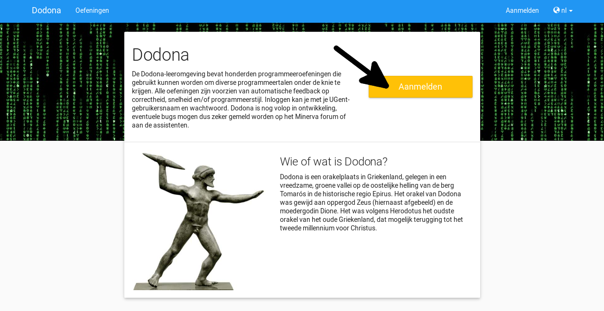
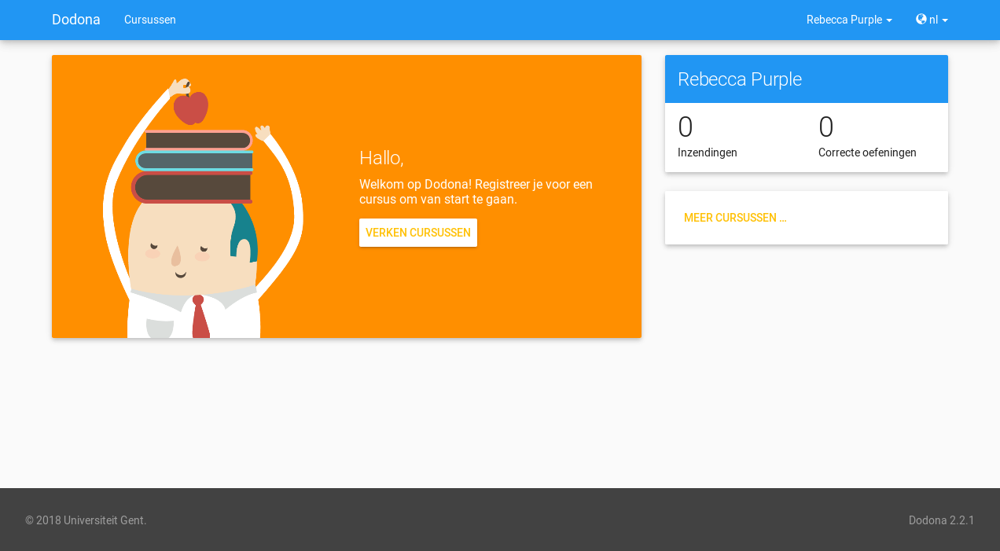
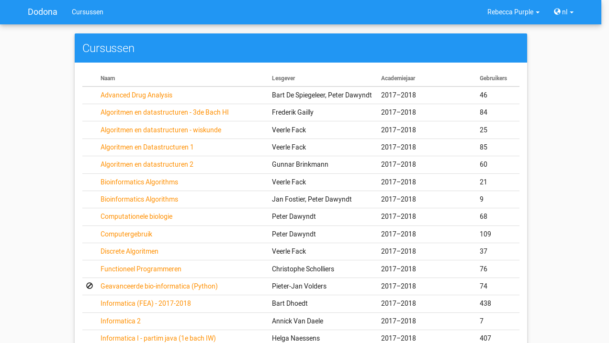
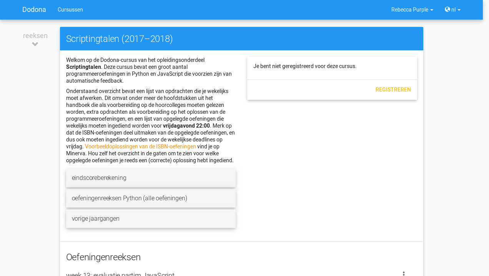
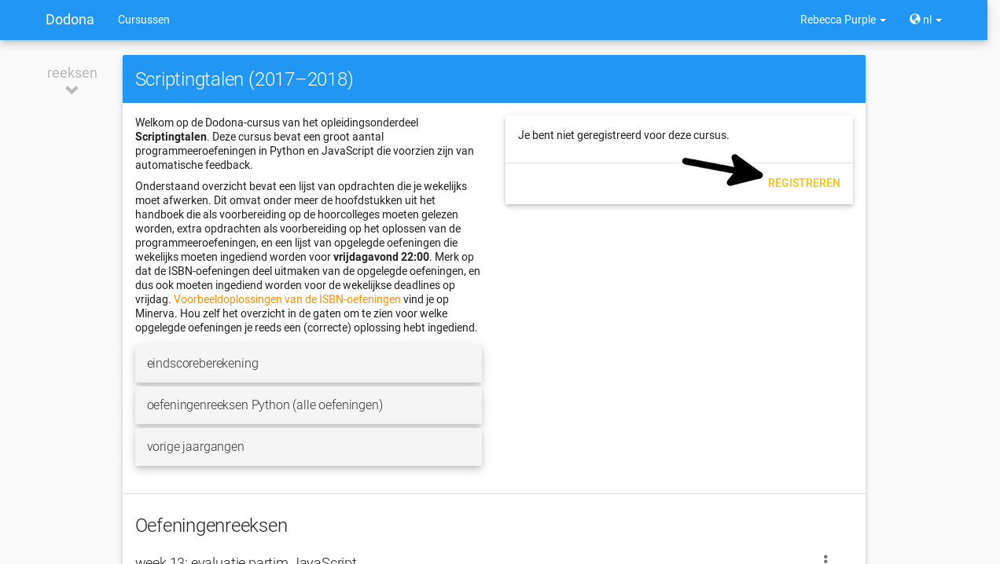

.. _for_students:

=========================
Informatie voor studenten
=========================

Inloggen
--------

Om in te loggen op Dodona navigeer je naar
`dodona.ugent.be <https://dodona.ugent.be>`_. Klik op "Aanmelden".

Selecteer dan de onderwijsinstelling waar je aan verbonden bent. Dit zal je naar
een inlogpagina van jouw onderwijsinstelling brengen.

.. image:: institution.nl.png

Nadat je succesvol ingelogd bent kom je op je persoonlijke homepagina aan.

Inschrijven op een cursus
-------------------------

Als je ingelogd bent via een speciale link die je van je lesgever hebt
gekregen ben je al ingeschreven en mag je deze stap overslaan.

Als dit niet gebeurd is zal je je zelf moeten inschrijven op de cursus. Als
voorbeeld zullen wij ons inschrijven op de cursus Scriptingtalen van het
academiejaar 2017--2018. Klik hiervoor op de "Verken cursussen" knop. Deze knop
zal niet aanwezig zijn wanneer je al ingeschreven bent op een cursus. In dat
geval kan je de "Meer cursussen..." knop rechts onderaan de pagina gebruiken.

.. image:: explore_courses.nl.png

Je komt nu op een pagina met een lijst van alle cursussen op Dodona. Deze staan
eerst gesorteerd op academiejaar (met het huidige academiejaar eerst) en dan
alfabetisch op naam.

Vind de cursus waar je je op wil inschrijven. De naam van de cursus zal meestal
dezelfde zijn als de naam van het vak dat je volgt. Als je niet zeker bent voor
welke cursus je je moet inschrijven kan je ook gebruik maken van het lesgever
veld om de juiste cursus te kiezen. Let er zeker op dat je je voor het juiste
academiejaar inschrijft. Klik op de naam van de cursus om naar de cursuspagina
te gaan. Wij zullen verdergaan met de cursus Scriptingtalen.

Je komt dan op een pagina terecht die er ongeveer als volgt uit ziet:

Je kan je registreren via de de knop "Registreren".

Als hier "Registratieverzoek indienen" staat zal je moeten wachten tot de
lesgever je verzoek goedkeurt. Nadat je er op geklikt hebt zal er de boodschap
"Je staat al op de wachtlijst" staan.

Wanneer je geregistreerd bent voor een cursus zal je homepagina er als volgt uit zien:

.. image:: homepage_after_registration.nl.png

Een oefening indienen
---------------------

