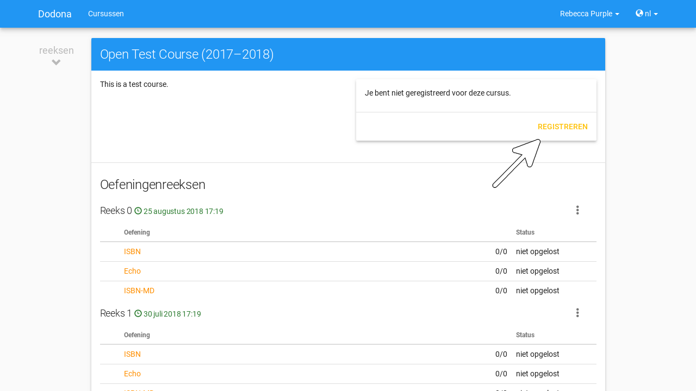
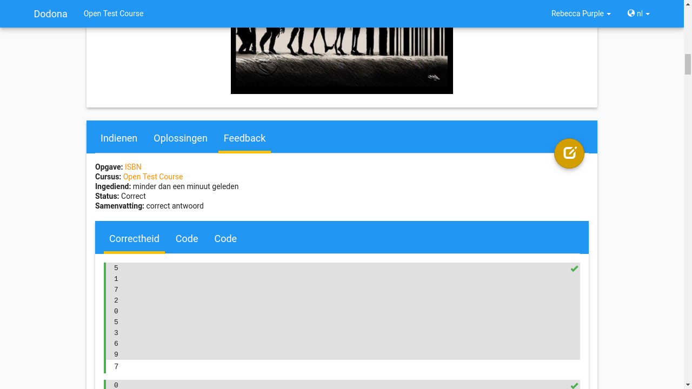
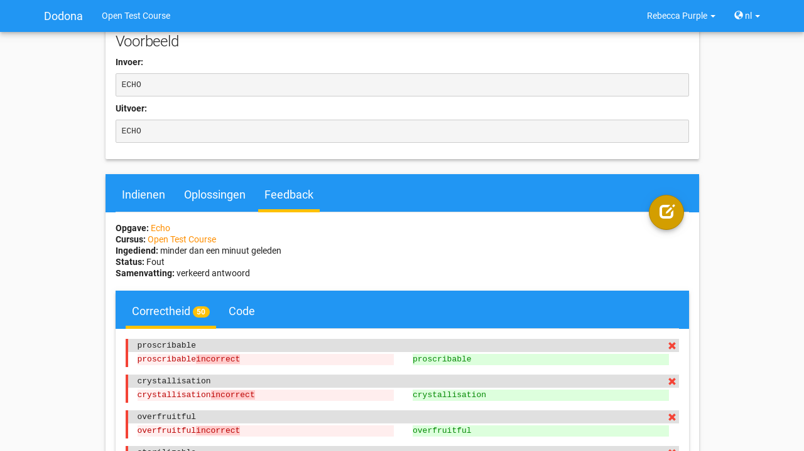

.. _for_students:

Dodona voor studenten
=====================

Als student kan je op Dodona registreren voor één of meer **cursussen** (modules). Elke cursus bevat een reeks **oefeningen** die gegroepeerd zijn in **oefeningenreeksen**. Voor elke oefening kan je herhaald **oplossingen** indienen die door Dodona automatisch van feedback voorzien worden. Deze acties vereisen echter dan je je eerst aanmeldt op Dodona.

.. important::

    Om te kunnen aanmelden moet je over een **gebruikersaccount** beschikken op Dodona. Op dit moment kan je zelf geen gebruikersaccount aanmaken, maar maakt Dodona automatisch een gebruikersaccount aan als je aanmeldt via een gebruikersaccount van één van deze instellingen:

      * Universiteit Gent (UGent)
      * Universiteit Hasselt (UHasselt)
      * Hogeschool West-Vlaanderen (Howest)
      * Hogeschool Gent (HoGent)
      * Katholieke Universiteit Leuven (KU Leuven)
      * College Waregem
      * Sint-Bavohumaniora (Gent)
      * College Ieper

    Voor authenticatie via bestaande gebruikersaccounts van externe instellingen ondersteunt Dodona zowel `SAML <https://nl.wikipedia.org/wiki/Security_Assertion_Markup_Language>`_ als `OAuth <https://nl.wikipedia.org/wiki/OAuth>`_. Vraag een ICT-beheerder of lesgever van je instelling om contact op te nemen met team Dodona als je graag alle gebruikersaccounts van je instelling toegang wilt geven tot Dodona. Deze dienstverlening is gratis.

Aanmelden
---------

Om in te loggen op Dodona navigeer je naar
`dodona.ugent.be <https://dodona.ugent.be>`_. Klik op **Aanmelden**.

.. image:: login.nl.png

Selecteer de instelling die de gebruikersaccount beheert waarmee je wilt aanmelden op Dodona. Daar kan je de instellingsspecifieke aanmeldingsprocedure volgen.

.. image:: institution.nl.png

.. note::

    Voor sommige instellingen moet je op het einde van de aanmeldingsprocedure expliciet toestemming geven voor het uitwisselen van gebruikersinformatie tussen de instelling en Dodona. Dodona gebruikt deze informatie enkel voor intern beheer van gebruikersaccounts.

Nadat je met succes bent aangemeld, krijg je je persoonlijke homepagina op Dodona te zien. In de navigatiebalk (bovenaan de pagina) zie je de naam van de gebruikersaccount waarmee je bent aangemeld. Indien dit de eerste keer is dat je bent aangemeld op Dodona, werd er een nieuwe gebruikersaccount voor je aangemaakt.

.. image:: homepage.nl.png

.. note::

    Indien je beschikt over gebruikersaccounts bij verschillende externe instellingen, dan corresponderen deze gebruikersaccounts bij aanmelden met verschillende gebruikersaccount op Dodona.

Inschrijven op een cursus
-------------------------

.. note::

   Als je ingelogd bent via een speciale link die je van je lesgever hebt
   gekregen ben je al ingeschreven en mag je deze stap overslaan.

Als dit niet gebeurd is zal je je zelf moeten inschrijven op de cursus. Als
voorbeeld zullen wij ons inschrijven op de cursus Scriptingtalen van het
academiejaar 2017--2018. Klik hiervoor op de "Verken cursussen" knop. Deze knop
zal niet aanwezig zijn wanneer je al ingeschreven bent op een cursus. In dat
geval kan je de "Meer cursussen..." knop rechts onderaan de pagina gebruiken.

.. image:: explore_courses.nl.png

Je komt nu op een pagina met een lijst van alle cursussen op Dodona. Deze staan
eerst gesorteerd op academiejaar (met het huidige academiejaar eerst) en dan
alfabetisch op naam.

.. image:: courses.nl.png

Vind de cursus waar je je op wil inschrijven. De naam van de cursus zal meestal
dezelfde zijn als de naam van het vak dat je volgt. Als je niet zeker bent voor
welke cursus je je moet inschrijven kan je ook gebruik maken van het lesgever
veld om de juiste cursus te kiezen. Let er zeker op dat je je voor het juiste
academiejaar inschrijft. Klik op de naam van de cursus om naar de cursuspagina
te gaan. Wij zullen verdergaan met de cursus Scriptingtalen.

Je komt dan op een pagina terecht die er ongeveer als volgt uit ziet:

.. image:: course.nl.png

Je kan je registreren via de de knop "Registreren".

Als hier "Registratieverzoek indienen" staat zal je moeten wachten tot de
lesgever je verzoek goedkeurt. Nadat je er op geklikt hebt zal er de boodschap
"Je staat al op de wachtlijst" staan.

Wanneer je geregistreerd bent voor een cursus zal je homepagina er als volgt uit zien:

.. image:: homepage_after_registration.nl.png

Als er deadlines zijn voor de cursussen waar je bent voor ingeschreven zullen
deze ook op je homepagina te zien zijn.

Een oefening indienen
---------------------

Om een oefening in te dienen moet je natuurlijk eerst naar een oefening gaan. Op
de pagina van een cursus kan je een oefening selecteren. Klik op de naam van de
oefening om de pagina van de oefening te openen. Je komt dan op een pagina
terecht die er zoals de volgende zal uitzien.

.. image:: exercise_start.nl.png

De pagina begint met een beschrijving van de oefening die je zal moeten
oplossen. Lees deze grondig. Om de oefening op te lossen gebruik je best een
apart programma (bvb. PyCharm voor Python of IntelliJ IDEA voor Java). Zo kan je
zelf eerst al kort testen of je code werkt en kan je gebruikmaken van de extra
hulp die zo'n programma's je aanbieden bij het schrijven van code.

Wanneer je je code hebt geschreven en je er van overtuigd bent dat ze werkt kan
je ze onderaan de pagina indienen. Normaal kan je de code gewoon kopiëren en
plakken van je extern programma. Klik op de afspeelknop om in te dienen.

.. image:: exercise_before_submit.nl.png

Als je code correct is zal de feedback er ongeveer als volgt uitzien:

In de eerste tabs (dit kunnen er meer dan 1 zijn) kan je de testgevallen zien
die werden uitgevoerd. In de "Code" tab kan je de code die je hebt ingediend nog
eens bekijken. Het kan zijn dat er hierbij enkele annotaties staan die hints
geven over hoe je je code iets mooier had kunnen schrijven.

Als je code niet correct is zal de feedback er ongeveer als volgt uitzien:

Via de kleuren bij de testgevallen kan je makkelijk zien welke testgevallen
juist zijn en welke fout zijn. Voor foute testgevallen kan je ook makkelijk het
verschil zien tussen de output van jouw code en de verwachte output. Het cijfer
in de bol naast de naam van de tab geeft aan hoeveel testgevallen fout waren.
