.. _for_students:

Dodona voor studenten
=====================

Als student kan je :ref:`registreren <registreren>` voor één of meer :ref:`cursussen <cursus>` (modules). Elke cursus bevat een reeks :ref:`oefeningen <oefening>` die gegroepeerd zijn in :ref:`oefeningenreeksen <oefeningenreeks>`. Voor elke oefening kan je herhaald :ref:`oplossingen indienen <oplossing indienen>` die automatisch worden beoordeeld en van :ref:`feedback <feedback>` voorzien. Deze acties vereisen echter dat je over een :ref:`gebruikersaccount <gebruikersaccount>` beschikt en dat je :ref:`aangemeld <aanmelden>` bent op Dodona.

.. TODO:tutorial-update: overweeg om de meer neutrale term "module" te gebruiken in plaats van de term "cursus"

.. _gebruikersaccount:

.. important::

    Om te kunnen :ref:`aanmelden <aanmelden>`, moet je over een **gebruikersaccount** beschikken op Dodona. In het :ref:`gebruikersprofiel <gebruikersprofiel>` van deze gebruikersaccount kan je persoonlijke voorkeuren instellen voor de :ref:`natuurlijke taal <taal selecteren>` en de :ref:`tijdzone <tijdzone instellen>` die door Dodona gebruikt worden. Daarnaast worden alle acties die je op het platform uitvoert — zoals het :ref:`registreren voor cursussen <registreren>` of het :ref:`indienen van oplossingen <oplossing indienen>` — aan je gebruikersaccount gekoppeld.

    Je kan zelf geen gebruikersaccount aanmaken. Dodona maakt automatisch een gebruikersaccount aan als je voor het eerst :ref:`aanmeldt <aanmelden>` met een gebruikersaccount van één van deze externe onderwijs- of onderzoeksinstellingen:

      * Universiteit Gent (UGent)
      * Universiteit Hasselt (UHasselt)
      * Hogeschool West-Vlaanderen (Howest)
      * Hogeschool Gent (HoGent)
      * Katholieke Universiteit Leuven (KU Leuven)
      * H.-Hartcollege Waregem
      * Sint-Bavohumaniora Gent
      * College Ieper

.. note::

    Voor authenticatie met gebruikersaccounts van externe onderwijs- of onderzoeksinstellingen ondersteunt Dodona zowel `SAML <https://nl.wikipedia.org/wiki/Security_Assertion_Markup_Language>`_ als `OAuth <https://nl.wikipedia.org/wiki/OAuth>`_. Vraag een ICT-beheerder of lesgever van je onderwijs- of onderzoeksinstelling om :ref:`contact <contact opnemen>` op te nemen met team Dodona als je graag alle gebruikersaccounts van je instelling toegang wilt geven tot Dodona. Deze dienstverlening is gratis.

.. _taalmenu:
.. _navigatiebalk:
.. _taal selecteren:

Selecteren van de natuurlijke taal
----------------------------------

Voor de natuurlijke taal van Dodona kan je kiezen tussen Nederlands of Engels. Gebruik hiervoor het **taalmenu** aan de rechterkant van de **navigatiebalk** (bovenaan elke pagina).

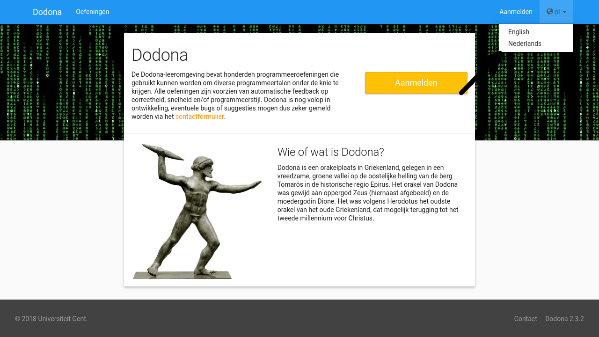

.. TODO:screenshot-update: overwegen om bijschriften toe te voegen aan afbeeldingen

Als je een natuurlijke taal selecteert terwijl je :ref:`aangemeld <aanmelden>` bent dan wordt die ook als voorkeurstaal ingesteld in je :ref:`gebruikersprofiel <gebruikersprofiel>`. Op die manier wordt bij aanmelden automatisch je voorkeurstaal geselecteerd.

.. note::

    De taal waarin vaste componenten van Dodona (menubalken, cursusstructuur, mededelingen, …) worden weergegeven valt volledig onder de controle van het platform. Deze componenten worden altijd weergegeven in de geselecteerde natuurlijke taal.

    De naam en de inhoud van een :ref:`cursus <cursus>` liggen vast. Deze componenten zijn niet afhankelijk van de selectie van de natuurlijke taal. De taal van deze componenten valt volledig onder de controle van de lesgever die de cursus heeft opgesteld.

    De naam en de omschrijving van een :ref:`oefening <oefening>` zijn afhankelijk van de selectie van de natuurlijke taal. Als bij het opstellen van de oefening een vertaling voorzien werd van de naam en de omschrijving in de geselecteerde natuurlijke taal, dan zullen deze componenten van de oefening ook in die taal weergegeven worden.

    De natuurlijke taal die gebruikt wordt in de :ref:`feedback <feedback>` over een :ref:`oplossing <oplossing indienen>` die je hebt ingediend voor een :ref:`oefening <oefening>` is een gedeelde verantwoordelijkheid van de *judge* en de oefening. Hierbij kan de feedback afhankelijk gemaakt worden van de geselecteerde natuurlijke taal.

.. TODO:feature-missing: nagaan of cursusinhoud taalafhankelijk kan gemaakt worden
.. TODO:feature-update: standaardtaal instellen op Engels
.. TODO:feature-update: restyling van landingspagina; tekst bevat zelfs nog een expliciete verwijzing naar UGent
.. TODO:feature-update: link naar oefeningen nodig in navigatiebalk op landingspagina?
.. TODO:feature-discuss: eventueel uitleggen hoe initiële instelling van de taal gebeurt; eventueel heuristiek hiervoor verfijnen indien nodig
.. TODO:feature-discuss: aangeven waarop wordt teruggevallen indien geen vertaling voorhanden is van de naam en de omschrijving van de oefening voor de natuurlijke taal die werd ingesteld

.. _aanmelden:

Aanmelden
---------

.. tip::

    Je kunt enkel aanmelden als je momenteel afgemeld bent. Je herkent dat je afgemeld bent als je :guilabel:`Aanmelden` ziet staan aan de rechterkant van de :ref:`navigatiebalk <navigatiebalk>`. Als je aangemeld bent dan staat op dezelfde plaats het :ref:`gebruikersmenu <gebruikersmenu>` met de naam uit je :ref:`gebruikersprofiel <gebruikersprofiel>`.

    Als je wilt schakelen naar een andere gebruikersaccount dan deze die momenteel aangemeld is, dan moet je eerst :ref:`afmelden <afmelden>` en daarna terug aanmelden met de andere gebruikersaccount.

Druk op :guilabel:`Aanmelden` aan de rechterkant van de :ref:`navigatiebalk <navigatiebalk>` of navigeer naar de :ref:`landingspagina <landingspagina>` en druk op de knop :guilabel:`Aanmelden` centraal op de landingspagina.

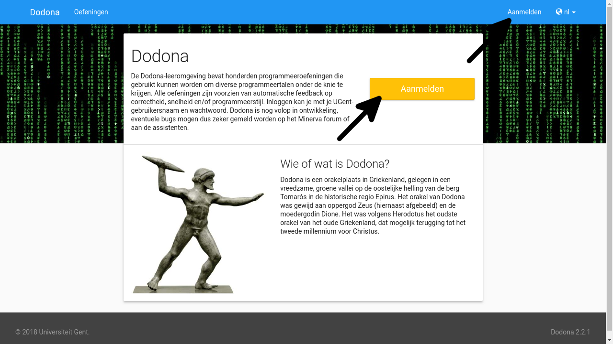

Selecteer de onderwijs- of onderzoeksinstelling die de gebruikersaccount beheert waarmee je wilt aanmelden. Daarna volg je de instellingsspecifieke aanmeldingsprocedure.

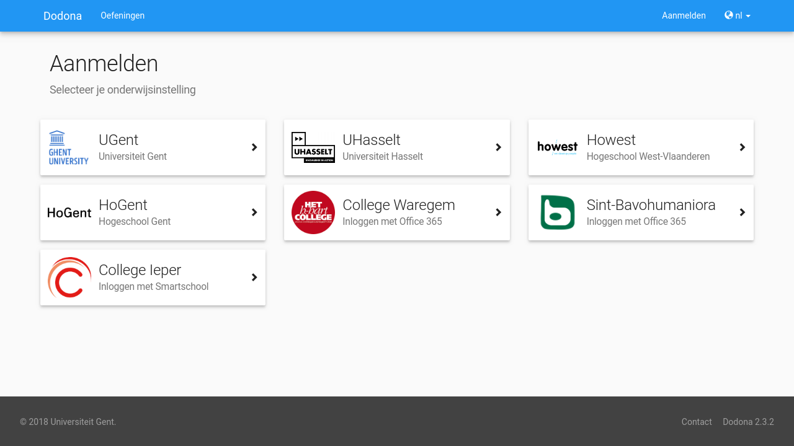

.. important::

    Sommige onderwijs- of onderzoeksinstellingen vragen op het einde van de aanmeldingsprocedure expliciet jouw toestemming voor het doorsturen van enkele persoonlijke gegevens naar Dodona. Vaak hoef je deze toestemming slechts één keer te geven op elke computer waarmee je aanmeldt. Dodona gebruikt deze persoonlijke gegevens enkel voor intern beheer van je :ref:`gebruikersprofiel <gebruikersprofiel>` en wisselt deze informatie nooit uit met externe partijen.

Als dit de eerste keer is dat je aanmeldt op Dodona dan wordt er automatisch een nieuwe gebruikersaccount aangemaakt op basis van de gegevens die doorgestuurd werden door je externe onderwijs- of onderzoeksinstelling. In het :ref:`gebruikersprofiel <gebruikersprofiel>` van deze gebruikersaccount kan je persoonlijke voorkeuren instellen voor de :ref:`natuurlijke taal <taal selecteren>` en de :ref:`tijdzone <tijdzone instellen>` die door Dodona gebruikt worden.

.. important::

    Als je beschikt over gebruikersaccounts bij verschillende externe onderwijs- of onderzoeksinstellingen, dan corresponderen deze elk met een afzonderlijke gebruikersaccount op Dodona.

.. _gebruikersmenu:

Als je aangemeld bent dan zie je aan de rechterkant van de :ref:`navigatiebalk <navigatiebalk>` het **gebruikersmenu** met de naam uit je :ref:`gebruikersprofiel <gebruikersprofiel>`. Het gebruikersmenu staat op de plaats waar voorheen :guilabel:`Aanmelden` stond toen je nog niet aangemeld was.

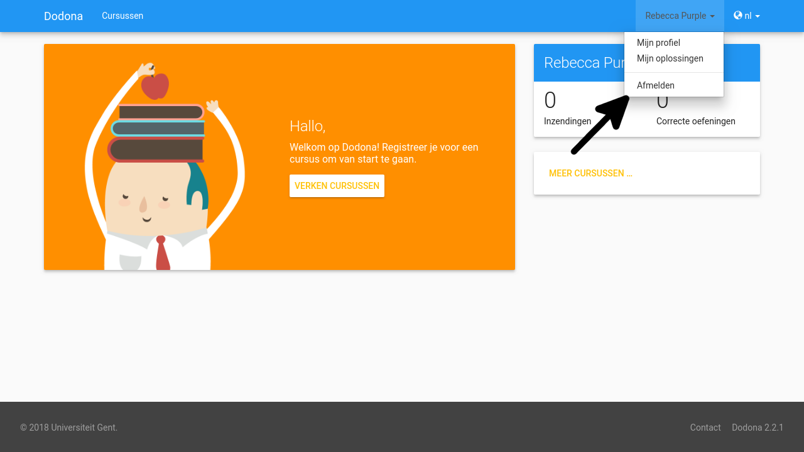

.. TODO:feature-update: nagaan of we onder de naam van de gebruiker in de navigatiebalk in het klein ook de naam van de instelling kunnen zetten waaraan de gebruiker verbonden is; op die manier kan een gebruiker met accounts van meerdere instellingen zien met welke account hij momenteel is ingelogd

.. TODO:tutorial-update: extra witruimte tussen vorige figuur en volgende paragraaf in HTML versie
.. TODO:tutorial-update: paragraaf dit volgt op vorige figuur heeft aan het begin van de eerste zin een klein beetje insprong in de LaTeX versie die weg zou moeten

.. _startpagina:

Als je :ref:`aangemeld <aanmelden>` bent dan verandert de neutrale :ref:`landingspagina <landingspagina>` ook in een gepersonaliseerde **startpagina** met een overzicht van alle cursussen waarvoor je :ref:`geregistreerd <registreren>` bent, oefeningenreeksen met nakende :ref:`deadlines <oefeningenreeks deadline>` en je voortgang bij het :ref:`indienen van oplossingen <oplossing indienen>` voor oefeningen. Je kan dus ook makkelijk aan de landingspagina of aan je startpagina herkennen of je al dan niet aangemeld bent.

.. tip::

    Vanaf elke pagina kan je naar de :ref:`landingspagina <landingspagina>` (als je afgemeld bent) of naar je :ref:`startpagina <startpagina>` (als je aangemeld bent) navigeren door uiterst links in de :ref:`navigatiebalk <navigatiebalk>` op :guilabel:`Dodona` te drukken.

Als dit de eerste keer is dat je aanmeldt op Dodona dan ben je uiteraard nog voor geen enkele cursus geregistreerd en heb je nog geen enkele oplossing ingediend. Daardoor ziet je startpagina er op dit moment nog vrij kaal uit.

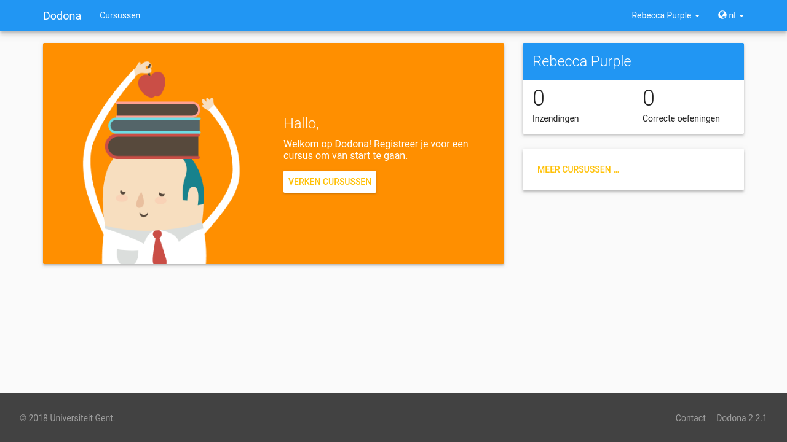

.. TODO:feature-discuss: omschrijving van speciale manier van aanmelden voor gebruikers met een tijdelijk account, inclusief de medeling voor gebruikers die over een tijdelijk account beschikken; nu we werken met meerdere identity providers moet de omschrijving van die boodschap ook bijgewerkt worden (verwijst nu nog naar UGent)

.. _afmelden:

Afmelden
--------

.. tip::

    Je kunt enkel afmelden als je momenteel :ref:`aangemeld <aanmelden>` bent. Je herkent dat je aangemeld bent als je aan de rechterkant van de :ref:`navigatiebalk <navigatiebalk>` het :ref:`gebruikersmenu <gebruikersmenu>` ziet staan met de naam uit je :ref:`gebruikersprofiel <gebruikersprofiel>`. Als je afgemeld bent dan staat op dezelfde plaats :guilabel:`Aanmelden`.

Kies voor :guilabel:`Afmelden` in het :ref:`gebruikersmenu <gebruikersmenu>` aan de rechterkant van de :ref:`navigatiebalk <navigatiebalk>`. Daarna ben je afgemeld op Dodona en opent de browser een extra tab/venster met een bevestiging die aangeeft of het afmelden ook bij je externe onderwijs- of onderzoeksinstelling geslaagd is.

.. image:: sign_out.nl.png

.. _landingspagina:

Als je :ref:`afgemeld <afmelden>` bent dan verandert je :ref:`startpagina <startpagina>` terug in de **landingspagina** met algemene informatie over Dodona. Om je startpagina terug te krijgen moet je opnieuw :ref:`aanmelden <aanmelden>`.

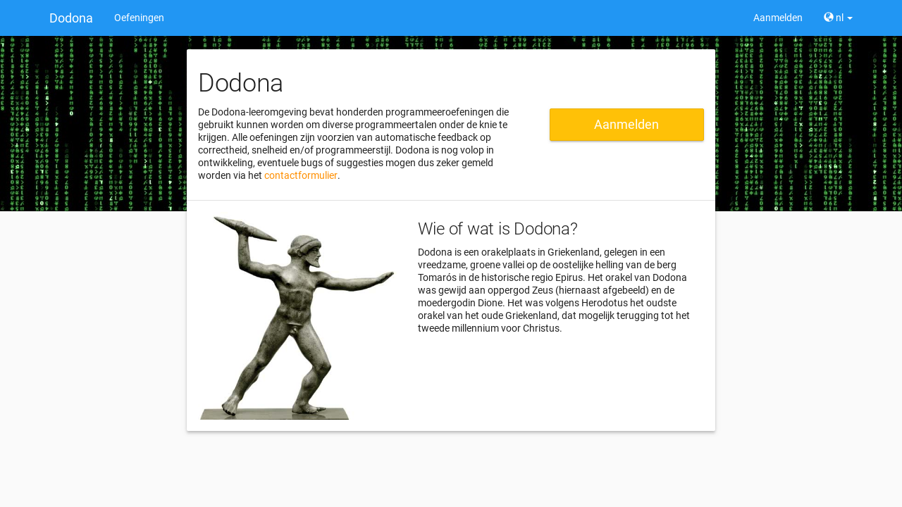

.. tip::

    Vanaf elke pagina kan je naar de :ref:`landingspagina <landingspagina>` (als je afgemeld bent) of naar je :ref:`startpagina <startpagina>` (als je aangemeld bent) navigeren door uiterst links in de :ref:`navigatiebalk <navigatiebalk>` op :guilabel:`Dodona` te drukken.

.. image:: navigate_to_homepage.nl.png

.. _profielpagina:
.. _gebruikersprofiel:

Gebruikersprofiel
-----------------

Kies voor :guilabel:`Mijn profiel` in het :ref:`gebruikersmenu <gebruikersmenu>` aan de rechterkant van de :ref:`navigatiebalk <navigatiebalk>` om naar je **profielpagina** te navigeren. Op je profielpagina staan je **persoonlijke gegevens** (gebruikersnaam, voornaam, familienaam en emailadres) en enkele **persoonlijke voorkeuren** (natuurlijke taal en tijdzone) die samen je **gebruikersprofiel** vormen. Dodona gebruikt het gebruikersprofiel om de gebruikerervaring te personaliseren.

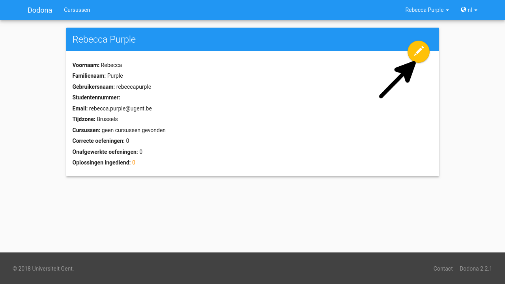

.. TODO:feature-update: studentennummer is UGent-specifiek en hoort niet langer thuis in het gebruikersprofiel na de verruiming naar andere identity providers

.. _gebruikersprofiel bijwerken:

Druk op de editeerknop in de rechterbovenhoek van je :ref:`profielpagina <profielpagina>` om je :ref:`gebruikersprofiel <gebruikersprofiel>` bij te werken. Je persoonlijke gegevens kan je niet zelf bijwerken. Deze worden automatisch bijgewerkt op basis van de gegevens die tijdens het :ref:`aanmelden <aanmelden>` doorgestuurd worden door je externe onderwijs- of onderzoeksinstelling.

.. _tijdzone instellen:

Je kan de **tijdzone** instellen die gebruikt wordt voor het weergeven van alle tijdsaanduidingen op het platform (bijvoorbeeld de tijd waarop je een :ref:`oplossing hebt ingediend <oplossing indienen>` of de :ref:`deadline voor een oefeningenreeks <oefeningenreeks deadline>`).

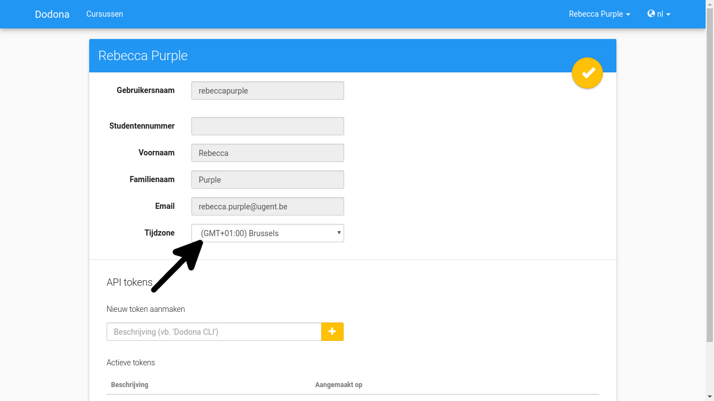

.. TODO:feature-discuss: eventueel aangeven op welke manier de tijdzone werd ingesteld bij het aanmaken van je gebruikersaccount

.. tip::

    Als de tijdzone uit je gebruikersprofiel niet overeenkomt met de lokale tijdzone zoals die door je browser gedecteerd wordt, dan krijg je bovenaan elke pagina een mededeling te zien die erop wijst dat alle tijdsaanduidingen op het platform niet overeenkomen met de lokale tijdzone. Je kan deze mededeling enkel weghalen door in je gebruikersprofiel de tijdzone in te stellen op de lokale tijdzone.

    .. image:: wrong_timezone.nl.png

.. TODO:feature-missing: feature toevoegen waarmee je bij het bijwerken van het gebruikersprofiel meteen de tijdzone kan instellen op de lokale tijdzone zoals die door je browser gedetecteerd wordt
.. TODO:feature-missing: voorkeur voor natuurlijke taal zou ook moeten weergegeven worden in het gebruikersprofiel; die voorkeur zou daar ook moeten kunnen bijgewerkt worden
.. TODO:feature-discuss: omschrijving van API tokens toevoegen

.. _cursus:

Navigeren naar een cursus
-------------------------

Aan de linkerkant van je :ref:`startpagina <startpagina>` staan kaartjes van alle cursussen waarvoor je :ref:`geregistreerd <registreren>` bent, gegroepeerd per academiejaar. Gebruik de zoekbalk bovenaan je startpagina om te zoeken naar specifieke cursussen op basis van een cursusnaam, een naam van een lesgever of een academiejaar. Selecteer een cursus door op de gekleurde titelbalk van het kaartje van de cursus te drukken of door onderaan het kaartje op de knop :guilabel:`GA NAAR DEZE CURSUS` te drukken.

.. TODO:screenshot-missing: screenshot van startpagina met minstens vijf cursussen waarvoor gebruiker geregistreerd is (zodat zoekbalk getoond wordt)

.. TODO:feature-update: academiejaar is terminologie die enkel in het hoger onderwijs gebruikt wordt; secundair onderwijs zou hier de term "schooljaar" gebruiken; zoeken naar generiekere oplossing in Dodona door bijvoorbeeld de begin- en einddatum van een module in te stellen, en dan een weergave te zien met modules die actief zijn, modules die afgelopen zijn en modules die in de toekomst zullen lopen

.. TODO:feature-discuss: ergens moeten we ook een plaats zoeken om de volledige uitleg te geven van de cards voor de cursussen; welke onderdelen vind een gebruiker terug op zo een card: naam cursus, academiejaar, naam lesgever(s), statistieken (aantal ingezonden oplossingen, aantal oefeningen correct opgelost), oefeningenreeksen met nakende deadlines; misschien moet dit in een nieuwe sectie "Voortgang en deadlines opvolgen"

Het :ref:`gebruikersmenu <gebruikersmenu>` aan de rechterkant van de :ref:`navigatiebalk <navigatiebalk>` bevat onder de hoofding :guilabel:`Mijn vakken` een lijst van alle cursussen waarvoor je geregistreerd bent. Deze lijst is beperkt tot de cursussen van het meest recente academiejaar waarvoor je voor een cursus geregistreerd bent. Omdat de navigatiebalk op elke pagina beschikbaar is, vormt dit een snelle manier om één van de cursussen uit deze lijst te selecteren zonder dat je eerst naar je :ref:`startpagina <startpagina>` moet navigeren.

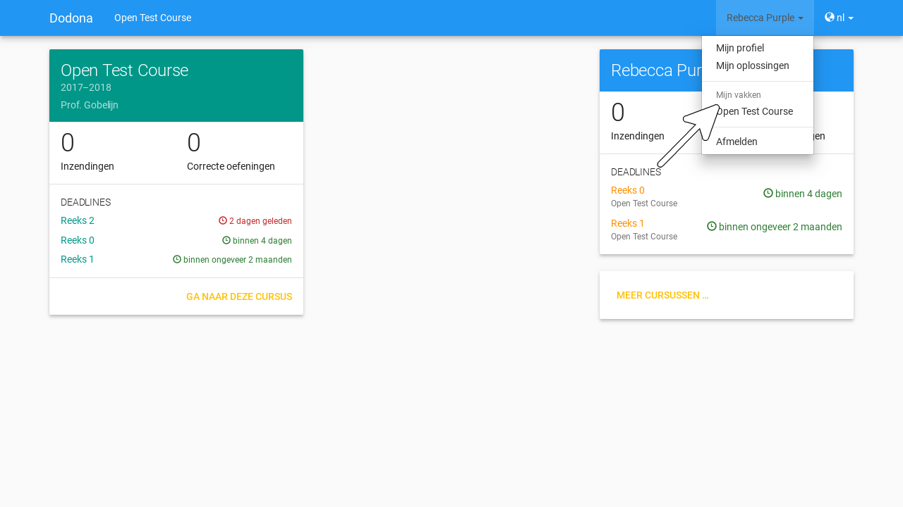

.. TODO:feature-discuss: gebruikersmenu is niet opengeklapt waardoor pijl in het luchtledige wijst

.. _paneel wachten op goedkeuring:

Als je nog :ref:`registratieverzoeken voor cursussen <registreren>` hebt openstaan hebt die wachten op goedkeuring van een cursusbeheerder, dan vind je deze cursussen in het paneel :guilabel:`Wachten op goedkeuring` in de rechterkolom van je :ref:`startpagina <startpagina>`. Je kan één van deze cursussen selecteren door op de naam van de cursus te drukken.

.. TODO:screenshot-missing: screenshot van startpagina met pijl naar paneel met cursussen die wachten op goedkeuring

.. _cursusoverzicht:

Het **cursusoverzicht** bevat alle beschikbare cursussen, gegroepeerd per academiejaar. Navigeer naar het cursusoverzicht door te drukken op de knop :guilabel:`MEER CURSUSSEN …` onderaan in de rechterkolom op je :ref:`startpagina <startpagina>`. Als je nog voor geen enkele cursus geregistreerd bent, dan kan je als alternatief ook drukken op de knop :guilabel:`VERKEN CURSUSSEN` naast de afbeelding op je startpagina.

.. TODO:feature-update: optie "cursussen" of "cursusoverzicht" zou beschikbaar moeten zijn in het gebruikersmenu, in plaats van de tab "Admin" zoals nu het geval is; op die manier krijgt de student vanaf elke pagina rechtstreeks toegang tot het cursusoverzicht
.. TODO:feature-update: vervang de tekst op de knop "MEER CURSUSSEN …" in de rechterkolom van de startpagina door de tekst "CURSUSOVERZICHT"; misschien wordt deze knop zelfs overbodig als er een item wordt toegevoegd aan het gebruikersmenu

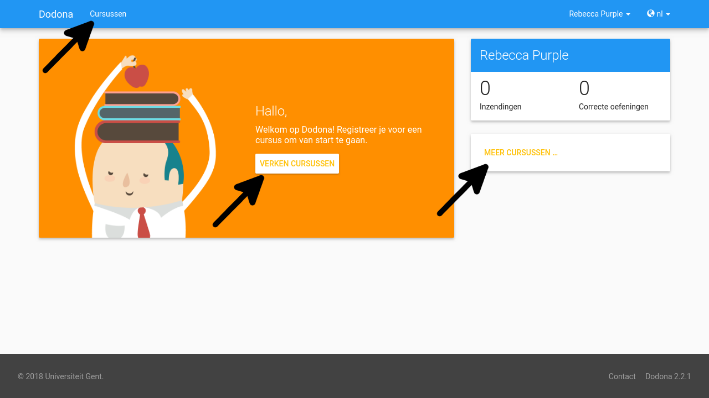

.. TODO:screenshot-update: blijft de feature met "cursussen" in de navigatiebalk behouden? indien niet, dan moet de pijl weg in de screenshot; anders moet deze optie ook in de tekst besproken worden

Gebruik de zoekbalk bovenaan het cursusoverzicht om te zoeken naar specifieke cursussen op basis van een cursusnaam, een naam van een lesgever of een academiejaar. Selecteer een cursus door op de gekleurde titelbalk van het kaartje van de cursus te drukken of door onderaan het kaartje op de knop :guilabel:`GA NAAR DEZE CURSUS` te drukken.

.. TODO:feature-discuss: uitleggen hoe studenten kunnen zien welke cursussen open staan voor registratie, en voor welke cursussen een registratieverzoek moet ingediend worden; op die ogenblik lijkt dit nog niet te zien in het cursusoverzicht

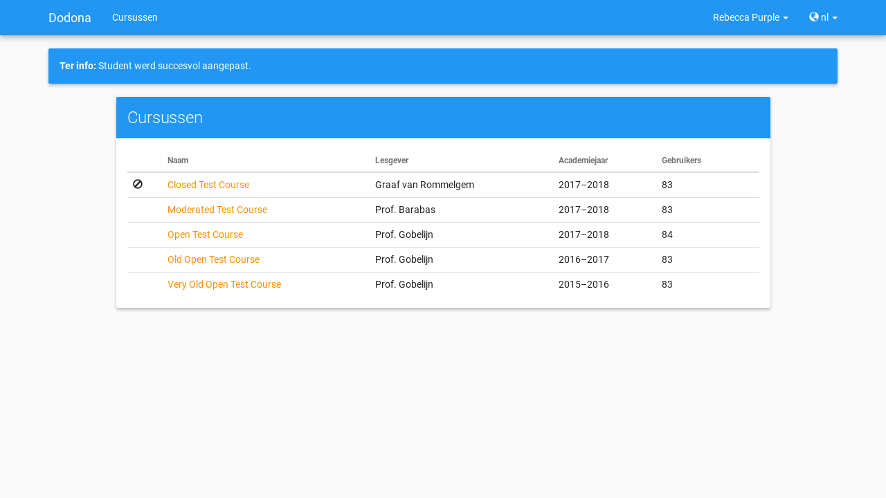

.. TODO:screenshot-update: werk met volwaardige cursussen in plaats van dummy cursussen

.. TODO:feature-discuss: uitleg over gebruikte symbolen op kaartje van een cursus in het cursusoverzicht en op je startpagina

.. _cursuspagina:

Na :ref:`selectie van een cursus <cursus>` krijg je de **cursuspagina** te zien.

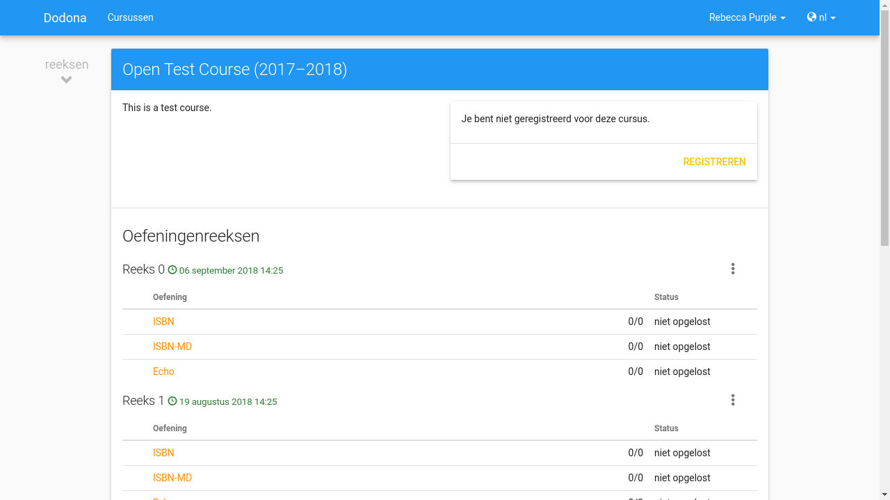

.. tip::

    Na selectie van een cursus of bij het uitvoeren van een actie binnen een cursus verschijnt de naam van de cursus naast :guilabel:`Dodona` aan de linkerkant van de :ref:`navigatiebalk <navigatiebalk>`. Door in de navigatiebalk op de naam van de cursus te drukken, navigeer je terug naar de :ref:`cursuspagina <cursuspagina>`.

.. TODO:screenshot-missing: screenshot van navigatiebalk met naam van cursus in breadcrumb

.. _manuele registratie:
.. _registreren:

Registreren voor een cursus
---------------------------

Als je :ref:`navigeert naar een cursus <cursus>` waarvoor je nog niet geregistreerd bent, dan zie je bovenaan de :ref:`cursuspagina <cursuspagina>` een paneel dat aangeeft of en hoe je je voor de cursus kan registreren. Hierbij zijn er drie mogelijkheden:

.. TODO:feature-update: toon het registratiepaneel over de volledige breedte aan de bovenkant van de cursuspagina (boven de omschrijving)

* .. _open registratie:

  De cursus werkt met **open registratie**, wat betekent dat iedereen voor de cursus kan registreren zonder expliciete goedkeuring van een cursusbeheerder. Druk op de knop :guilabel:`REGISTREREN` om je voor de cursus te registreren.

  .. image:: register.nl.png

* .. _gemodereerde registratie:

  De cursus werkt met **gemodereerde registratie**, wat betekent dat je een registratieverzoek kunt indienen dat daarna dient goedgekeurd of afgekeurd te worden door een cursusbeheerder. Pas wanneer je registratieverzoek wordt goedgekeurd, ben je ook effectief geregistreerd voor de cursus. Druk op de knop :guilabel:`REGISTRATIEVERZOEK INDIENEN` om een registratieverzoek voor de cursus in te dienen.

  .. image:: moderated_register.nl.png

  Zolang je registratieverzoek nog niet werd goedgekeurd of afgekeurd door een cursusbeheerder, verschijnt in het paneel bovenaan de cursuspagina de boodschap :guilabel:`Je staat al op de wachtlijst.` en wordt de cursus opgelijst in het paneel :guilabel:`Wachten op goedkeuring` in de rechterkolom van je :ref:`startpagina <startpagina>`.

  .. image:: moderated_waiting.nl.png

* .. _gesloten registratie:

  De cursus werkt met **gesloten registratie**, wat betekent dat je geen registratieverzoek kan indienen voor de cursus.

  .. image:: closed_registration.nl.png

.. TODO:feature-update: tekst van gemodereerde registratie vervangen door "Je moet een registratieverzoek indienen dat eerst moet goedgekeurd worden door een cursusbeheerder voor je toegang krijgt tot de cursus." (huidige term "vak" komt nergens anders voor op Dodona)
.. TODO:feature-update: tekst van gemodereerde registratie na indienen van registratieverzoek vervangen door "Je hebt al een registratieverzoek ingediend voor deze cursus. Je krijgt toegang tot de cursus zodra dit registratieverzoek wordt goedgekeurd door een cursusbeheerder."
.. TODO:feature-update: tekst "Je staat al op de wachtlijst." weglaten omdat bovenstaande tekst al aangeeft dat er niet nog eens een registratieverzoek kan ingediend worden; in plaats daarvan moet de student de kans krijgen om zich uit te schrijven uit de cursus (als goedkeuring van het registratieverzoek bijvoorbeeld te lang op zich laat wachten)
.. TODO:feature-discuss: aangeven wat er gebeurt als een cursusbeheerder de registratie goedkeurt/afkeurt; automatische email naar de student?

.. note::

    Op een :ref:`cursuspagina <cursuspagina>` kan je enkel de omschrijving en de oefeningenreeksen zien als je voor de cursus :ref:`geregistreerd <registreren>` bent of als de cursus werkt met :ref:`open registratie <open registratie>`.

Zodra je voor een cursus geregistreerd bent, verschijnt er ook een kaartje van de cursus aan de linkerkant van je :ref:`startpagina <startpagina>`. Als de cursus wordt aangeboden in het meest recente academiejaar waarvoor je voor een cursus geregistreerd bent, dan wordt de cursus ook opgelijst onder :guilabel:`Mijn vakken` in het :ref:`gebruikersmenu <gebruikersmenu>` aan de rechterkant van de :ref:`navigatiebalk <navigatiebalk>`.

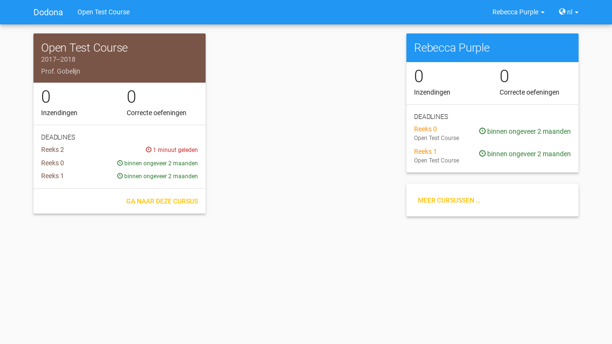

.. TODO:feature-discuss: aangeven wat de statistieken betekenen op het kaartje van de nieuw aangemaakte cursus
.. TODO:feature-discuss: aangeven wat de statistieken betekenen in het paneel aan de rechterkant van de startpagina
.. TODO:feature-discuss: behandeling van deadlines moet ergens ander staan.
.. Als er deadlines zijn voor de cursussen waar je bent voor ingeschreven zullen deze ook op de startpagina te zien zijn.

.. _registratielink:

Naast de mogelijkheid om zelf :ref:`naar een cursus te navigeren <cursus>` en op de :ref:`cursuspagina <cursuspagina>` de registratieprocedure te doorlopen, bestaat ook de mogelijkheid dat je een **registratielink** ontvangt (bijvoorbeeld per email van een lesgever). Door op de registratielink te drukken, wordt de registratieprocedure opgestart voor een specifieke cursus en hoef je dus zelf niet meer naar te cursus te navigeren. De registratieprocedure blijft net zoals bij :ref:`manuele registratie <manuele registratie>` wel afhankelijk van het feit of de cursus werkt met open, gemodereerde of gesloten registratie.

.. _uitschrijven:

Uitschrijven uit een cursus
---------------------------

Als je :ref:`navigeert naar een cursus <cursus>` waarvoor je :ref:`geregistreerd <registreren>` bent of waarvoor je nog een :ref:`registratieverzoek <registreren>` hebt openstaan, dan zie je op de :ref:`cursuspagina <cursuspagina>` onder de omschrijving van de cursus een knop :guilabel:`UITSCHRIJVEN` waarmee je je kunt uitschrijven uit de cursus.

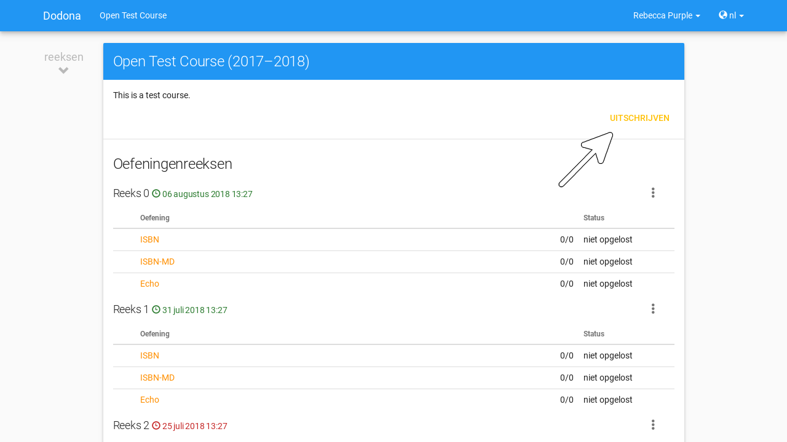

Hierdoor verdwijnt het kaartje van de cursus aan de linkerkant van je :ref:`startpagina <startpagina>`. Als de cursus werd opgelijst onder :guilabel:`Mijn vakken` in het :ref:`gebruikersmenu <gebruikersmenu>` aan de rechterkant van de :ref:`navigatiebalk <navigatiebalk>`, dan verdwijnt de cursus ook uit die lijst. Als de cursus werd opgelijst in het paneel :guilabel:`Wachten op goedkeuring` in de rechterkolom van je :ref:`startpagina <startpagina>`, dan verdwijnt de cursus ook uit die lijst.

.. _oefeningenreeks:
.. _oefeningenreeks deadline:
.. _oefening:

Navigeren naar een oefening
---------------------------

.. oefening selecteren uit oefeningenreeks op cursuspagina

Een :ref:`cursuspagina <cursuspagina>` bevat een reeks **oefeningen** die gegroepeerd zijn in **oefeningenreeksen**. Voor elke oefeningenreeks kan er door een cursusbeheerder optioneel een **deadline** ingesteld zijn die dan naast de naam van de oefening wordt weergegeven. Bij weergave van de deadline wordt rekening gehouden met de :ref:`tijdzone <tijdzone instellen>` uit je :ref:`gebruikersprofiel <gebruikersprofiel>`. Deadlines worden in het groen weergegeven als ze nog niet verstreken zijn, en in het rood als ze reeds verstreken zijn.

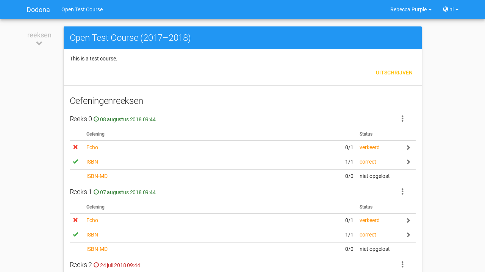

.. TODO:feature-update: Blijkbaar is de terminologie die gebruikt wordt voor de status voor een gebruiker van een oefening in een oefeningenreeks en voor de status van een ingediende oplossing niet dezelfde, terwijl de eerst doorgaans toch van de tweede wordt afgeleid; zo zien we bijvoorbeeld de combinatie correct/Correct (let op het verschil in hoofdletter) en verkeerd/Fout. We kunnen deze terminologie beter consistent maken.

Onder de naam van een oefeningenreeks staat optioneel een beschrijving, met daaronder een lijst met alle oefeningen uit de reeks. De lijst toont voor elke oefening :ref:`statistieken <oefeningenreeks statistieken>` en je :ref:`status <oefeningenreeks status>`. In de lijst zie je vóór elke oefening ook een icoontje dat correspondeert met je :ref:`status <oefeningenreeks status>` voor de oefening.

.. belangrijk::

    Dezelfde oefening kan voorkomen in meerdere cursussen. De :ref:`statistieken <oefeningenreeks statistieken>` en je :ref:`status <oefeningenreeks status>` voor de oefening zijn dan doorgaans niet hetzelfde omdat ze voor elke cursus afzonderlijk bepaald worden en je doorgaans :ref:`oplossingen indient <oplossing indienen>` binnen een bepaalde cursus.

    Dezelfde oefening kan ook voorkomen in meerdere oefeningenreeksen van een cursus. Ook dan zijn de :ref:`statistieken <oefeningenreeks statistieken>` en je :ref:`status <oefeningenreeks status>` voor de oefening niet noodzakelijk hetzelfde omdat de status afhangt van de deadlines van de oefeningenreeksen. Als er geen deadline werd ingesteld of als dezelfde deadline werd ingesteld voor de oefeningenreeksen, dan zijn de :ref:`statistieken <oefeningenreeks statistieken>` en je :ref:`status <oefeningenreeks status>` voor de oefening per definitie wel hetzelfde.

.. _oefeningenreeks statistieken:

De **statistieken** van een oefening uit een :ref:`oefeningenreeks <oefeningenreeks>` bestaan uit twee getallen :math:`c/i`. Daarbij staat :math:`i` voor het aantal gebruikers (studenten en cursusbeheerders) dat in de cursus al minstens één :ref:`oplossing <oplossing indienen>` heeft ingediend voor de oefening en :math:`c` voor het aantal gebruikers (studenten en cursusbeheerders) dat in de cursus al minstens één *correcte* :ref:`oplossing <oplossing indienen>` heeft ingediend voor de oefening.

.. _oefeningenreeks status:

Je **status** voor een oefening uit een :ref:`oefeningenreeks <oefeningenreeks>` wordt bepaald op basis van de :ref:`oplossing <oplossing indienen>` die je als laatste in de cursus hebt ingediend voor de oefening. Als er een :ref:`deadline <oefeningenreeks deadline>` werd ingesteld voor de oefeningenreeks, dan is dit de laatst ingediende oplossing voorafgaand aan de deadline. Als je in een oefeningenreeks drukt op je status voor een oefening, dan :ref:`navigeer je naar de oplossing <oplossing>` op basis waarvan je status bepaald werd (indien je effectief een oplossing hebt ingediend op basis waarvan je status kon bepaald worden).

Mogelijke weergaven van je status vóór het verstrijken van de deadline of als er geen deadline is ingesteld:

.. list-table::
  :header-rows: 1

  * - status
    - icoontje
    - weergegeven als je

  * - :guilabel:`niet opgelost`
    - .. image::
    - geen oplossing hebt ingediend (vóór de deadline)

  * - :ref:`status <oplossing status>` van laatst ingediende oplossing
    - .. image::
    - minstens één oplossing hebt ingediend (vóór de deadline)

.. TODO:screenshot-missing: iconen toevoegen die corresponderen met elke status

Mogelijke weergaven van je status nadat de deadline verstreken is:

.. list-table::
  :header-rows: 1

  * - status
    - icoontje
    - weergegeven als je

  * - :guilabel:`correct` (groen)
    - .. image::
    - laatst ingediende oplossing vóór de deadline correct is

  * - :guilabel:`deadline gemist` (rood)
    - .. image::
    - geen oplossingen hebt ingediend vóór de deadline of als je laatst ingediende oplossing vóór de deadline niet correct is

.. TODO:screenshot-missing: iconen toevoegen die corresponderen met elke status

.. _waarschuwingssymbool:

.. important::

    Als je **vóór het verstrijken van de deadline** van een oefeningenreeks een :ref:`oplossing indient <oplossing indienen>` voor een oefening uit de oefeningenreeks, dan kan je status voor de oefening in de oefeningenreeks nog wijzigen omdat die status altijd gebaseerd is op je laatst ingediende oplossing vóór de deadline. Het is dus je eigen verantwoordelijkheid om ervoor te zorgen dat je laatst ingediende oplossing vóór de deadline ook je meest correcte oplossing is. Je kan eventueel een voorgaande :ref:`oplossing selecteren <oplossing>` en :ref:`opnieuw indienen <oplossing opnieuw indienen>`.

    Dodona toont een **waarschuwingssymbool** naast je status van een oefening in een :ref:`oefeningenreeks <oefeningenreeks>` en in de lijst met :ref:`recente oefeningen <recente oefeningen>` op je :ref:`startpagina <startpagina>` als je laatst ingediende oplossing voor de oefening vóór de :ref:`deadline van de oefeningenreeks <oefeningenreeks deadline>` een status heeft die slechter is dan de status van een oplossing voor de oefening die je daarvoor hebt ingediend. Je kan eventueel een voorgaande :ref:`oplossing selecteren <oplossing>` en :ref:`opnieuw indienen <oplossing opnieuw indienen>`.

    .. image:: deadline_series_warning.nl.png

    Als je **na het verstrijken van de deadline** van een oefeningenreeks een :ref:`oplossing indient <oplossing indienen>` voor een oefening uit een oefeningenreeks, dan zal je status voor de oefening in de oefeningenreeks daardoor nooit wijzigen. Je status voor een oefening in een oefeningenreeks wordt immers bepaald op basis van je laatst ingediende oplossing vóór de deadline.

.. TODO:feature-discuss: aangeven wat er expliciet bedoeld wordt met "een status die slechter is dan"

.. _oefeningenreeks menu:

In het menu van een oefeningenreeks vind je de volgende opties:

:guilabel:`Toon overzicht`

    Toont een overzicht waarin de titels en omschrijvingen van alle oefeningen uit de oefeningenreeks netjes onder elkaar staan. Onder elke omschrijving staat ook je :ref:`status <oefeningenreeks status>` voor de oefening. Als je op de status drukt dan :ref:`navigeer je naar de oplossing <oplossing>` op basis waarvan je status bepaald werd (indien je effectief een oplossing hebt ingediend op basis waarvan je status kon bepaald worden).

    .. _printbare versie oefeningenreeks:

    .. tip::

        Dit overzicht is handig als je een afgedrukte versie wil van alle oefeningen uit een oefeningenreeks. Dodona voorziet dezelfde verzorgde opmaak als bij het :ref:`afdrukken van een individuele oefening <printbare versie oefening>`.

:guilabel:`Oplossingen downloaden`

    Downloadt een ZIP-bestand dat voor elke oefening uit de oefeningenreeks de ingediende oplossing bevat op basis waarvan je :ref:`status <oefeningenreeks status>` voor de oefening bepaald werd (indien je effectief een oplossing hebt ingediend op basis waarvan je status kon bepaald worden voor de oefening).

.. TODO:feature-discuss: bespreek mogelijkheid om overzichtspagina van een oefeningenreeks af te drukken
.. TODO:feature-update: gedownload ZIP-bestand bevat (lege) bestanden voor alle oefeningen waarvoor geen oplossing werd ingediend; deze bestanden zouden niet mogen voorkomen in het ZIP-bestand
.. TODO:feature-update: gedownload ZIP-bestand bevat bestanden met de extensie .txt voor JavaScript oplossingen en bestanden met de extensie .py voor Python oplossingen; geef JavaScript oplossingen de gebruikelijke extensie .js

Selecteer een oefening uit een oefeningenreeks door op de naam van de oefening te drukken.

.. TODO:feature-missing: voorzien dat studenten binnen een cursus nog extra oefeningen kunnen selecteren, waarbij de submissions dan ook aan die cursus gelinkt zijn; deze oefeningen moeten dan ook op één of andere manier zichtbaar gemaakt worden op de cursuspagina; kunnen deze extra oefeningen enkel aan de cursus gelinkt worden, of kunnen ze ook aan een specifieke reeks in de cursus gelinkt worden?

.. TODO:tutorial-update: in PDF zijn vorige en volgende paragraaf niet van elkaar gescheiden

.. _recente oefeningen:
.. oefening uit reeksen met deadlines selecteren op de startpagina

Het bovenste paneel in de rechterkolom van je :ref:`startpagina <startpagina>` bevat een lijst :guilabel:`RECENTE OEFENINGEN` met maximaal vijf oefeningen waar je het laatst oplossingen voor ingediend hebt over alle cursussen heen. In de lijst zie je vóór elke oefening ook een icoontje dat correspondeert met je :ref:`status <oefeningenreeks status>` voor de oefening. Selecteer een oefening uit de lijst door op de naam van de oefening te drukken. Op die manier kan je snel oefeningen selecteren waaraan je recent gewerkt hebt.

.. TODO:feature-discuss: oefening selecteren uit de lijst van alle beschikbare oefeningen; hiervoor moeten we eerst nog nagaan op welke manier studenten deze lijst te zien krijgen

.. TODO:tutorial-update: in PDF zijn vorige en volgende paragraaf niet van elkaar gescheiden

.. _oefeningpagina:

Na :ref:`selectie van een oefening <oefening>` krijg je de **oefeningpagina** te zien.

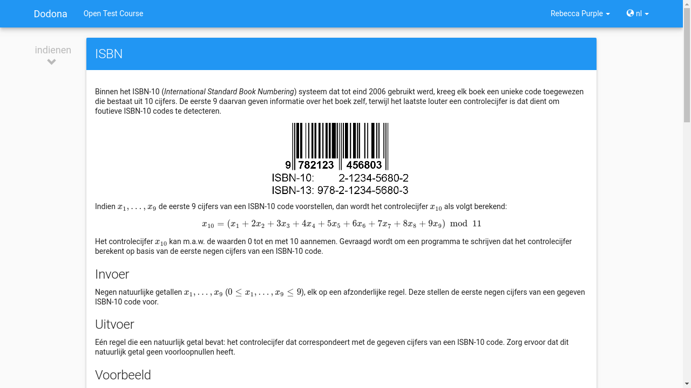

.. TODO:screenshot-update: bijschrift toevoegen aan figuur met link naar oefening op Dodona

.. tip::

    Na :ref:`selectie van een oefening <oefening>` of bij het uitvoeren van een actie op een oefening verschijnt de naam van de oefening naast :guilabel:`Dodona` aan de linkerkant van de :ref:`navigatiebalk <navigatiebalk>`, eventueel voorafgegaan door de naam van de cursus en de naam van de oefeningenreeks waaruit je de :ref:`oefening geselecteerd <oefening>` hebt. Door in de navigatiebalk op de naam van de oefening te drukken, navigeer je naar de :ref:`oefeningpagina <oefeningpagina>`. Door in de navigatiebalk op de naam van de oefeningenreeks te drukken, navigeer je naar de :ref:`oefeningenreeks <oefeningenreeks>` op de cursuspagina. Door in de navigatiebalk op de naam van de cursus te drukken, navigeer je naar de :ref:`cursuspagina <cursuspagina>`.

.. TODO:screenshot-missing: in notitie screenshot met breadcrumbs toevoegen, met pijlen naar de verschillende onderdelen van de breadcrumb

Bovenaan de :ref:`oefeningpagina <oefeningpagina>` staat een paneel met de naam en de omschrijving van de oefening. De weergave van deze componenten is afhankelijk van de :ref:`geselecteerde natuurlijk taal <taal selecteren>`. Als bij het opstellen van de oefening een vertaling voorzien werd van de naam en de omschrijving in de geselecteerde natuurlijke taal, dan zullen deze componenten van de oefening ook in die taal weergegeven worden.

.. _printbare versie oefening:

.. tip::

    Dodona voorziet een verzorgde opmaak bij het afdrukken van een :ref:`oefeningpagina <oefeningpagina>` waarbij sommige componenten die je in een browser te zien krijgt automatisch worden verborgen en enkel de titel en de omschrijving van de oefening worden afgedrukt.

    Bovendien is het mogelijk dat bij het opstellen van de oefening bepaalde componenten uit de omschrijving expliciet werden verboren in de afdrukbare versie (bijvoorbeeld interactieve componenten zoals afspeelbare videofragmenten) of dat er extra componenten aan de omschrijving werden toegevoegd die enkel zichtbaar zijn in de afdrukbare versie (bijvoorbeeld een statische afbeelding als alternatief voor een videofragment).

.. TODO:feature-discuss: eenmaal de sidebar beschikbaar is, moeten we ook aangeven hoe je makkelijk andere oefeningen van dezelfde oefeningenreeks kan selecteren

.. _code editor:
.. _oplossing indienen:

Indienen van een oplossing
--------------------------

Onder het paneel met de omschrijving van de oefening op een :ref:`oefeningpagina <oefeningpagina>` staat een tweede paneel waarmee je een oplossing kan indienen voor de oefening. Druk hiervoor op de tab :guilabel:`Indienen` als deze tab niet geselecteerd was en plaats de programmacode van je oplossing in de **code editor**. Druk daarna op de afspeelknop in de rechtbovenhoek van het paneel om je oplossing in te dienen.

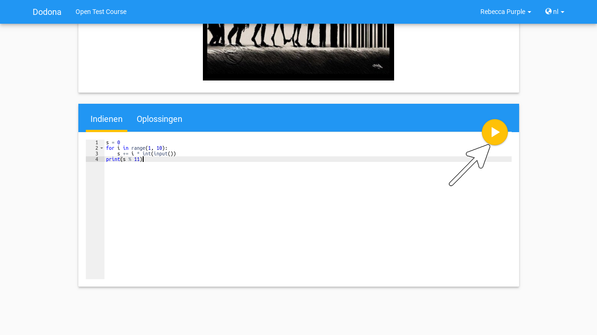

.. tip::

    Voor het schrijven van software maken programmeurs gebruik van een geavanceerde ontwikkelingsomgeving: een zogenaamde `Integrated Development Environment <https://nl.wikipedia.org/wiki/Integrated_development_environment>`_ of kortweg IDE. Voorbeelden hiervan zijn `PyCharm <https://www.jetbrains.com/pycharm/specials/pycharm/pycharm.html>`_ voor `Python <https://www.python.org/>`_ of `IntelliJ IDEA <https://www.jetbrains.com/idea/>`_ voor `Java <https://java.com/>`_. Let wel, het schrijven van programma's in dergelijke omgevingen moet evenwel nog altijd door een programmeur gebeuren. Alleen zijn er heel wat extra hulpmiddelen om het schrijven van programmacode te ondersteunen en om administratie bij te houden die grote softwareprojecten met zich meebrengen.

    Om een aantal belangrijke redenen **raden we ten stelligste af om rechtstreeks programmacode te schrijven in de code editor van Dodona**. In plaats daarvan adviseren we om programmacode eerst te schrijven en te testen in een IDE. Voer je programmacode eerst uit op een aantal testgevallen om na te gaan dat ze geen grammaticale en logische fouten meer bevat. Gebruik daarvoor bijvoorbeeld de testgevallen die in de omschrijving van de oefening gegeven werden. Aangezien zelfs de meest doorgewinterde programmeur bijna nooit programmacode schrijft die meteen kan uitgevoerd worden, zonder fouten te produceren, bieden IDEs heel wat ondersteuning voor het debuggen van programmacode. Leer werken met de debugger van je IDE om daarmee logische fouten te leren opsporen in je programmacode.

    Pas wanneer je ervan overtuigd bent dat de programmacode geen fouten meer bevat en je de programmacode wilt uittesten op een groter aantal testgevallen, kan je ze selecteren en knippen uit de code editor van je IDE en plakken in de code editor van Dodona alvorens ze in te dienen. Op die manier leer je je programmeervaardigheden generiek in te zetten om andere programmeeropdrachten aan te pakken dan enkel de oefeningen uit Dodona.

Na het indienen van een oplossing wordt automatisch de tab :guilabel:`Oplossingen` geselecteerd. Deze tab bevat een overzicht van alle oplossingen die je in de cursus hebt ingediend voor de oefening. Deze oplossingen worden in het overzicht opgelijst in omgekeerde chronologische volgorde (meest recente bovenaan), waardoor de oplossing die je net hebt ingediend helemaal bovenaan staat. Het overzicht bevat voor elke oplossing het tijdstip van indienen, de :ref:`status <oplossing status>` en een korte samenvatting van de :ref:`feedback <feedback>`. In het overzicht zie je vóór elke ingediende oplossing ook een icoontje dat correspondeert met de status van de oplossing.

.. _wachtrij ingediende oplossingen:

Om overbelasting van het platform tegen te gaan, worden ingediende oplossingen niet onmiddellijk beoordeeld maar worden ze eerst in een wachtrij geplaatst. Zolang een oplossing in de wachtrij staat heeft ze de status :guilabel:`In de wachtrij…`. Van zodra het platform klaar is om een oplossing te beoordelen, wordt de eerst ingediende oplossing uit de wachtrij (*first-in-first-out*) geselecteerd en :ref:`beoordeeld <feedback>` door een *judge*. Tijdens het beoordelen van een oplossing heeft ze de status :guilabel:`Aan het uitvoeren…`.

Zodra de beoordeling van de ingediende oplossing klaar is, krijgt de oplossing haar finale :ref:`status <oplossing status>` en wordt de :ref:`feedbackpagina <feedbackpagina>` met de gedetailleerde feedback over de oplossing automatisch weergegeven in een nieuwe tab :guilabel:`Feedback`.

.. image:: exercise_feedback_correct_tab.nl.png

.. tip::

    Er zit geen beperking op het aantal keer dat je een oplossing kan indienen voor een oefening. Gebruik de :ref:`feedback <feedback>` die de *judge* heeft aangeleverd om je oplossing steeds verder te verfijnen.

.. _oplossing:

Navigeren naar een oplossing
----------------------------

Er zijn verschillende plaatsen waar je een overzicht kan krijgen van je :ref:`ingediende oplossingen <oplossing indienen>`:

* Kies :guilabel:`Mijn oplossingen` in het :ref:`gebruikersmenu <gebruikersmenu>` aan de rechterkant van de :ref:`navigatiebalk <navigatiebalk>` of druk op de statistiek :guilabel:`Inzendingen` in het paneel in de rechterkolom van je :ref:`startpagina <startpagina>` voor een overzicht van al je ingediende oplossingen.

  .. image:: all_submissions.nl.png

* Druk op de statistiek :guilabel:`Inzendingen` in het kaartje van een cursus op je :ref:`startpagina <startpagina>` of op de :ref:`cursuspagina <cursuspagina>` voor een overzicht van alle oplossingen die je binnen de cursus hebt ingediend.

  .. image:: course_submissions.nl.png

* Selecteer de tab :guilabel:`Oplossingen` op een :ref:`oefeningpagina <oefeningpagina>` voor een overzicht van alle oefeningen die je hebt ingediend voor de oefening. Als je de oefening :ref:`geselecteerd hebt binnen een cursus <oefening>`, dan is het overzicht bijkomend beperkt tot alle oplossingen die je binnen de cursus hebt ingediend.

  .. image:: exercise_submissions_tab.nl.png

* Druk in een :ref:`oefeningenreeks <oefeningenreeks>` op het groter dan symbool aan de rechterkant van een oefening voor een overzicht van alle oplossingen die je binnen de cursus hebt ingediend voor de oefening.

  .. image:: exercise_submissions_page.nl.png

.. TODO:feature-update: Dodona is inconsistent in zijn vertaling van de term "submission" voor ingediende oplossingen; in gebruikersmenu en in de tab op de oefeningpagina wordt de term "oplossingen" gebruikt; in de kaartjes van de cursussen wordt voor de statistieken gebruik gemaakt van de term "inzendingen"; voorstel is om overal de term "inzendingen" te vervangen door "oplossingen"
.. TODO:feature-update: vervang
.. TODO:feature-missing: mogelijkheid om te zoeken in een overzicht van ingediende oplossingen ontbreekt

Het overzicht bevat voor elke oplossing het tijdstip van indienen, de :ref:`status <oplossing status>` en een korte samenvatting van de :ref:`feedback <feedback>`. Vóór elke ingediende oplossing staat ook nog een icoontje dat correspondeert met de :ref:`status van de oplossing <oplossing status>`. De ingediende oplossingen worden altijd opgelijst in omgekeerde chronologische volgorde (meest recente bovenaan).

.. TODO:feature-discuss: aangeven dat op de oplossingpagina ook extra de naam van de oefening vermeld wordt; OPMERKING: voor studenten is de gebruikersnaam nooit zichtbaar, omdat de lijst altijd beperkt is tot hun eigen inzendingen

Je kan een ingediende oplossing selecteren door op het groter dan symbool te drukken aan rechterkant van de oplossing. Hierdoor krijg je de :ref:`feedbackpagina <feedbackpagina>` te zien met de gedetailleerde feedback over de oplossing.

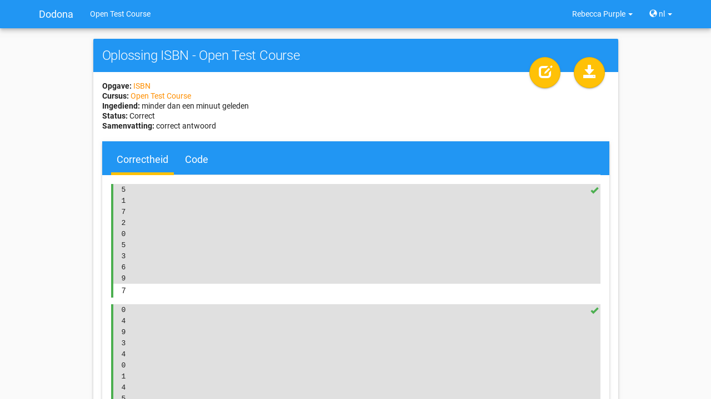

.. _feedbackpagina:
.. _feedback:

Feedback
--------

De **feedbackpagina** toont gedetailleerde feedback over een :ref:`oplossing <oplossing>` die voor een oefening werd :ref:`ingediend <oplossing indienen>`. Deze feedback werd automatisch gegenereerd door de *judge* die aan de oefening gekoppeld is.

.. TODO:feature-update: de titelbalk van een oplossing zou enkel de term "Oplossing" mogen bevatten; de naam van de oefeningen en de naam van de cursus vormen hier niet echt een meerwaarde

Bovenaan de :ref:`feedbackpagina <feedbackpagina>` vind je de volgende gegevens over de :ref:`ingediende oplossing <oplossing indienen>`:

:guilabel:`Opgave`

    .. TODO:feature-update: inconsistentie in de terminologie: in de header van de feedbackpagina wordt de term "Opgave" gebruikt, waar elders de term "Oefening" gebruikt wordt; we spreken ook van een oefeningenreeks

    Naam van de oefening waarvoor je de oplossing hebt ingediend. Druk op de naam om naar de :ref:`oefeningpagina <oefeningpagina>` te navigeren.

:guilabel:`Cursus`

    Naam van de cursus waarbinnen je de oplossing hebt ingediend. Druk op de naam om naar de :ref:`cursuspagina <oefeningpagina>` te navigeren.

    .. TODO:feature-update: vermeld in de header van de feedbackpagina naast de naam van de cursus ook het academiejaar om de benaming consistent te maken met de benaming in de titelbalk op de cursuspagina van de cursus

    .. note::

       Dit informatieveld ontbreekt als je de :ref:`oplossing <oplossing indienen>` niet binnen de context van een cursus hebt ingediend.

    .. TODO:tutorial-update: bovenstaande opmerking wordt niet als note weergegeven

:guilabel:`Ingediend`

    Tijdstip waarop je de oplossing hebt ingediend. Dit tijdstip wordt op een gebruiksvriendelijke manier weergegeven, bijvoorbeeld :guilabel:`ongeveer 2 uur geleden`. Als je de muiswijzer boven het tijdstip plaatst dan krijg je de gedetailleerde weergave van het tijdstip te zien.

.. _oplossing status:

:guilabel:`Status`

    Status die Dodona of de *judge* aan de oplossing heeft toegekend. Met elke status correspondeert ook een icoontje dat in elke oplijsting van de :ref:`oplossing <oplossing>` wordt weergegeven. Betekenis van de mogelijke statussen die aan de oplossing kunnen toegekend worden:

    .. list-table::
      :header-rows: 1

      * - status
        - icoontje
        - betekenis

      * - :guilabel:`In de wachtrij…`
        - .. image:: submission_icons/queued.png
        - oplossing staat in de :ref:`wachtrij <wachtrij ingediende oplossingen>`

      * - :guilabel:`Aan het uitvoeren…`
        - .. image:: submission_icons/running.png
        - oplossing wordt momenteel beoordeeld door de *judge*

      * - :guilabel:`Correct`
        - .. image:: submission_icons/correct.png
        - oplossing is geslaagd voor alle testen

      * - :guilabel:`Fout`
        - .. image:: submission_icons/wrong.png
        - logische fout gevonden in minstens één test

      * - :guilabel:`Uitvoeringsfout`
        - .. image:: submission_icons/runtime_error.png
        - onverwachte fout opgeworpen tijdens het uitvoeren van minstens één test

      * - :guilabel:`Timeout`
        - .. image:: submission_icons/time_limit_exceeded.png
        - tijdslimiet vastgelegd voor de oefening werd overschred tijdens het testen; kan wijzen op slechte performantie of een oneindige lus

          .. TODO:tutorial-update: laatste zin van omschrijving zou beter als een tip worden weergegeven binnen de tabel; eerste poging om dit te doen is mislukt

      * - :guilabel:`Geheugenfout`
        - .. image:: submission_icons/memory_limit_exceeded.png
        - geheugenlimiet vastgelegd voor de oefening werd overschreven tijdens het uitvoeren van minstens één test

      * - :guilabel:`Compilatiefout`
        - .. image:: submission_icons/compilation_error.png
        - ingediende oplossing bevat grammaticale fouten

      * - :guilabel:`Interne fout`
        - .. image:: submission_icons/internal_error.png
        - *judge* is gecrashed tijdens het beoordelen van de oplossing; oorzaak van fout ligt dus niet bij de ingediende oplossing maar bij het falen van de *judge*

    .. TODO:feature-missing: tijdslimiet en geheugenlimiet van een oefening niet zichtbaar voor student; deze zouden ook als informatievelden kunnen opgenomen worden in de header van de oplossing (voorafgaand aan de status)

    Hoe lager de status in bovenstaande tabel wordt opgelijst, hoe zwaarder het soort fout dat ermee correspondeert. Indien de *judge* bij het beoordelen van de oplossing verschillende soorten fouten tegenkomt, dan staat het hem vrij te beslissen welke status hij aan de oplossing toekent. Raadpleeg de documentatie van de *judge* voor meer details over de specifieke procedure die hij gebruikt om de status van de oplossing te bepalen.

:guilabel:`Samenvatting`

    Korte motivering van de *judge* bij de status die hij aan de oplossing heeft toegekend.

.. TODO:feature-missing: vanuit de feedbackpagina op een aparte pagina zou je ook makkelijk naar een overzicht moeten kunnen navigeren van alle oplossingen die de gebruiker heeft ingediend voor die oefening, eventueel binnen de context van een cursus (als de oplossing zelf binnen een cursus werd ingediend); als de feedbackpagina in een tab wordt weergegeven, dan hoeft dit niet, want dan staat daarnaast al een tab "Oplossingen"

.. TODO:feature-update: verwijder in de header van de feedbackpagina de gebruikersnaam (enkel de naam van de gebruiker weergeven) om de benaming consistent te maken met de benaming in de titelbalk op de profielpagina van de gebruiker

.. _feedback tab:
.. _feedback tab badge:

Daaronder staat meer gedetailleerde feedback die mogelijk uitgesplitst werd over meerdere **tabs**. Naast de naam van een tab kan aan de rechterkant een *badge* staan met daarin een getal. Het getal geeft aan hoeveel fouten de *judge* gevonden heeft bij het uitvoeren van de testen waarover hij rapporteert onder de tab. Het staat de *judge* vrij om te beslissen of en op welke manier deze fouten geteld worden. Raadpleeg de documentatie van de *judge* voor meer details over de specifieke procedure die hij gebruikt om de waarde voor de *badge* te bepalen.

.. TODO:screenshot-missing: screenshot van feedbackpagina met meerdere tabs, waarbij minstens één van de tabs een badge count heeft

.. _feedback tab code:

De laatste tab heeft altijd de naam :guilabel:`Code` en bevat de broncode van de :ref:`ingediende oplossing <oplossing indienen>`. Op bepaalde plaatsen in de broncode kan de *judge* opmerkingen toegevoegd hebben (bijvoorbeeld over de programmeerstijl) die ook kunnen motiveren waarom hij een bepaalde status aan de oplossing toegekend heeft.

.. TODO:screenshot-missing: screenshot van feedbackpagina met meerdere tabs, waarbij de tab "Code" geselecteerd werd en waarin annotaties op de code zichtbaar zijn

.. TODO:feature-missing: een judge kan een tab al dan niet aanvaarden (accepted), maar dit wordt momenteel niet visueel weergegeven via een kleur of een symbool bij de tab zoals dat bij andere niveau's wel het geval is; nadenken of we dit toch niet moeten introduceren

.. _oplossing opnieuw indienen:

In de tab :guilabel:`Code` van de :ref:`feedbackpagina <feedbackpagina>` kan je de broncode van de oplossing niet wijzigen. Als je op de broncode drukt dan wordt die volledig geselecteerd. Kopieer de broncode naar het klembord en plak die in je IDE. Als alternatief kan je op de downloadknop drukken in de rechterbovenhoek van de :ref:`feedbackpagina <feedbackpagina>`. Daarmee download je een bestand met de broncode, dat je dan kan openen in je IDE. In je IDE kan je de broncode bewerken en daarna eventueel opnieuw :ref:`indienen <oplossing indienen>`.

.. TODO:feature-update: in plaats van de feature die de volledige code selecteert als je erop klikt (en die verhindert dat je stukken van de code zou kunnen selecteren en naar het klembord kopiëren) zouden we beter een knop voorzien waarmee de volledige code naar het klembord kan gekopieerd worden

Als alternatief kan je ook op de editeerknop drukken in de rechterbovenhoek van de :ref:`feedbackpagina <feedbackpagina>` om te navigeren naar de :ref:`pagina van de oefening <oefeningpagina>` waarvoor de oplossing werd ingediend. De broncode van de oplossing werd daarbij ingevoegd in de :ref:`code editor <code editor>` aan de onderkant van de :ref:`oefeningpagina <oefeningpagina>`. Daar kan je de broncode wel bewerken en daarna eventueel opnieuw :ref:`indienen <oplossing indienen>`.

.. _test:
.. _testgeval:
.. _context:

Onder een tab rapporteert de *judge* over individuele **testen** waaraan hij de code onderworpen heeft. Gerelateerde testen worden gegroepeerd in een **testgeval** en testgevallen die van elkaar afhankelijk zijn worden gegroepeerd in een **context**.

.. image:: exercise_feedback_correct_tab.nl.png

.. TODO:screenshot-missing: screenshot dat een voorbeeld geeft van i) twee of meer contexten, ii) twee of meer testgevallen en iii) twee of meer testen; de afbeelding hierboven is slechts een placeholder; misschien moeten we de individuele onderdelen van de feedback (tab, context, testgeval, test) ook expliciet aanduiden op de figuur; een bijschrift bij de figuur zal misschien ook wel nodig zijn in dit geval

De omschrijving van een :ref:`testgeval <testgeval>` wordt in de feedbacktabel weergegeven binnen een lichtgrijze rechthoek. In de rechterbovenhoek van die rechthoek staat een gekleurd symbool dat aangeeft of de *judge* het volledige testgeval beoordeelt als geslaagd (groen vinkje) of niet geslaagd (rood kruisje).

.. TODO:tutorial-update: nagaan of we effectief afbeeldingen van het groen vinkje en het rood kruisje kunnen opnemen in voorgaande paragraaf

Alle :ref:`testgevallen <testgeval>` van eenzelfde :ref:`context <context>` worden aan de linkerkant geconnecteerd met een gekleurde lijn. De kleur van die lijn geeft aan of de *judge* de volledige context beoordeelt als geslaagd (groen) of niet geslaagd (rood).

.. TODO:feature-discuss: aangeven waar de "messages" worden weergegeven die toegekend worden aan de oplossing, een tab, een context, een testcase en een test
.. TODO:feature-discuss: status per oplossing (DONE), tab (DONE), context (DONE), testcase (DONE) en test; uitleggen hoe dit werkt
.. TODO:feature-discuss: openklappen van linkerrand context om grafische debugger te starten in Python judge
.. TODO:feature-discuss: rode/groene kleur in diff, met extra aanduidingen binnen een regel (verwachte uitvoer vs gegenereerde uitvoer)
.. TODO:feature-discuss: voorbeeld van test met een boodschap
.. TODO:feature-discuss: voorbeeld van test met een grafische boodschap (Curling)

.. TODO:feature-missing: toon enkel de contexten die fout zijn
.. TODO:feature-missing: toon regelnummers in diff
.. TODO:feature-missing: schakelen tussen unified/split in diff

.. _voettekst:
.. _contactpagina:
.. _contact opnemen:

Contact opnemen
---------------

Zit je bij het werken met of het verkennen van Dodona met vragen over hoe je het platform kan gebruiken, of heb je suggesties of commentaar over hoe we het platform zouden kunnen verbeteren of uitgebreiden, neem dan contact op met team Dodona. Navigeer daarvoor naar de `contactpagina <https://dodona.ugent.be/nl/contact/>`_ door in de **voettekst** (onderaan elke pagina) op :guilabel:`Contact` te drukken.

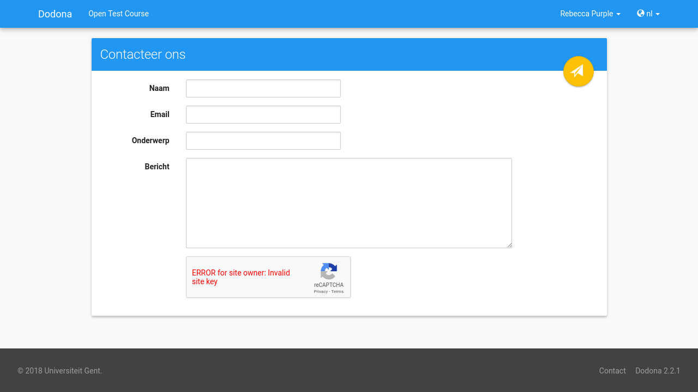

Vul de gegevens in het paneel :guilabel:`Contacteer ons` aan en druk daarna op de verzendknop in de rechterbovenhoek van het paneel.

.. TODO:feature-update: voor aangemelde gebruikers zouden de naam en het emailadres al automatisch kunnen ingevuld worden op de contactpagina op basis van de gegevens uit het gebruikersprofiel