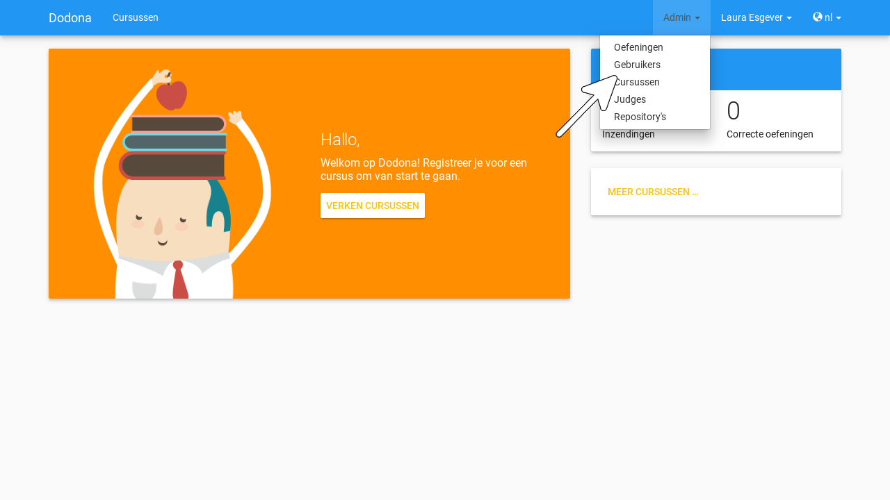
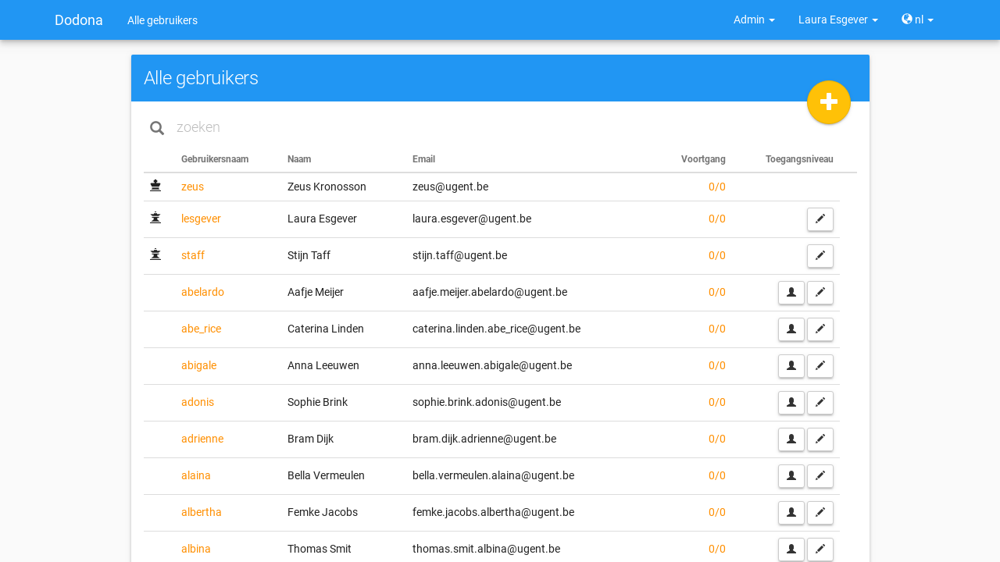
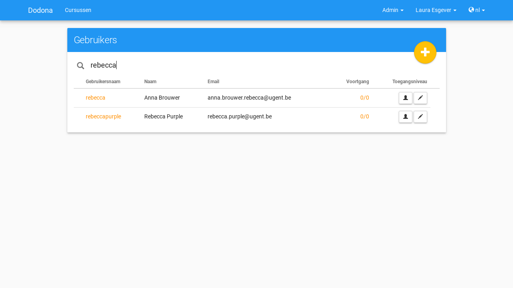
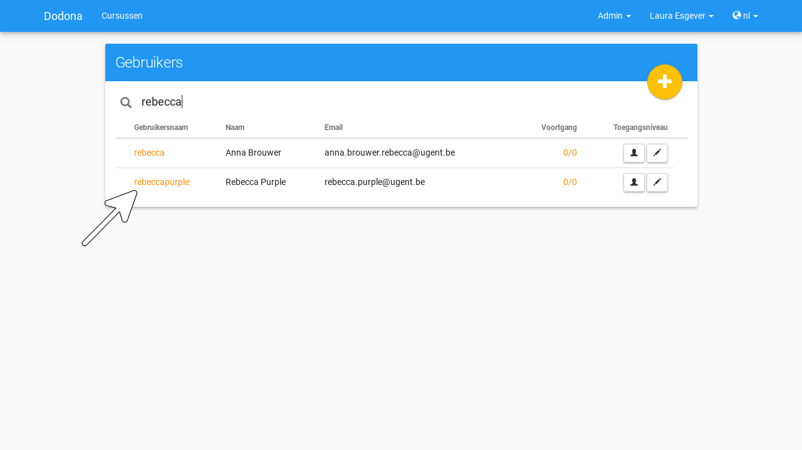
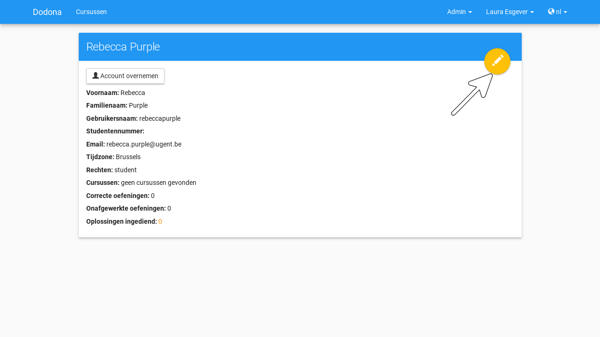
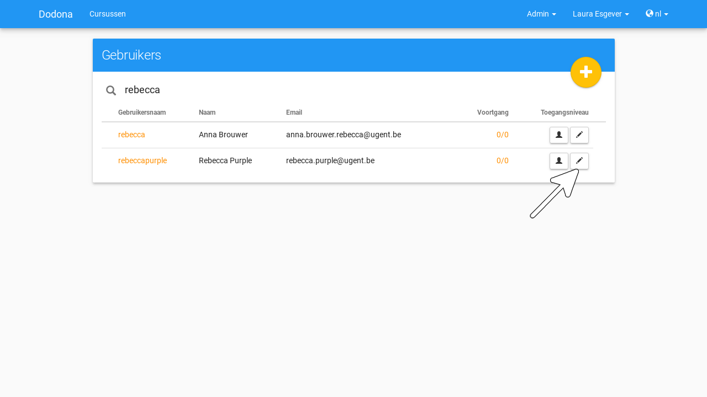
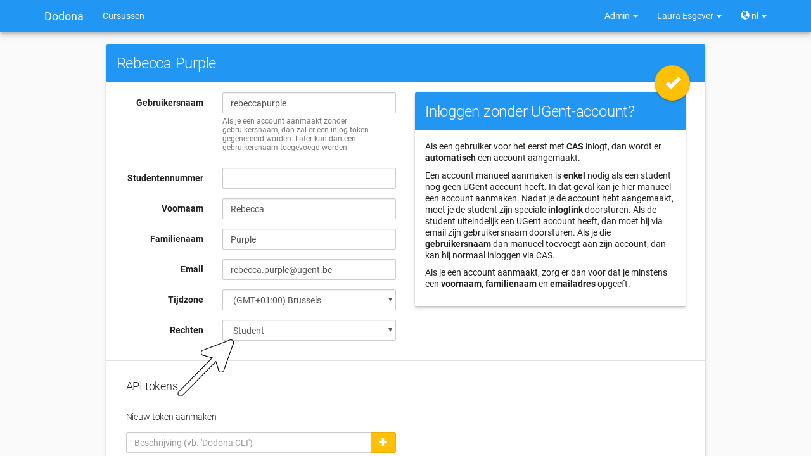

.. _gebruikersbeheer:

.. TODO:tutorial-update: overwegen om te spreken van toegangsniveau's als we het hebben over het onderscheid tussen studenten, lesgevers en beheerders

Gebruikersbeheer
================

.. _gebruiker:

Alle **gebruikers** kunnen zich :ref:`aanmelden <aanmelden>` en hun :ref:`gebruikersprofiel <gebruikersprofiel>` beheren. Voor sommige acties heb je echter bijkomende :ref:`beheersrechten <beheersrechten>` nodig. Onder gebruikers onderscheiden we daarom :ref:`studenten <student>`, :ref:`lesgevers <lesgever>` en :ref:`beheerders <beheerder>` afhankelijk van de beheersrechten die aan hen :ref:`toegewezen <beheersrechten toewijzen>` werden. Als lesgever kan je zelf ook andere lesgevers aanduiden.

.. _beheersmenu:

.. tip::

    Je herkent dat je :ref:`lesgever <lesgever>` bent als je het **beheersmenu** (menu :guilabel:`Admin`) ziet staan links van het :ref:`gebruikersmenu <gebruikersmenu>` aan de rechterkant van de :ref:`navigatiebalk <navigatiebalk>`.

    .. image:: images/staff.admin_menu.nl.png

.. important::

    Onder de :ref:`geregistreerde <registreren>` gebruikers van een :ref:`cursus <cursus>` onderscheiden we studenten en :ref:`cursusbeheerders <cursusbeheerder>` afhankelijk van de :ref:`beheersrechten <beheersrechten>` die ze gekregen hebben voor de cursus. Enkel cursusbeheerders kunnen een cursus beheren. In :ref:`cursusbeheer` bespreken we hoe cursussen beheerd worden, inclusief het aanduiden van cursusbeheerders.

.. TODO:tutorial-update: lijkt eventueel aangewezen om informatie over aanmelden, afmelden, natuurlijke taal instellen en gebruikersprofiel bewerken naar dit hoofdstuk te verplaatsen; valt nog te bekijken of het instellen van het gebruikersprofiel niet moet gediversifieerd worden tussen studenten en lesgevers; als we dat doen, dan moeten we in de inleiding best ook twee paragrafen voorzien: één voor het gebruikersbeheer van studenten en één voor het gebruikersbeheer van lesgevers; de rest van "Dodona voor studenten" kunnen we dan eventueel opsplitsen in "werken met cursussen", "werken met oefeningen" en eventueel "werken met oplossingen" al kan dit laatste misschien ook in "werken" met oefeningen"

.. _gebruiker selecteren:

Navigeren naar een gebruiker
----------------------------

Als :ref:`lesgever <lesgever>` navigeer je naar het :ref:`gebruikersoverzicht <gebruikersoverzicht>` door :guilabel:`Gebruikers` te selecteren in het :ref:`beheersmenu <beheersmenu>` aan de rechterkant van de :ref:`navigatiebalk <navigatiebalk>`.

.. _gebruikersoverzicht:

In het **gebruikersoverzicht** worden de gebruikersnaam, de naam, het emailadres en voortgangsstatistieken opgelijst uit het :ref:`gebruikersprofiel <gebruikersprofiel>` van alle gebruikers. Vóór elke lesgever en beheerder staat een :ref:`icoontje <beheersrechten icoontje>` dat correspondeert met de :ref:`beheersrechten <beheersrechten>` die aan de gebruiker :ref:`toegewezen <beheersrechten toewijzen>` werden.

.. TODO:tutorial-missing: uitleggen van de betekenis van de voortgangsstatistieken

Gebruik de zoekbalk bovenaan het :ref:`gebruikersoverzicht <gebruikersoverzicht>` om te zoeken naar specifieke gebruikers op basis van een gebruikersnaam, een naam of een emailadres.

Druk op een gebruikersnaam om naar de :ref:`profielpagina <profielpagina>` van de gebruiker te navigeren.

.. _gebruikersprofiel bewerken:

Bewerken van het gebruikersprofiel
----------------------------------

Als :ref:`lesgever <lesgever>` kan je het :ref:`gebruikersprofiel <gebruikersprofiel>` van :ref:`studenten <student>` en andere lesgevers bewerken. Druk daarvoor op de editeerknop aan de rechterbovenkant van de :ref:`profielpagina <profielpagina>` van een gebruiker om het :ref:`gebruikersprofiel <gebruikersprofiel>` te bewerken.

Als alternatief kan je in het :ref:`gebruikersoverzicht <gebruikersoverzicht>` ook drukken op de editeerknop aan de rechterkant van een gebruiker om onmiddellijk het :ref:`gebruikersprofiel <gebruikersprofiel>` van de gebruiker te bewerken.

.. _beheersrechten toewijzen:

Toewijzen van beheersrechten
----------------------------

Als :ref:`lesgever <lesgever>` zie je aan het informatieveld :guilabel:`Rechten` op de :ref:`profielpagina <profielpagina>` van een gebruiker welke :ref:`beheersrechten <beheersrechten>` aan haar toegewezen werden.

.. _beheersrechten:
.. _beheersrechten icoontje:

Aan gebruikers kunnen de volgende **beheersrechten** toegewezen worden:

.. list-table::
  :header-rows: 1

  * - naam
    - icoontje
    - permissies

  * - :guilabel:`Student`
    - *geen*
    - :ref:`studenten <student>` kunnen hun :ref:`gebruikersprofiel <gebruikersprofiel>` :ref:`bewerken <gebruikersprofiel bewerken>`, kunnen zich :ref:`registreren <registreren>` voor :ref:`cursussen <cursus>` en kunnen :ref:`oplossingen <oplossing>` :ref:`indienen <oplossing indienen>` voor :ref:`oefeningen <oefening>`

  * - :guilabel:`Staff`
    - .. image:: images/role_icons/staff.png
    - :ref:`lesgevers <lesgever>` krijgen alle permissies van :ref:`studenten <student>` en kunnen bovendien ook lesgevers aanduiden, het :ref:`gebruikersprofiel <gebruikersprofiel>` van studenten en lesgevers :ref:`bewerken <gebruikersprofiel bewerken>`, :ref:`cursussen <cursus>` :ref:`aanmaken <cursus aanmaken>`, :ref:`oefeningen <oefening>` :ref:`toevoegen <oefening toevoegen>` en :ref:`judges <judge>` :ref:`toevoegen <judge toevoegen>`

      .. TODO:feature-update: misschien zouden lesgevers enkel de rechten mogen instellen van studenten en lesgevers en mogen enkel cursusbeheerders gebruikers beheren die voor hun cursussen geregistreerd zijn
      .. TODO:feature-update: zoek vertaling van de rol "Staff" in het nederlands; op basis van de handleiding komt de term "lesgever" in aanmerking om deze rol te beschrijven; die naam staat tegenover de rol "student"

  * - :guilabel:`Zeus`
    - .. image:: images/role_icons/zeus.png
    - :ref:`beheerders <beheerder>` krijgen alle permissies van :ref:`lesgevers <lesgever>` en cursusbeheerders en kunnen bovendien ook alle :ref:`beheersrechten <beheersrechten>` (inclusief cursusbeheerders) toewijzen, het :ref:`gebruikersprofiel <gebruikersprofiel>` van alle gebruikers :ref:`bewerken <gebruikersprofiel bewerken>`, alle :ref:`cursussen <cursus>` :ref:`bewerken <cursus bewerken>`, alle :ref:`oefeningen <oefening>` :ref:`bewerken <oefening bewerken>` en alle :ref:`judges <judge>` :ref:`bewerken <judge bewerken>`

      .. TODO:tutorial-update: nagaan of beheerders effectief cursussen, oefeningen en judges kunnen bewerken; vraag is of dit logisch is als ze geen toegang hebben tot de repo
      .. TODO:feature-update: kies meer generieke naam voor "Zeus"; op basis van de handleiding komt de term "beheerder" in aanmerking om deze rol te beschrijven; de naam staat tegenover de rol "lesgever"

.. _student:
.. _lesgever:
.. _beheerder:

Een gebruiker waarvoor de :ref:`beheersrechten <beheersrechten>` ingesteld zijn op :guilabel:`Student` noemen we een **student**. Een gebruiker waarvoor de beheersrechten ingesteld zijn op :guilabel:`Staff` noemen we een **lesgever**. Een gebruiker waarvoor de beheersrechten ingesteld zijn op :guilabel:`Zeus` noemen we een **beheerder**.

Als je het :ref:`gebruikersprofiel <gebruikersprofiel>` van een gebruiker :ref:`bewerkt <gebruikersprofiel bewerken>` dan kan je daar de :ref:`beheersrechten <beheersrechten>` van de gebruiker instellen. Als :ref:`lesgever <lesgever>` kan je enkel de beheersrechten :guilabel:`Student` en :guilabel:`Staff` toekennen aan gebruikers (inclusief jezelf). Op die manier kan je een gebruiker promoveren tot lesgever of degraderen tot :ref:`student <student>`.

.. Screenshot van opgengeklapte select is niet mogelijk: dit wordt door het OS gerenderd, niet door de browser.

.. important::

    Als je jezelf als :ref:`lesgever <lesgever>` degradeert tot :ref:`student <student>`, dan kan je jezelf daarna niet terug promoveren tot lesgever.

.. TODO:feature-update: zou het niet logischer zijn dat een lesgever wel studenten kan promoveren tot lesgever, maar geen andere lesgevers kan degraderen tot student (inclusief zichzelf); analoog voor beheerders; dan vervalt ook bovenstaande opmerking
.. TODO:feature-update: zoek vertaling van de rol "Staff" in het nederlands; op basis van de handleiding komen de termen "beheerder" of "lesgever" in aanmerking om deze rol te beschrijven; de laatste staat beter tegenover de rol "student", de eerste is de meer generieke naam voor die rol

.. TODO:tutorial-missing: uitleggen hoe de account van een gebruiker kan overgenomen worden en wat daarvan de gevaren zijn als je onder het mom van de gebruiker registreert voor cursussen of oplossingen indient voor oefeningen
